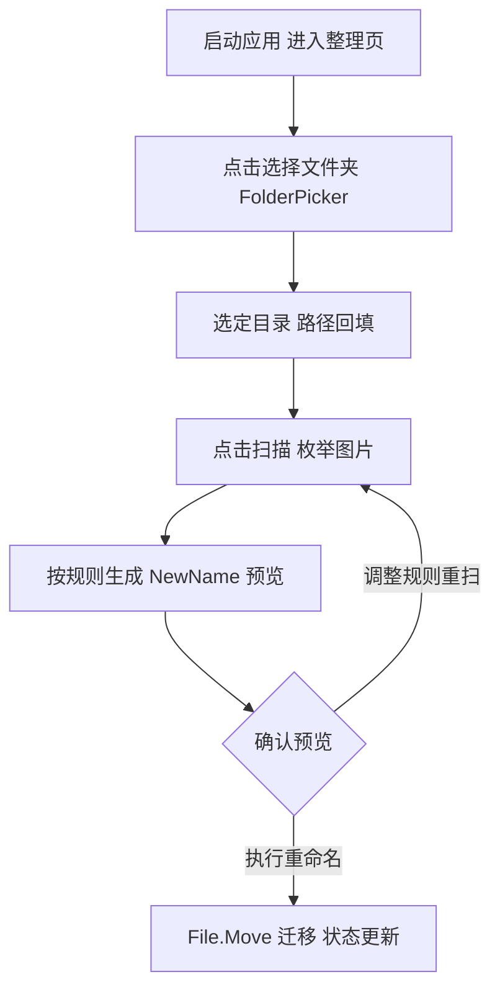
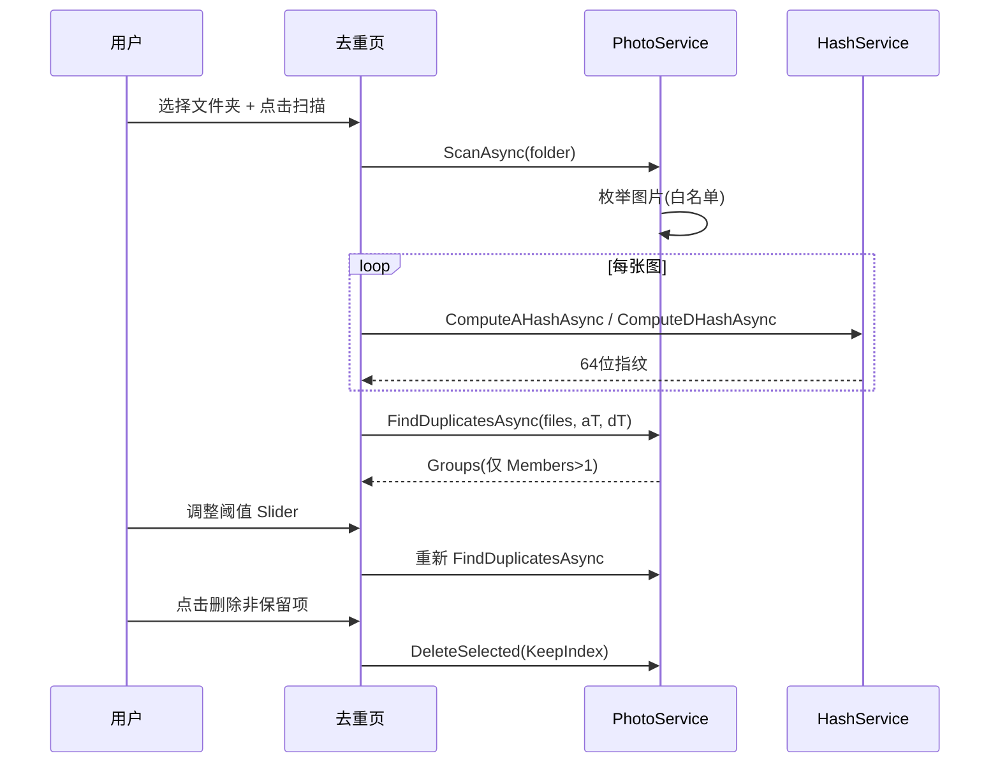
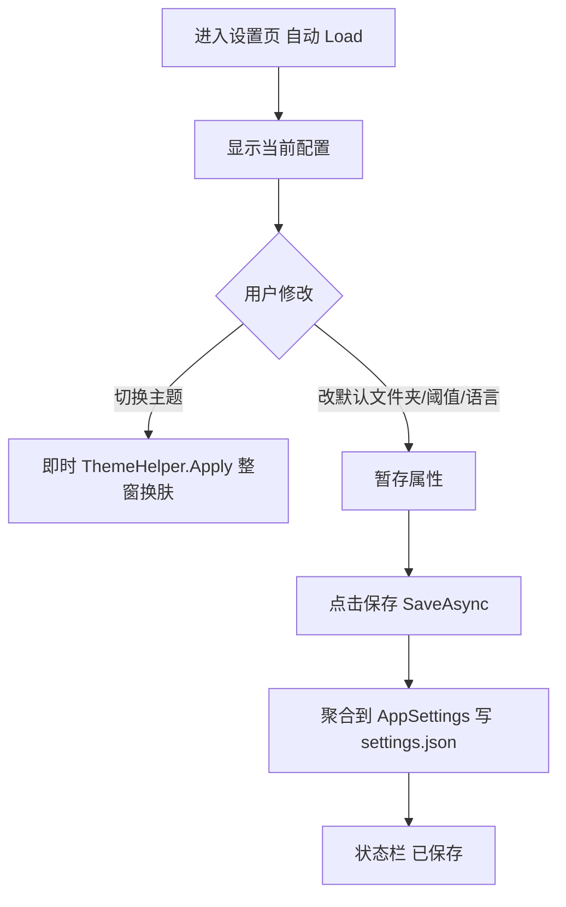
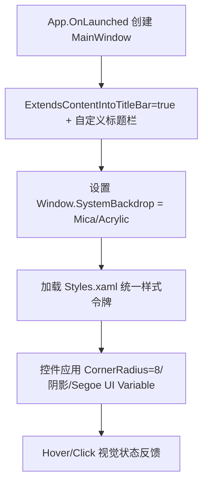
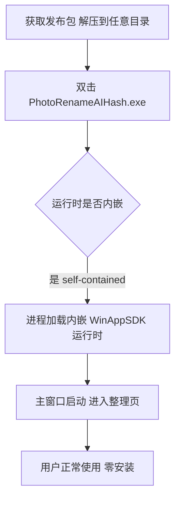

# PhotoRenameAIHash · UserStory（用户故事与验收标准）

> 文档版本：v1.0（架构方案包，2026-07-08）
> 本文档为 PhotoRenameAIHash（照片整理 / 感知哈希去重 Windows 桌面工具）的产品用户故事，对应 G4 阶段产物，由 product-story-designer（顾全景）撰写。
> 上游输入：《高层架构设计》（G3 已通过，功能清单 F1–F14 冻结，MVP 范围已定，F15 EXIF 待裁决）。
> 下游输出：驱动《系统设计》《部署设计》《安全设计》的具体功能实现。
> 范围纪律：本 UserStory 严格对齐《高层架构设计》§6.3 功能清单，**不扩展 In-Scope**，不重定义模块边界（归 system-architect），不越权安全 / 部署（归 Phase 5）。
> 产品基线：WinUI 3 + Windows App SDK 1.5 + .NET 8，原生 Windows 11 风格，self-contained 免安装便携发布。

---

## 1. 业务背景与价值

### 1.1 业务背景

- **当前业务现状（行业 / 产品 / 用户规模）**：PhotoRenameAIHash 是一款面向个人 / 摄影爱好者的 Windows 11 原生照片整理与感知哈希去重单机工具。现有 WinUI 3 重写版已具备整理 / 去重 / 设置 / 关于四大页面与核心算法（HashService / PhotoService / SettingsService），并已通过 `material_digest.md` 完成现状代码精读（D2）。
- **触发本次需求的事件（新场景 / 痛点修复）**：现状缺失原生 Windows 11 视觉规范（无 Mica/Acrylic、无分层标题栏、无 Fluent 圆角 / 阴影、主题未覆盖整窗，对应 G2–G4），且依赖预装 WinAppSDK 运行时（非 self-contained，对应 G1/X1）。用户（主理人齐构成）要求补齐原生体验并交付免安装 self-contained 便携发布（开箱即用）。
- **本系统在产品矩阵中的位置**：独立的本地单机工具，承担"本地照片资产整理"职责，无上下游业务系统，形成"整理 → 去重 → 设置 → 关于"闭环。与《高层架构设计》§4.2 系统定位一致。

### 1.2 行业方案

> 同类功能、痛点的行业标杆系统及解决方案。

- **同类工具参照（仅作背景，非本期调研结论）**：桌面照片整理 / 去重工具如 DigiKam、AntiDupl、FastPhotoTagger 提供感知哈希去重与批量重命名能力；本系统的差异化在于 **WinUI 3 原生 Windows 11 视觉 + self-contained 便携发布** 的组合，实现"0 安装门槛 + 原生质感"。
- **说明**：《高层架构设计》§3 行业调研已按主理人批准（need_research=false）跳过，本节不虚构标杆打分矩阵，仅列行业同类能力作为背景参照。

### 1.3 方案收益与价值

| 项 | 说明 |
| --- | --- |
| 功能模块 | 照片整理（F1–F3）、感知哈希去重（F4–F6）、设置（F7）、关于（F8）、原生 UI 基底（F9–F13）、便携发布（F14） |
| 预期价值收益 | 为个人 / 摄影爱好者提供原生 Windows 11 风格、开箱即用的照片整理与感知哈希去重工具，0 安装门槛；复用现有核心算法底座，仅扩展 UI 材质与发布形态，控制返工 |
| 量化标准 | ① 整理 / 去重核心路径操作步数 ≤ 3 步（选文件夹→扫描预览→执行）；② 原生规范 8/8 项覆盖（Mica/Acrylic/分层标题栏/Fluent CornerRadius=8/阴影/主题覆盖整窗/Hover-Click）；③ 终端部署 0 安装步骤、无需预装 WinAppSDK 运行时 |

### 1.4 术语清单

> 统一文档中专有名词的中英文对照与含义（与 `system-architect` 术语表对齐）。

| 术语 | 英文 / 缩写 | 含义 |
| --- | --- | --- |
| 感知哈希 | Perceptual Hash (aHash / dHash) | 将图像缩放为 8×8（aHash）或 9×8（dHash）灰度缓冲后二值化生成的 64 位指纹 |
| 汉明距离 | Hamming Distance | 两个 64 位哈希指纹不同位的个数；值越小越相似 |
| 可调阈值分组 | Threshold Grouping | 按 aHash / dHash 汉明距离阈值（Slider 0–20）将相似图片归为一组，OR 条件并入同组 |
| 保留策略 | KeepIndex | 每组保留首个（KeepIndex=0），其余删除 |
| 自包含发布 | self-contained | 运行时随包内嵌，无需预装 WinAppSDK 运行时，双击 exe 即用 |
| 分层标题栏 | Layered Title Bar | `ExtendsContentIntoTitleBar=true` + 自定义标题栏区域，使 Mica 背景延伸至标题栏 |
| 材质背景 | Mica / Acrylic | WinUI 3 提供的窗口背景材质（Mica 不透明分层、Acrylic 半透明） |
| 整窗主题切换 | Full-window Theming | 主题（Light/Dark/System）覆盖窗口背景、Mica、标题栏与所有页面，无缝无残影 |
| 关于页 | About | 只读展示 AppVersion 与产品描述 |
| EXIF（待裁决） | Exchangeable Image File Format | 图片元数据中的拍摄时间；F15 是否实现由 G3/G4 人工审核裁决，本期不纳入 MVP |

---

## 2. 范围与边界

### 2.1 系统内模块及功能

> 一级功能清单（与《高层架构设计》§6.1 In-Scope、§6.2 模块全景图一致）。

| 一级模块 | 二级功能 | 功能编号 | 说明 |
| --- | --- | --- | --- |
| 照片整理 | 选文件夹扫描 / 命名规则预览 / 批量重命名 | F1–F3 | FolderPicker + 扩展名白名单枚举 → 规则预览新名 → File.Move 迁移 |
| 感知哈希去重 | 计算 aHash/dHash / 阈值分组 / 删除多余 | F4–F6 | HashService + ImageDecoder 计算指纹，阈值分组（OR 条件），KeepIndex 保留策略删除 |
| 设置 | 主题 / 默认文件夹 / 阈值 / 语言 JSON 持久化 | F7 | 写入 `%LocalAppData%/PhotoRenameAIHash/settings.json` |
| 关于 | 版本与描述页 | F8 | 只读展示 |
| 原生 UI 基底 | Mica+Acrylic / 分层标题栏 / Fluent 圆角阴影 / 整窗主题 / Hover-Click 动画 | F9–F13 | 补齐 G2–G4 缺失 / 部分满足项，覆盖整窗 |
| 便携发布 | self-contained 免安装发布 | F14 | 运行时自包含 + CI 产物调整 |
| 非功能 | 高 DPI 适配 | N1 | manifest + 布局级处理 |

### 2.2 系统外模块及功能

> 当前系统**不覆盖**的功能，及其原因（与《高层架构设计》§6.1 Out-of-Scope O1–O3 + 补充约束一致）。

| 编号 | 不做的事 | 原因 | 后续计划 |
| --- | --- | --- | --- |
| O1 | 云端账户 / 同步能力 | 定位本地单机便携工具，用户诉求无联网需求 | 不做 |
| O2 | 多用户 / 协作能力 | 服务对象为个人 / 摄影爱好者，单用户即可 | 后续版本评估 |
| O3 | 移动端 / 跨平台（macOS、Linux、Android、iOS） | 锁死 Windows 11 + WinUI 3 原生体验 | 不做 |
| C1 | 外部网络依赖与 telemetry | 纯本地、零外部依赖，符合 self-contained 定位 | 不做 |
| C2 | 插件 / 扩展机制 | 保持内核精简，降低维护成本 | 不做 |
| F15（待裁决） | EXIF 日期解析 | X2 冲突项，待 G3/G4 人工审核裁决；裁决前不纳入 MVP In-Scope | 完整版（若裁决实现） |

### 2.3 外部依赖

| 依赖系统 | 提供方 | 依赖能力 | 接入方式 | 接口人 |
| --- | --- | --- | --- | --- |
| Windows OS 文件系统 | Microsoft / OS | 目录枚举、文件读写 | 进程内 API 调用（同步） | OS 内核 |
| Windows Imaging API（BitmapDecoder） | OS / WinAppSDK | 图像解码为 Gray8 | 进程内 WinRT 调用（同步） | WinAppSDK |
| WinAppSDK 运行时（自包含内嵌） | Microsoft | UI 框架 / 窗口 / 标题栏 | 进程内（自包含后无外部依赖） | Microsoft |
| HashService / PhotoService / SettingsService | 现有代码库（D2） | 哈希 / 扫描 / 持久化 | 进程内类调用（同步） | 研发团队（复用底座） |
| ImageDecoder / ThemeHelper | 现有代码库（D2） | 成像缩放 / 主题 | 进程内（ThemeHelper 需扩展覆盖整窗） | 研发团队（复用并扩展） |

---

## 3. 功能清单

> **定位**：全景骨架表，进入"角色 / 场景 / US"之前先看到完整功能版图。与《高层架构设计》§6.3 功能清单逐项互查一致（F1–F14 MVP ✅，F15 延后）。

### 3.1 功能清单结构

| 一级模块 | 二级模块 | 功能项 | 优先级（P0/P1/P2） | MVP 范围 | 完整版范围 | 备注 |
| --- | --- | --- | --- | --- | --- | --- |
| 照片整理 | 选文件夹扫描 | F1 FolderPicker 选目录并枚举图片（扩展名白名单） | P0 | ✅ MVP | ✅ | 对齐 V1 |
| 照片整理 | 命名规则预览新名 | F2 按 {yyyy}{MM}{dd}_{n} 等规则生成预览新名 | P0 | ✅ MVP | ✅ | 对齐 V1 |
| 照片整理 | 批量重命名 | F3 File.Move 迁移（目标不存在才移动） | P0 | ✅ MVP | ✅ | 对齐 V1 |
| 感知哈希去重 | 计算 aHash/dHash | F4 调用 HashService（ImageDecoder Gray8） | P0 | ✅ MVP | ✅ | 对齐 V1 |
| 感知哈希去重 | 可调阈值分组 | F5 aHash/dHash 汉明阈值 Slider 分组（OR 条件） | P0 | ✅ MVP | ✅ | 对齐 V1 |
| 感知哈希去重 | 删除多余项 | F6 KeepIndex 保留策略 + File.Delete | P0 | ✅ MVP | ✅ | 对齐 V1 |
| 设置 | JSON 持久化 | F7 主题/默认文件夹/阈值/语言 写入 settings.json | P0 | ✅ MVP | ✅ | 对齐 V1 |
| 关于 | 版本与描述页 | F8 只读展示 AppVersion / Description | P2 | ✅ MVP | ✅ | — |
| 原生 UI 基底 | Mica+Acrylic 材质背景 | F9 窗口 / 页面材质，覆盖背景 | P0 | ✅ MVP | ✅ | 对齐 V1 |
| 原生 UI 基底 | Windows 11 分层标题栏 | F10 ExtendsContentIntoTitleBar + 自定义标题栏 | P0 | ✅ MVP | ✅ | 对齐 V1 |
| 原生 UI 基底 | Fluent 圆角/阴影/间距/Segoe UI Variable | F11 统一样式令牌（CornerRadius=8） | P0 | ✅ MVP | ✅ | 对齐 V1 |
| 原生 UI 基底 | 深浅主题整窗无缝切换 | F12 ThemeHelper 扩展覆盖整窗（含 Mica/标题栏） | P0 | ✅ MVP | ✅ | 对齐 V1 |
| 原生 UI 基底 | 控件 Hover/Click 动画 | F13 WinUI 3 视觉状态 + 自定义动画 | P1 | ✅ MVP | ✅ | 对齐 V1 |
| 便携发布 | self-contained 免安装发布 | F14 运行时自包含 + CI 产物调整 | P0 | ✅ MVP | ✅ | 对齐 V2 |
| EXIF 日期解析（待裁决） | 解析 EXIF 拍摄时间优先、回退 last-write | F15 X2 冲突项，待 G3/G4 裁决是否实现 | P1 | ❌ 延后 | ✅ 完整版 | 对齐 V3；**待 G4 人工审核裁决** |

> **互查结论**：本表与《高层架构设计》§6.3 功能清单逐行一致（F1–F14 MVP ✅，F15 延后）。未新增任何 In-Scope 功能。

---

## 4. 角色与场景

### 4.1 角色清单

| 角色 | 业务身份 | 主要操作 | 核心关注点 |
| --- | --- | --- | --- |
| 个人摄影爱好者（整理场景） | 一线使用者 / 摄影爱好者 | 选文件夹 → 扫描预览新名 → 批量重命名 | 操作效率与视觉体验（原生质感、少步骤、重命名结果可预期） |
| 摄影爱好者（去重场景） | 一线使用者 / 摄影爱好者 | 扫描 → 调阈值分组 → 删除多余 | 去重准确与可控（阈值可调、保留策略明确、误删风险低） |
| 设置使用者 | 一线使用者 / 自服务运营 | 设置主题 / 默认文件夹 / 阈值 / 语言并持久化 | 配置即时生效与跨会话保留、换肤无残影 |
| 关于查看者 | 一线使用者 | 查看版本与描述 | 快速确认应用版本与功能范围 |
| 受影响方：Windows OS / 文件系统 | 运行环境 | 提供目录枚举 / 成像 API / 文件读写 | 零外部依赖、运行稳定性、高 DPI 正确渲染、无管理员提权 |

### 4.2 关键场景清单

| 编号 | 角色 | 触发条件 | 期望结果 | 频率（日均 / QPS） |
| --- | --- | --- | --- | --- |
| S1 | 个人摄影爱好者 | 拥有一次外出拍摄的导出文件夹需要归类命名 | ≤3 步完成选文件夹→预览→批量重命名 | 日均 1–3 次 |
| S2 | 摄影爱好者（去重） | 长期积累的图片库存在重复拷贝 | 调阈值后获得相似分组，保留一份其余删除 | 周均 1–2 次 |
| S3 | 设置使用者 | 首次使用希望固定深色主题与默认工作目录 | 设置即时换肤且重启后保留 | 低频（设置后长期不变） |
| S4 | 关于查看者 | 向同事说明所用工具版本 | 关于页显示清晰版本号与描述 | 极低频 |
| S5 | 受影响方（OS/FS） | 应用枚举含长路径 / 高 DPI 显示器 / 文件锁定 | 正常枚举、正确渲染、锁定文件跳过不崩溃 | 随每次操作 |

---

## 5. 用户旅程（UserStory）

> 下列 7 条 UserStory（US-1 ~ US-7）覆盖《高层架构设计》§6.3 全部 MVP 功能（F1–F14），逐条按 **业务场景 / 业务流程 / UE 原型 / 业务逻辑 / 数据描述 / 验收标准 / 外部集成接口** 七段式展开。F15（EXIF）不在本期 MVP 范围，仅在高层面标注"待 G4 人工审核裁决"。

### 5.1 US-1：照片整理主链路（选文件夹 → 扫描预览 → 批量重命名）

#### 5.1.1 业务场景

- **视角**：个人摄影爱好者（整理场景）
- **描述逻辑**：用户从相机 / 手机导出一批照片到某个文件夹，希望按拍摄日期统一重命名以便归档。用户在 Windows 11 上启动应用（self-contained exe），进入"整理"页，通过 FolderPicker 选择该文件夹，点击"扫描"后看到每张照片的预览新名，确认无误后点击"执行重命名"一次性完成批量重命名。

#### 5.1.2 业务流程

- **视角**：用户
- **描述方式**：Given / When / Then 表述产品表现流程（详见 §5.1.6 验收标准）。整体流程：



#### 5.1.3 UE 原型

- 核心路径节点交互（整理页，Padding=24，Fluent CornerRadius=8）：
  - 行0：`Button`「选择文件夹」(FolderPicker) + `TextBox`（路径，TwoWay 绑定 FolderPath）+ `Button`「扫描」(ScanCommand)
  - 行1：`TextBox`（命名规则，默认 `{yyyy}{MM}{dd}_{n}`，TwoWay）+ `Button`「执行重命名」(RenameCommand)
  - 行2：`ListView` 绑定 `Preview`，DataTemplate 显示 `Name`（原）与 `NewName`（Accent 色高亮）
  - 行3：`TextBlock` 状态栏（实时刷新扫描 / 重命名结果）
  - 视觉：Mica 背景、Acrylic 面板、控件 Hover/Click 视觉反馈、整窗主题跟随。

#### 5.1.4 业务逻辑

- **视角**：业务系统
- **描述方式**：结构化表述业务逻辑流程
  1. `OrganizeViewModel.ScanAsync`：校验 `FolderPath` 非空且目录存在 → 调用 `IPhotoService.ScanAsync(folder)` 非递归枚举，按扩展名白名单（.jpg/.jpeg/.png/.bmp/.gif/.tif/.tiff/.webp）过滤，填充 `PhotoFile`（含 `LastWriteTimeUtc`）。
  2. 逐文件 `BuildName`：以 `f.LastModified`（= FileInfo.LastWriteTimeUtc）做 `{yyyy}{MM}{dd}{HH}{mm}{n}{name}` 文本替换生成 `NewName`，状态置"待重命名"。
  3. `OrganizeViewModel.RenameAsync`：构造 `RenameItem`（目标=同目录 + NewName），调用 `IPhotoService.RenameAsync(items)`，逐文件 `File.Move`（目标不存在才移动），状态置"已重命名"。

#### 5.1.5 数据描述

- 输入：`FolderPath`（字符串）、`Pattern`（字符串，默认 `{yyyy}{MM}{dd}_{n}`）。
- 流转：`PhotoFile{ Path, Name, SizeBytes, LastModified, NewName?, Status? }` → `RenameItem{ SourcePath, DestinationPath }`。
- 输出：文件系统实际重命名（目标路径文件）、状态栏文本（成功数 / 跳过数）。

#### 5.1.6 验收标准 AC

- **正常路径**
  - Given 用户进入整理页并选择含 50 张 jpg 的文件夹，When 点击「扫描」，Then 预览列表显示 50 条记录，每条 `NewName` 按规则生成且 `Status="待重命名"`。
  - Given 预览列表已生成且 `NewName` 唯一，When 用户点击「执行重命名」，Then 全部文件按 `NewName` 迁移，`Status` 更新为"已重命名"，状态栏显示"已重命名 50 项"。
- **异常路径**
  - Given 未选择文件夹，When 点击「扫描」，Then 状态栏提示"请先选择文件夹"，且不执行任何文件操作。
  - Given 文件夹为空或不含白名单内图片，When 点击「扫描」，Then 状态栏提示"未发现可处理图片"。
  - Given 文件夹中含 3 张损坏 / 不可解码图片，When 点击「扫描」，Then 这 3 张在 try/catch 中跳过，状态栏提示"3 个文件解码失败已跳过"，其余正常预览。
  - Given 目标文件名已存在（与前次重命名冲突），When 执行重命名，Then 该文件跳过迁移，状态栏提示"N 项因目标已存在跳过"，不覆盖既有文件。
  - Given 规则导致 `NewName` 重复，When 预览生成，Then 系统对重复项追加序号后缀以保证唯一，避免重命名相互覆盖。

#### 5.1.7 外部集成接口

- 依赖 `Windows.Storage.Pickers.FolderPicker`（需 `InitializeWithWindow` 绑定 `App.MainWindow` 句柄）获取文件夹。
- 依赖 OS 文件系统 `Directory.EnumerateFiles` / `File.Move`（进程内，无网络）。
- 依赖 `BitmapDecoder` 仅用于去重（本 US 不直接解码图像，仅用文件元数据）。

---

### 5.2 US-2：感知哈希去重主链路（选文件夹 → 扫描 → 阈值分组 → 删除多余）

#### 5.2.1 业务场景

- **视角**：摄影爱好者（去重场景）
- **描述逻辑**：用户长期积累的图片库中存在大量重复拷贝（如多次备份、微信转发）。用户进入"去重"页，选择图片库文件夹，点击「扫描相似图片」，系统计算每张图的 aHash/dHash 并按当前阈值（aHash / dHash 汉明距离 Slider）分组；用户查看分组、确认保留项（默认每组首项），点击「删除非保留项」清除多余副本，仅保留一份。

#### 5.2.2 业务流程

- **视角**：用户
- **描述方式**：Given / When / Then（详见 §5.2.6）。整体流程：



#### 5.2.3 UE 原型

- 去重页（同整理页布局，Fluent 圆角 + Mica/Acrylic）：
  - 行0：`Button`「选择文件夹」+ `TextBox`（路径）+ `Button`「扫描相似图片」
  - 行1：`Slider` aHash 阈值（0–20，默认 8）+ `Slider` dHash 阈值（0–20，默认 10）+ `Button`「删除非保留项」(DeleteSelectedCommand)
  - 行2：`ListView` 绑定 `Groups`（显示组 Id 与成员名，首项标记"保留"）
  - 行3：`TextBlock` 状态栏（分组数 / 待删数 / 异常提示）

#### 5.2.4 业务逻辑

- **视角**：业务系统
  1. `DeduplicateViewModel.ScanAsync`：`ScanAsync(folder)` → `FindDuplicatesAsync(files, AHashThreshold, DHashThreshold)`。
  2. `IPhotoService.FindDuplicatesAsync`：对每张图开流分别算 aHash/dHash（同一流复用），try/catch 跳过不可读图像；用 `used[]` 贪心分组，当 `da≤aHashThreshold || dd≤dHashThreshold`（**OR 条件**）即并入同组；仅保留 `Members.Count>1` 的组。
  3. `DeduplicateViewModel.DeleteSelected`：遍历各组，`i==KeepIndex` 保留，其余 `File.Delete`（catch 忽略锁定 / 已删），最后 `Groups.Clear()`。

#### 5.2.5 数据描述

- 输入：`FolderPath`、`AHashThreshold`(默认 8)、`DHashThreshold`(默认 10)。
- 流转：`PhotoFile` → `IHashService` 输出 `ulong aHash/dHash` → `DuplicateGroup{ Id, Members:List(PhotoFile), KeepIndex=0 }`。
- 输出：被删文件从磁盘移除；状态栏报告删除数与跳过数。

#### 5.2.6 验收标准 AC

- **正常路径**
  - Given 文件夹含 2 张内容相同（汉明距离 0）的图片，When 以默认阈值扫描，Then 生成 1 个 `DuplicateGroup`，`Members.Count=2`，`KeepIndex=0`。
  - Given 分组已生成且 `KeepIndex=0`，When 点击「删除非保留项」，Then 仅保留每组首个，其余 `File.Delete`，状态栏显示"已删除 N 项"。
  - Given 用户将 aHash 或 dHash 阈值调小以收紧分组，When 重新扫描，Then 分组结果按新阈值重算（OR 条件生效）。
- **异常路径**
  - Given 全部图片汉明距离均大于阈值（无相似对），When 扫描分组，Then 提示"未找到相似图片组"，不显示空组。
  - Given 某待删文件被其他进程锁定，When 删除非保留项，Then 该文件 catch 跳过，状态栏提示"M 项因文件锁定跳过"，其余正常删除。
  - Given 文件夹中含不可解码图像，When 扫描，Then 该图跳过哈希计算并在状态栏提示，不影响其余图片分组。
  - Given 用户将阈值设为 0（最严格），When 扫描，Then 仅汉明距离=0 的归组，其余各自成单张（不形成组）。

#### 5.2.7 外部集成接口

- 依赖 `Windows.Storage.Pickers.FolderPicker`（`InitializeWithWindow` 绑定窗口句柄）。
- 依赖 OS 文件系统与 `BitmapDecoder`（通过 `ImageDecoder.DecodeGrayAsync` 解码为 Gray8）。
- 依赖 `IHashService`（进程内，复用 HashService 底座）。

---

### 5.3 US-3：设置（JSON 持久化 + 即时换肤）

#### 5.3.1 业务场景

- **视角**：设置使用者
- **描述逻辑**：用户首次启动后希望固定深色主题、设定默认工作目录、调整去重阈值与界面语言，并使这些配置在关闭重启后依然生效。用户在"设置"页通过单选按钮（主题）、文本框（默认文件夹 / 语言）、滑块（阈值）完成配置，点击「保存」写入本地 JSON；切换主题时希望窗口立即换肤（含 Mica / 标题栏）。

#### 5.3.2 业务流程

- **视角**：用户
- **描述方式**：Given / When / Then（详见 §5.3.6）。



#### 5.3.3 UE 原型

- 设置页（`StackPanel Padding=24 MaxWidth=560`）：
  - 标题 + `RadioButtons` 主题（浅色 / 深色 / 跟随系统，`SelectedIndex`↔`ThemeIndex`）
  - `TextBox` 默认文件夹 + `Slider` aHash/dHash（0–20）+ `TextBox` 语言（如 zh-CN）
  - `Button`「保存」(SaveCommand) + `TextBlock` 状态。

#### 5.3.4 业务逻辑

- **视角**：业务系统
  1. `SettingsViewModel` 构造时 `Load()` 并映射到属性；`ThemeIndex` 在 `AppTheme` 与 RadioButtons 索引(0=Light,1=Dark,2=System)互转。
  2. `OnThemeChanged`：写回 `_model.Theme` → `ThemeHelper.Apply(App.MainWindow, newValue)` **即时整窗换肤** → 通知属性变更。
  3. `SaveAsync`：聚合各属性到 `_model` → `ISettingsService.SaveAsync`（`SettingsService` 创建目录后 `JsonSerializer.Serialize` 写回 `%LocalAppData%/PhotoRenameAIHash/settings.json`）。

#### 5.3.5 数据描述

- 输入：用户交互产生的主题 / 默认文件夹 / 阈值 / 语言。
- 持久化对象：`AppSettings{ AppVersion, Theme, DefaultFolder, AHashThreshold, DHashThreshold, Language }`。
- 存储位置：`%LocalAppData%/PhotoRenameAIHash/settings.json`（缩进 JSON）。

#### 5.3.6 验收标准 AC

- **正常路径**
  - Given 用户在设置页将主题切到「深色」，When 选择单选按钮，Then 窗口（含 Mica 背景与标题栏）立即切换为深色，无需点击保存即生效。
  - Given 用户修改默认文件夹与阈值并点击「保存」，When `SaveAsync` 完成，Then `settings.json` 被更新，状态栏显示"已保存"，重启后配置保留。
- **异常路径**
  - Given `settings.json` 缺失或损坏，When 应用启动 `Load()`，Then 回退默认 `new AppSettings()`（主题=System、aHash 阈值=8、dHash 阈值=10、语言=zh-CN），不崩溃。
  - Given 用户将阈值滑块拖到 0–20 之外（程序性越界，如通过键盘输入），When 保存，Then 系统将值钳制回 [0,20] 合法区间后再写入，状态栏提示"阈值已校正至合法范围"。
  - Given 默认文件夹文本框填入一个不存在的路径，When 保存，Then 允许保存（仅作默认提示值），但在整理 / 去重页使用该默认路径时由对应 US 的"目录不存在"异常路径拦截并提示。

#### 5.3.7 外部集成接口

- 依赖 OS 文件系统（`%LocalAppData%` 目录创建与文件读写，进程内）。
- 依赖 `ThemeHelper.Apply`（进程内，扩展覆盖整窗）。

---

### 5.4 US-4：关于页（版本与描述只读展示）

#### 5.4.1 业务场景

- **视角**：关于查看者
- **描述逻辑**：用户想确认当前所用工具的版本号与功能范围（例如向同事说明、或在反馈问题时附上版本）。用户通过 NavigationView 页脚「关于」进入，页面只读展示应用版本与产品描述。

#### 5.4.2 业务流程

- **视角**：用户
- **描述方式**：Given / When / Then（详见 §5.4.6）。

```mermaid
flowchart TD
    A[点击导航 关于] --> B[ContentFrame.Navigate(AboutPage)]
    B --> C[AboutViewModel 读取 AppVersion/Description]
    C --> D[页面只读展示]
```

#### 5.4.3 UE 原型

- 关于页（`StackPanel Padding=24`）：`TextBlock` 标题 + `TextBlock` `Version`（SemiBold）+ `TextBlock` `Description`（Wrap，说明 WinUI 3 + Windows App SDK、MVVM、整理 / 去重功能）。

#### 5.4.4 业务逻辑

- **视角**：业务系统
  1. `AboutViewModel` 初始化时读取 `AppSettings.AppVersion`（默认 1.0.0）与产品描述文案。
  2. 页面绑定展示，无编辑 / 写回逻辑。

#### 5.4.5 数据描述

- 输入：编译期 `AppVersion` 常量 + 描述字符串。
- 输出：页面只读文本（不落盘、不发送）。

#### 5.4.6 验收标准 AC

- **正常路径**
  - Given 用户进入关于页，When 页面加载完成，Then 显示非空版本号（如 1.0.0）与产品描述，且所有文本遵循当前主题（深色 / 浅色）配色。
- **异常路径**
  - Given `AppVersion` 因构建配置缺失为空，When 页面加载，Then 回退展示占位版本（如 "1.0.0"）且不抛出空引用异常。

#### 5.4.7 外部集成接口

- 无外部集成（纯本地只读展示，依赖编译期常量 `AppSettings.AppVersion`）。

---

### 5.5 US-5：原生 UI 基底（Mica/Acrylic + 分层标题栏 + Fluent 圆角/阴影/Segoe UI Variable + Hover/Click 动画）

#### 5.5.1 业务场景

- **视角**：所有最终用户（横切体验）
- **描述逻辑**：用户在 Windows 11 上启动应用，期望获得与系统一致的现代质感——窗口背景呈现 Mica 材质、面板使用 Acrylic 半透明、顶部为自定义分层标题栏、所有控件具备 Fluent 8px 圆角与阴影层级、全局 Segoe UI Variable 字体、鼠标悬停与点击有明确视觉反馈。这是贯穿四大页面的基底能力（F9–F11、F13）。

#### 5.5.2 业务流程

- **视角**：用户
- **描述方式**：Given / When / Then（详见 §5.5.6）。



#### 5.5.3 UE 原型

- 窗口级：Mica 背景延伸到分层标题栏（标题文字 + 拖拽区 + 最小/最大/关闭按钮自定义布局）。
- 页面级：`Page` 背景透明以透出 Mica；卡片 / 面板使用 Acrylic `Fill` 半透明。
- 控件级：`CornerRadius=8`、阴影 `Shadow`/`Translation`、字体 `FontFamily="Segoe UI Variable"`；按钮 / 列表项具备 PointerOver / Pressed 视觉状态动画。

#### 5.5.4 业务逻辑

- **视角**：业务系统
  1. `MainWindow`：设置 `ExtendsContentIntoTitleBar=true`，构建自定义标题栏 Grid（含 `WindowCaptionButtons`），将标题栏区域 `SetTitleBar` 绑定。
  2. 设置 `Window.SystemBackdrop` 为 `MicaBackdrop`（或 Acrylic，按场景）；ThemeHelper 扩展使背景随主题更新。
  3. `Styles.xaml` 新增统一样式令牌：`CornerRadius=8`、阴影资源、`PagePadding=24`、全局 `FontFamily="Segoe UI Variable"`；各原生控件继承 Fluent 视觉。
  4. 启用 WinUI 3 控件默认视觉状态（PointerOver / Pressed）+ 必要的自定义动画。

#### 5.5.5 数据描述

- 输入：系统主题（Light/Dark/System）、DPI 缩放比例。
- 配置：样式令牌资源字典（编译期内嵌，无运行时落盘）。
- 输出：渲染层视觉（背景材质 / 圆角 / 阴影 / 字体 / 动画状态）。

#### 5.5.6 验收标准 AC

- **正常路径**
  - Given 用户在 Windows 11 启动应用，When 主窗口渲染完成，Then 窗口背景为 Mica 材质、标题栏为自定义分层样式、各页面卡片呈 Fluent 8px 圆角与阴影层级、全局字体为 Segoe UI Variable、控件在鼠标悬停 / 点击时呈现明显视觉反馈。
  - Given 系统主题在 Light/Dark 间切换，When 应用跟随，Then Mica 背景与标题栏同步切换，无视觉残影。
- **异常路径**
  - Given 运行环境不支持 Mica（如非受支持的系统版本），When 应用启动，Then 优雅回退到 Acrylic 或纯色背景，应用不崩溃、功能可用。
  - **【待 G4 人工审核裁决】** Given 自定义分层标题栏与某些 WinAppSDK 版本存在兼容差异，When 渲染，Then 建议以 `ExtendsContentIntoTitleBar` + 标准 `WindowCaptionButtons` 为最小可行实现，避免自绘按钮导致的交互缺陷；具体实现细节由 system-architect 在系统设计阶段确认。

#### 5.5.7 外部集成接口

- 依赖 WinAppSDK / WinUI 3 提供的 `SystemBackdrop`（MicaBackdrop / DesktopAcrylicBackdrop）、`ExtendsContentIntoTitleBar`、`WindowCaptionButtons`（进程内，自包含后无外部依赖）。

---

### 5.6 US-6：深浅主题整窗无缝切换（覆盖 Mica / 标题栏 / 全部页面）

#### 5.6.1 业务场景

- **视角**：设置使用者 / 所有最终用户（横切体验）
- **描述逻辑**：用户期望主题切换不仅是页面内容变深色，而是窗口背景（Mica）、自定义分层标题栏、Acrylic 面板与所有页面**整窗一致**地切换，且无闪烁 / 残影。这是 F12，也是对现状 G8（ThemeHelper 仅作用于 Content 根、未覆盖窗口背景）的补齐。

#### 5.6.2 业务流程

- **视角**：用户
- **描述方式**：Given / When / Then（详见 §5.6.6）。

```mermaid
flowchart TD
    A[设置页切换主题] --> B[ThemeHelper.Apply(window, AppTheme)]
    B --> C[设置 Window.Content 根 RequestedTheme]
    C --> D[同步更新 SystemBackdrop/Mica 配色]
    D --> E[同步自定义标题栏配色]
    E --> F[全部页面无残影刷新]
```

#### 5.6.3 UE 原型

- 设置页「主题」单选按钮（浅色 / 深色 / 跟随系统）触发即时整窗换肤；切换瞬间整窗（含标题栏拖拽区、最小化 / 关闭按钮、背景材质、所有页面控件）配色一次性更新。

#### 5.6.4 业务逻辑

- **视角**：业务系统
  1. 扩展 `ThemeHelper.Apply(Window, AppTheme)`：除设置 `Content` 根 `RequestedTheme` 外，同步更新 `Window.SystemBackdrop`（Mica/Acrylic 随主题调整配色）与自定义标题栏配色。
  2. 应用启动时（`MainWindow` 构造后 `Load()` 设置）即按持久化主题应用一次，保证首屏即整窗正确。
  3. 「跟随系统」(System) 监听系统主题变更并实时同步。

#### 5.6.5 数据描述

- 输入：`AppTheme`（Light/Dark/System）来自设置。
- 输出：整窗视觉状态（背景材质配色、标题栏配色、页面配色一致）。

#### 5.6.6 验收标准 AC

- **正常路径**
  - Given 当前主题为「跟随系统」且系统为浅色，When 用户在设置页选「深色」并保存，Then 窗口背景（Mica）、标题栏、Acrylic 面板与所有页面同步切换为深色，无残留浅色区域。
  - Given 主题设为「跟随系统」，When 操作系统主题由浅变深，Then 应用实时同步整窗配色。
- **异常路径**
  - Given 主题切换发生在某页面正在加载大量图片时，When 切换，Then 已渲染与待渲染控件均遵循新主题，无控件停留在旧主题配色（无残影）。

#### 5.6.7 外部集成接口

- 依赖 WinAppSDK `SystemBackdrop`、`UISettings` 系统主题监听（进程内，自包含后无外部依赖）。

---

### 5.7 US-7：便携发布（self-contained 免安装，双击 exe 即用）

#### 5.7.1 业务场景

- **视角**：所有最终用户 / 受影响方（分发与运行）
- **描述逻辑**：用户从分发渠道（如网盘 / U 盘）获取一个压缩包，解压到任意本地目录（无需管理员权限、无需预装任何运行时），双击 `PhotoRenameAIHash.exe` 即可启动应用，无任何安装向导或运行时下载。这是 F14 / V2，对应 X1 冲突的解决（补齐 self-contained，现状为 unpackaged 依赖预装 WinAppSDK）。

#### 5.7.2 业务流程

- **视角**：用户
- **描述方式**：Given / When / Then（详见 §5.7.6）。



#### 5.7.3 UE 原型

- 分发形态：单目录自包含包（含 exe + 运行时依赖 + 资源），绿色便携，可置于 U 盘 / 任意文件夹。
- 启动：双击 exe → 直接出现主窗口，无安装界面、无 UAC 提权弹窗。

#### 5.7.4 业务逻辑

- **视角**：业务系统
  1. 构建配置：以 `dotnet publish -c Release -r win-x64 --self-contained true` 产出自包含包，运行时随包内嵌（对应解决 X1）。
  2. CI（GitHub Actions windows-latest, .NET 8）构建自包含可执行文件并作为 `PhotoRenameAIHash-windows` artifact 上传。
  3. `app.manifest` 维持 `requestedExecutionLevel=asInvoker`（不提权）、`dpiAwareness=PerMonitorV2`、`longPathAware=true`。
  4. 入口 `App.OnLaunched` 创建并激活 `MainWindow`，默认导航到整理页并应用持久化主题。

#### 5.7.5 数据描述

- 输入：自包含发布产物（exe + 运行时 + 资源目录）。
- 运行时数据：仅本地 `%LocalAppData%/PhotoRenameAIHash/settings.json`（用户配置）。
- 输出：应用进程运行，无外部网络请求。

#### 5.7.6 验收标准 AC

- **正常路径**
  - Given 将发布包解压到任意非系统目录（如 `D:\tools\`），When 双击 `PhotoRenameAIHash.exe`，Then 应用成功启动并进入整理页，全程无需预装 WinAppSDK 运行时、无需管理员权限、无安装向导。
  - Given 应用已启动，When 进入各页面执行整理 / 去重 / 设置 / 关于，Then 功能与 unpackaged 版本一致，且启动耗时在合理范围（建议首次冷启动 ≤ 3s，待 G4 人工审核裁决具体阈值）。
- **异常路径**
  - Given 解压不完整导致关键运行时文件缺失，When 双击 exe，Then 操作系统 / .NET 给出明确错误信息（如"找不到 xxx.dll"），而非静默无响应；建议发布包附带校验说明（如 SHA256），由部署设计阶段确认。
  - Given 目标机器为 Windows 10（低于 WinAppSDK 1.5 要求），When 启动，Then 给出"需要 Windows 11 / 受支持版本"的清晰提示，而非崩溃无信息。

#### 5.7.7 外部集成接口

- 依赖 .NET 8 + WinAppSDK 1.5 运行时（**自包含内嵌**，无外部下载）。
- 依赖操作系统（Windows 11 推荐，Windows 10+ 视 WinAppSDK 支持而定）；无网络依赖。

---

## 6. 非功能性需求

### 6.1 易用性需求

> 操作便利性、UI 一致性、引导提示、错误反馈、无障碍支持等。

- **原生规范一致性**：所有页面与控件遵循 WinUI 3 / Fluent 设计规范，Mica/Acrylic 材质、Fluent 8px 圆角、阴影层级、全局 Segoe UI Variable 字体统一（F9–F11），覆盖整窗（F12）。
- **操作便利性**：整理 / 去重核心路径 ≤ 3 步（选文件夹→扫描预览→执行），命名规则与阈值提供合理默认值（Pattern=`{yyyy}{MM}{dd}_{n}`，aHash 阈值=8，dHash 阈值=10），降低上手成本（对齐 V1 操作步数指标）。
- **引导提示**：FolderPicker 选目录后路径回填；命名规则文本框默认展示规则模板；状态栏实时反馈扫描 / 重命名 / 删除结果与异常（解码失败、文件锁定、目标已存在跳过）。
- **错误反馈友好**：异常以状态栏文本而非弹窗轰炸呈现，明确说明跳过数量与原因；阈值过高无分组、空文件夹等情况给出明确提示。
- **无障碍支持**：控件具备清晰焦点态与对比度（跟随系统主题）；标题栏按钮尺寸符合 Windows 11 可点击区域规范；支持键盘操作（Tab 可达、焦点可见）。

### 6.2 性能响应需求

> 关键接口响应时延（P50 / P90 / P99）、吞吐量、并发、数据规模上限。**【注：以下数值为 US 自定建议基线，上游未给出硬性 SLA，待 G4 人工审核裁决】**

- **扫描与哈希（整理预览 / 去重分组主链路）**：
  - 建议基线：文件夹含 **1000 张**图片时，枚举 + 哈希计算 **P50 ≤ 3s、P90 ≤ 8s、P99 ≤ 15s**（桌面单机，非高并发场景）。
  - 大文件夹响应：含 **5000–10000 张**图片时，应用应持续刷新状态栏并显示进度，避免界面假死（建议异步 / 后台计算 + UI 进度反馈）。
- **批量重命名 / 删除**：单批次 1000 个文件迁移 / 删除，建议 P50 ≤ 5s；逐文件失败不影响整体进度（catch 跳过 + 状态汇总）。
- **主题切换**：整窗换肤（含 Mica / 标题栏）建议 ≤ 200ms 完成、无可见残影。
- **冷启动**：self-contained exe 首次冷启动建议 ≤ 3s（待 G4 裁决）；后续启动受本地缓存影响更快。
- **并发 / 规模**：单机单用户，无多用户并发；数据规模上限受文件系统与内存约束（建议单文件夹 ≤ 数万张，超出时分批处理，由系统设计确认）。

> ⚠️ **待 G4 人工审核裁决**：上述 P50/P90/P99 与冷启动阈值均为产品侧建议值，将作为 SLA 隐性承诺与测试成本基线，需主理人拍板后由 system-architect / 测试在系统设计与安全设计中落地。

### 6.3 操作与环境需求

> 浏览器 / 客户端兼容性、网络环境、设备规格、运行环境约束等。

- **操作系统**：Windows 11（推荐，原生 Mica / 分层标题栏最佳体验）；Windows 10+ 视 WinAppSDK 1.5 支持而定。
- **运行形态**：self-contained 免安装便携版，解压到任意目录双击即用，**无网络依赖、零外部下载**（对齐 O1 / C1）。
- **高 DPI 适配（N1）**：`app.manifest` 声明 `dpiAwareness=PerMonitorV2, PerMonitor`，并在布局级处理（避免逐控件模糊）；建议在 100% / 125% / 150% / 200% / 300% 缩放下均正确渲染、无错位。
- **设备规格**：x64 架构；建议 ≥ 4GB RAM；磁盘空间满足自包含包（含运行时，通常数百 MB）。
- **长路径**：`longPathAware=true`，支持超过 260 字符的文件路径。
- **权限**：`requestedExecutionLevel=asInvoker`，不请求管理员提权，普通用户目录即可运行。
- **网络环境**：纯离线可用，无任何 telemetry / 联网调用（对齐 C1）。

### 6.4 安全性需求

> 满足相关安全标准；本系统为本地单机工具，以下按"本地零依赖"特征落地。

#### 6.4.1 安全密码设置

- 本系统**不涉及账号 / 密码**功能（单用户本地工具，无登录体系），本条 **N/A**。相关约束：设置持久化为本地明文 JSON（`settings.json`），不含任何凭据 / 敏感信息。

#### 6.4.2 安全软件架构

- 系统为纯进程内单机应用，模块间通信为进程内类调用（NavigationView/Frame + AppServices service locator），无对外暴露的网络接口。
- 无外部系统接口调用（除 OS 文件系统 / 成像 API 进程内调用），不存在跨系统接口安全边界问题（对齐 O1/C1 无联网）。

#### 6.4.3 安全设计

- 无认证授权需求（单用户本地工具）。但需保证**文件操作的最小权限原则**：仅对用户在 FolderPicker 中显式选择的目录进行读写，不访问用户未授权路径；`asInvoker` 不提权，降低越权风险。

#### 6.4.4 安全开发

- **输入边界检查**：对 `FolderPath` 校验非空、目录存在、在用户授权范围内；对命名规则 `Pattern` 做格式校验，禁止产生非法文件名（含非法字符 `\/:*?"<>|` 或超长路径），必要时转义 / 截断并提示。
- **参数合法性检查**：阈值 Slider 钳制到 [0,20]；文件名 / 路径长度限制符合 OS 约束，防止路径注入或超长路径异常。
- **异常处理**：所有文件读写 / 图像解码均 try/catch，避免单文件异常导致进程崩溃或可被利用的高危漏洞；禁止执行任何未经授权 / 验证的外部代码。
- **输出过滤**：状态栏 / 日志展示用户文件路径时避免泄露系统内部结构；不记录敏感信息。

#### 6.4.5 安全测试和部署

- 上线前应进行**安全扫描测试**与**安全配置基线检查**（如 manifest 权限、自包含包完整性校验）。
- 应进行**安全功能测试**：文件锁定跳过、解码失败跳过、非法路径拒绝、阈值越界钳制均按 §5 验收标准覆盖。
- 系统上线前不存在高危风险（含自包含包需附校验值防止传输损坏 / 篡改，细节由部署设计确认）。

#### 6.4.6 数据安全

- **数据存储**：设置仅以本地 JSON 落盘（`%LocalAppData%/PhotoRenameAIHash/settings.json`），不含密码 / 身份鉴别信息等敏感数据，无需加密存储（N/A 加密传输，因无网络）。
- **数据传输**：系统**不存在任何网络传输**（纯离线），故无传输泄露风险（对齐 C1）。
- **文件安全**：重命名 / 删除操作均"目标不存在才移动 / 保留策略删除"，并提供跳过与状态汇总，最大限度降低误删与数据丢失风险。

---

## 附录：自检报告（product-story-designer）

> 依主理人齐构成指示，本阶段**不发起任何 [中间确认]**；所有分歧标注"待 G4 人工审核裁决"并给出专业建议。以下按 `intermediate_confirmation.md` §2.3 反向验证 3 问记录关键决策点自检。

### A.1 §3 / §6.3 功能清单与高层架构一致性

- 判定：本 UserStory §3 功能清单与《高层架构设计》§6.3 逐行互查一致（F1–F14 MVP ✅，F15 延后），**未扩展 In-Scope**，未新增功能。
- 反向验证 3 问：
  - Q1 返工范围：仅文档对齐，无代码返工，可控。
  - Q2 用户感知：用户可见功能范围与高层架构一致。
  - Q3 与诉求一致：直接引用 §6.3 冻结清单，一致。
- 结论：一致，不发起。

### A.2 §5 US 拆分粒度（7 条 US 覆盖 F1–F14）

- 判定：将 F1–F3 合为 US-1、F4–F6 合为 US-2、F7 为 US-3、F8 为 US-4、F9–F11/F13 合为 US-5、F12 为 US-6、F14 为 US-7；每条 US 七段式完整。粒度与高层架构模块边界一致，未跨模块合并或拆分。
- 反向验证 3 问：
  - Q1 返工范围：US 拆分仅影响本文档，不影响 system-architect 模块边界。
  - Q2 用户感知：用户故事结构清晰，不影响产品形态。
  - Q3 与诉求一致：覆盖全部 MVP 功能，一致。
- 结论：一致，不发起。

### A.3 §5.7.6 / §6.2 性能阈值自定取值（SLA 隐性承诺）

- **【待 G4 人工审核裁决】** 高层架构未给出扫描耗时 / 冷启动的硬性 SLA，US 自定了 P50/P90/P99 与冷启动建议基线。
- 反向验证 3 问：
  - Q1 返工范围：若主理人调整阈值，仅改本 US 验收标准与测试基线，可控。
  - Q2 用户可感知（影响性能承诺与测试成本）。
  - Q3 用户原始诉求未显式指定性能数值，存在空白。
- **专业建议（供 G4 参考）**：采纳建议基线（1000 张 P50≤3s；冷启动 ≤3s）作为 MVP 验收下限，由 system-architect 在系统设计阶段确认实现手段，由测试在 G5 前落地压测。依主理人指示不发起中间确认，标注待 G4 裁决。

### A.4 §5.5.6 分层标题栏实现细节（X4 / G3）

- **【待 G4 人工审核裁决】** 高层架构要求 `ExtendsContentIntoTitleBar + 自定义标题栏`，但具体自绘按钮 vs 标准 `WindowCaptionButtons` 存在实现选择。
- 反向验证 3 问：
  - Q1 返工范围：仅标题栏实现层，可控。
  - Q2 用户可感知（视觉与交互一致性）。
  - Q3 直接引用 D3 §UI-TitleBar，目标一致，实现细节未指定。
- **专业建议**：以 `ExtendsContentIntoTitleBar` + 标准 `WindowCaptionButtons` 为最小可行实现，规避自绘交互缺陷。依主理人指示不发起中间确认，标注待 G4 裁决。

### A.5 §2.2 / §3 F15（EXIF，X2 冲突）

- **【待 G4 人工审核裁决】** 同高层架构 §6.3 / 附录 C.3：README 称 EXIF 优先回退 last-write，代码实际无 EXIF 解析。本期不纳入 MVP In-Scope。
- **专业建议**：若 G4 裁决实现，放到完整版（F15），届时需扩展 PhotoFile 模型与 BuildName 逻辑。依主理人指示不发起中间确认，标注待 G4 裁决。

---

> **G4 阶段门结论**：本 UserStory 已覆盖《高层架构设计》§6.3 全部 MVP 功能（F1–F14），七段式用户故事完整、验收标准采用 Given/When/Then（含正常与异常路径）、非功能需求 §6.1–§6.4 全部覆盖；分歧点已标注"待 G4 人工审核裁决"并附专业建议。待主理人人工审核通过后，由主理人归档至 `delivery/UserStory.md`，方可进入部署与安全设计（Phase 5）。
