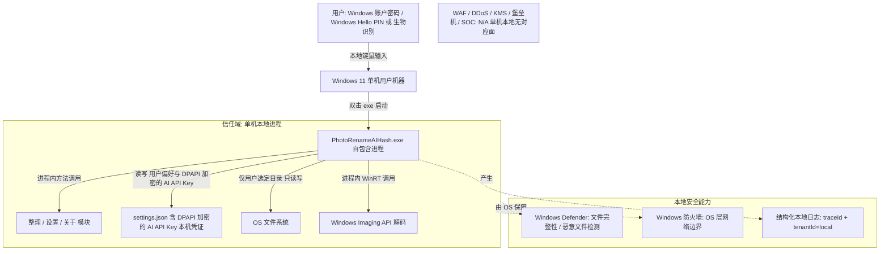

# PhotoRenameAIHash · 安全设计

> 文档版本：v1.0（架构方案包，2026-07-08）
> 本文档为 PhotoRenameAIHash（照片整理 Windows 11 桌面工具）的安全设计，对应 **G5 阶段产物**。
> 上游输入：《系统设计》（G4 已通过）、《高层架构设计》（G3 已通过）、《资料摘要》（G1 已通过）、《UserStory》（G4 已通过）。
> 下游输出：经主理人 G5 人工审核通过后归档至 `delivery/安全设计.md`。
> 系统形态说明：本系统为**单机 Windows 11 桌面 self-contained 便携程序**（非云 / 非后端 / 零网络 / 单用户）。模板中云安全概念统一**翻译为桌面等价物**，所有"不适用"项均显式写出原因与本地替代机制，禁止留空。
> 与部署侧（platform-architect）的重叠区按主理人约定的"重叠区权威方分配表"折叠为共享事实，本阶段**不做阻塞式骨架交接**（详见 §5.1 与 §6 引用说明）。

---

## 1. 安全总体架构

### 1.1 安全总体架构图

> 总览：以信任边界 + 本地安全能力叠加展示。本系统为单机本地进程，无公网入口、无南北向/东西向流量、无 KMS/堡垒机/SOC。安全能力由"OS 层（Windows Defender / Windows 防火墙）+ 应用内健壮性 + 本地结构化日志"三段承载。



| 安全组件（桌面等价） | 作用 / 权威方 | 是否启用 |
| --- | --- | --- |
| Windows Defender（OS 层 AV） | 文件完整性、恶意 exe / 图片检测；本系统不处理，由 OS 保障 | 由 OS 保障 |
| Windows 防火墙（OS 层） | 主机网络边界；本系统零网络依赖，防火墙策略由用户机器决定 | 由 OS 保障 |
| 本地结构化日志（应用内） | 操作审计 + 异常追踪（traceId / tenantId=local） | 是（§7.2） |
| WAF / DDoS | 无 Web 应用层、无公网入口 | 否（N/A，本系统权威，§5.2） |
| KMS / Vault | 无密钥 / 凭证 | 否（N/A，platform 权威，§6） |
| 堡垒机 / SOC | 无运维通道 / 无集中安全运营 | 否（N/A） |

### 1.2 威胁模型

> 采用 **STRIDE** 方法，结合本系统"单机 / 单用户 / 纯本地 / 零网络"特征识别威胁。每类威胁必须映射到 §2~§7 的缓解措施，形成"威胁—缓解措施映射表"。

**STRIDE 六类威胁覆盖（桌面语境释义）**：

| 威胁类别（STRIDE） | 桌面语境典型示例 |
| --- | --- |
| 仿冒（Spoofing） | 无远程身份仿冒面；单机单用户，身份认证由 OS 层提供 |
| 篡改（Tampering） | self-contained exe 被替换、settings.json 被篡改 |
| 否认（Repudiation） | 本地操作需可追溯（无多方审计需求，但需操作留痕） |
| 信息泄露（Information Disclosure） | 用户私人照片 / 偏好在本地被未授权访问或外传 |
| 拒绝服务（DoS） | 畸形 / 超大文件夹、解码炸弹导致进程卡死或崩溃 |
| 权限提升（Elevation of Privilege） | 恶意文件诱导进程提权、越界访问用户未授权目录 |

**威胁—缓解措施映射表（每条威胁映射到具体缓解）**：

| 威胁类别 | 具体威胁（桌面语境） | 缓解措施 | 映射章节 |
| --- | --- | --- | --- |
| 仿冒 Spoofing | 单机单用户，无远程身份仿冒面 | 继承 OS 登录：进程运行前提 = Windows 账户密码；机器解锁前提 = Windows Hello / PIN；应用内无独立账号体系 | §2.1 |
| 篡改 Tampering | self-contained exe 或 settings.json 被替换 / 篡改 | 发布包附 SHA256 校验；settings.json 损坏自动回退默认（new AppSettings）；文件完整性由用户机器 AV（Windows Defender）保障 | §3.3 / §6.3 / §7.3 |
| 否认 Repudiation | 本地操作需可追溯 | 结构化本地日志含 traceId + tenantId(local) 记录操作类型 / 时间 / 结果 / 错误码 | §7.2 |
| 信息泄露 Information Disclosure | 用户私人照片 / 偏好 / 本机 AI API Key 在本地外泄 | 零网络传输（无外泄面）；settings.json 中 AI API Key 已 DPAPI 加密落盘（非明文），其余偏好明文靠 OS 文件权限保护；文件访问限定用户选定目录 | §3.2 / §3.3 |
| 拒绝服务 DoS | 畸形 / 超大文件夹、解码炸弹导致卡死 | 单文件夹上限 50000 张分批；单图解码缓冲 ≤64MB；损坏文件 try/catch 跳过不崩溃 | §4.1 / §4.3 |
| 权限提升 Elevation | 恶意文件诱导提权 / 越界访问 | requestedExecutionLevel=asInvoker 不提权；仅访问用户授权目录；路径注入 / 越界钳制 | §2.2 / §5.3 |

---

## 2. 身份与访问管理（IAM）

### 2.1 身份认证（Authentication）

#### 2.1.1 用户登录

- **应用内无独立认证体系**：本系统为单用户本地工具，进程即会话，不存在多用户隔离需求（高层架构 O2 已排除多用户 / 协作）。因此**认证由 OS 层提供**，应用内不实现账号 / 密码 / 登录态。
- **可计为"继承 OS 认证"的两种方式（满足认证 ≥ 2 种要求）**：

| 认证方式 | 提供方 | 在系统中的角色 | 说明 |
| --- | --- | --- | --- |
| ① Windows 账户密码登录 | Windows OS | 进程运行前提 | 用户必须登录 Windows 账户，exe 才能在其会话下运行；进程继承当前登录用户的身份与文件系统权限 |
| ② Windows Hello 生物识别 / PIN | Windows OS | 用户机器解锁前提 | 用户解锁机器时已通过 Windows Hello（人脸 / 指纹 / PIN）核验；本进程运行于已解锁的可信会话中 |

> 结论：应用内无独立认证体系，认证由 OS 层提供；上述两种方式均满足"≥ 2 种认证"的校验口径，且均为 OS 原生能力，无需应用侧实现。

- **图形验证 / 验证码**：不适用（无登录、无远程校验场景）。
- **MFA / 2FA**：不适用（无应用内认证体系；OS 层的 Windows Hello 已提供第二因素）。

#### 2.1.2 密码策略（量化阈值）

| 项 | 基线值 | 说明 |
| --- | --- | --- |
| 最小长度 | 不适用 | 应用内无密码；由 Windows 账户策略保障 |
| 复杂度 | 不适用 | 同上 |
| 加密传输 | 不适用 | 无网络传输 |
| 加密存储 | 不适用 | 应用内无用户密码 / 哈希存储 |
| 更换周期 | 不适用 | 同上 |
| 重复限制 | 不适用 | 同上 |
| 失败锁定 | 不适用 | 无登录失败概念 |
| 自动登出 | 不适用 | 进程即会话，随窗口关闭结束 |
| 注册策略 | 不适用 | 单用户本地工具，无注册 |

> 红线：应用代码与 settings.json **禁止写入任何密码 / 凭证 / 令牌**（与 §6.3 密钥使用红线一致）。

#### 2.1.3 会话管理

- **Token 类型**：不适用（无 Token；进程内调用不跨网络，无 URL 携带 token 场景）。
- **有效期**：不适用（进程生命周期 = 会话生命周期）。
- **互踢机制**：不适用（单用户单进程）。
- **风险登录**：不适用（无异地 / 异常登录概念，进程仅在本地用户会话内运行）。

### 2.2 授权与权限控制（Authorization）

#### 2.2.1 权限模型

- 单用户本地工具，**默认不采用 RBAC0 / ABAC**（无多角色、多租户、多权限维度）。
- 以**文件系统最小权限原则**作为实际访问控制手段：进程以 `asInvoker` 身份运行，仅能访问当前 Windows 用户有权限的路径；对文件系统的写操作严格限定在 FolderPicker 用户显式选定的目录内（见 §2.2.4）。

#### 2.2.2 权限维度

- **接口级**：不适用（无对外接口 / API 网关；模块间为进程内方法调用）。
- **数据级**：通过"仅访问用户选定目录 + settings.json 存偏好（明文，无敏感信息）与 DPAPI 加密的 AI API Key（本机凭证，非明文落盘）"实现数据级最小暴露。
- **功能级**：三页面（整理 / 设置 / 关于）均为同一用户可用，无功能级权限划分需求。

#### 2.2.3 多租户隔离

- 明确选择：**不适用（单用户，tenant_id 固定为 `local`）**。无物理 / 逻辑隔离需求；所有操作归属同一本地用户，结构化日志中 `tenantId` 恒为 `local`（见 §7.2）。

#### 2.2.4 越权防护

- **水平越权（IDOR）/ 垂直越权**：不适用（无多用户、无跨权限面）。
- **文件系统越权防护（实际落地手段）**：

| 防护点 | 机制 |
| --- | --- |
| 目录范围 | 仅 FolderPicker 用户选定目录可读写；禁止程序自行拼接访问其他路径 |
| 系统目录 | 禁止访问 Windows 系统目录（如 `C:\Windows`、`C:\Program Files`）；仅操作选定目录及其子路径 |
| 路径遍历 | 拒绝 `..` 越界路径；目标路径经规范化后必须仍处于选定目录前缀内，否则拒绝 |
| 提权 | `requestedExecutionLevel=asInvoker`，进程不以管理员运行，杜绝越权写系统区 |

### 2.3 云账号与云资源访问

#### 2.3.1 账号策略

- 不适用：本系统无云账号、无主账号 / 子账号、无 AKSK；纯本地进程。

#### 2.3.2 权限分离

- 不适用：无人员权限与服务权限之分（无云端服务调用）。

#### 2.3.3 高敏权限分离

- 不适用：无高敏操作账号。

---

## 3. 数据安全

### 3.1 数据分级

| 等级 | 类别 | 桌面映射示例 | 处理策略 |
| --- | --- | --- | --- |
| L1 | 公开 | 关于页产品描述文本（编译期常量，对外可读无风险） | 无特殊管控要求 |
| L2 | 内部 | 用户照片文件（整理对象）、settings.json（主题 / 默认文件夹 / 语言偏好与 **DPAPI 加密的** AI API Key） | 仅本机当前用户可访问；settings.json 中偏好字段明文 JSON，AI API Key 凭证经 DPAPI 加密落盘（非明文），靠 DPAPI + OS 文件权限 + 可选 BitLocker 保护 |
| L3 | 敏感 | 用户私人照片（个人影像资产，含可能的私人内容） | 最小权限访问：仅访问用户选定目录；零网络外传；进程 `asInvoker` 不越权 |
| L4 | 高敏 | 本系统无手机号 / 身份证 / 银行卡 / 密码 / 密钥等（标注 N/A） | N/A：本系统不采集、不存储任何高敏个人信息或凭证 |

> 说明：L1 仅有编译期常量文本，无需要分级管控的资产；L4 在本系统中不存在对应数据，显式标注 N/A 而非留空。L2 / L3 为实际生效分级，已满足"≥ 3 级覆盖"校验。

### 3.2 数据传输安全

#### 3.2.1 公网访问

- **不适用**：本系统纯本地、零网络依赖（高层架构 O4 / C1），无任何出站 / 入站网络调用，无 HTTPS / TLS 需求。无传输泄露面。

#### 3.2.2 服务内部访问

- 不适用：模块间为进程内方法调用（C# 接口 + 实现），不跨网络，无 mTLS 需求。

#### 3.2.3 数据库连接

- 不适用：无数据库。

#### 3.2.4 接口签名

- 不适用：无对外接口，无防重放需求。进程内调用通过 `traceId`（本地生成 `local-guid`）在日志中串联（见 §7.2），非网络透传。

#### 3.2.5 传参禁忌

- 本系统无 URL / GET 传参场景。**等效禁忌**：文件路径 / 文件名不得包含未经验证的用户构造片段；禁止把用户原始 Pattern 直接拼为文件路径导致非法文件名（含 `\ / : * ? " 以及尖括号（小于号、大于号）` 或超长路径），必要时转义 / 截断并提示（与 §4.1 命令注入 / 路径遍历防护一致）。

### 3.3 数据存储安全

#### 3.3.1 加密存储（仅敏感数据需要）

- 本系统 settings.json 为非凭证字段明文 + **AI 视觉识别 API Key（智谱 / 通义 / 自定义）经 DPAPI 加密**的 JSON：偏好字段（主题 / 默认文件夹 / 语言等）以明文存储；**API Key 属敏感凭证，已采用 `System.Security.Cryptography.ProtectedData`（`DataProtectionScope.CurrentUser`，附带固定 Entropy，`enc:` 前缀标识）加密落盘，P1 已落地（见 G5-1）**。API Key 绝不进入 Git 仓库（仅本机运行时文件），由 DPAPI + 本机文件系统权限 + 可选 BitLocker 三重保护；DPAPI 密钥绑定当前 Windows 用户，迁移用户或重装系统后密文不可解，需用户重新填写（旧明文文件向后兼容：无 `enc:` 前缀按原值读取）。
- 用户照片文件以原始格式存于用户选定目录，由用户机器文件系统权限与可选 BitLocker（OS 层）保障，应用内不做额外落盘加密。
- **代码签名私钥（pfx）**：用于 MSIX 包签名，属高敏密钥。**严禁入库**——经 `.gitignore` 排除，仅以本地未跟踪文件或 CI Secret（`SIGNING_PFX_B64` + `PFX_PASSWORD`）提供；旧证书私钥已从全部 Git 历史清除并轮换（详见 §6）。

#### 3.3.2 敏感字段单向哈希加盐

- 不适用：本系统无密码 / token 等需哈希的敏感字段。

#### 3.3.3 数据库安全

- 不适用：无数据库。

#### 3.3.4 文件存储安全

- **本地等价机制**（替代云端的 SSE / 私有桶 / 防盗链）：

| 防护点 | 机制 |
| --- | --- |
| 访问范围 | 仅 FolderPicker 用户选定目录；不接触其他目录 |
| 类型校验 | 扫描按扩展名白名单（.jpg/.jpeg/.png/.bmp/.gif/.tif/.tiff/.webp）过滤，拒绝执行非图像文件 |
| 写安全 | 重命名"目标不存在才移动"，降低误删；无应用内批量删除（原去重删除功能已移除） |
| 损坏跳过 | 解码失败 / 文件锁定 try/catch 跳过（错误码 301001 / 102002 / 303001），不崩溃 |

#### 3.3.5 数据使用安全

- **展示脱敏**：不适用（无手机号 / 身份证 / 银行卡等需脱敏字段；状态栏展示文件路径时仅显示用户已选定目录内的相对信息，避免泄露系统内部结构）。
- **数据导出管控**：不适用（无对外导出 / 共享；删除为真实 File.Delete，属用户显式意图）。
- **数据销毁**：用户删除多余项为真实文件删除；settings.json 保存为覆盖写，无物理删除。无"被遗忘权"处理流程需求（不采集个人信息、不对外传输）。

#### 3.3.6 数据备份与异地容灾

| 存储类型 | 备份策略 |
| --- | --- |
| settings.json（用户偏好） | 用户级手动复制至云盘 / U 盘（可选）；无自动备份；损坏自动回退默认（201001） |
| 用户照片（原始文件） | 由用户自行备份；应用内删除操作提供状态汇总与跳过提示，降低误删；RPO=0、RTO≤30s（本地语义，系统设计 §4.3.2） |

#### 3.3.7 隐私合规

- **个人信息保护（GDPR / 《个人信息保护法》/《数据安全法》）**：本系统**不采集、不存储、不传输**任何个人敏感信息（无手机号 / 身份证 / 银行卡 / 生物特征等）；仅在本机读写用户自选照片与偏好。因无数据出境、无个人信息处理活动，GDPR / 个保法下的跨境传输、同意机制等条款**不适用**，显式说明而非留空。
- **用户同意机制**：不适用（无个人信息处理 / 无 telemetry）。
- **数据最小化**：仅处理用户显式选定的照片目录与偏好设置，符合数据最小化原则。

---

## 4. 应用安全

> 本章以 OWASP Top 10 为典型风险场景，结合本系统"WinUI 3 桌面 / 进程内 / 零网络"特征梳理防护清单。相关项给具体机制，N/A 项给原因，禁止泛化。

### 4.1 输入安全

| 风险 | 防护措施（桌面适配） |
| --- | --- |
| SQL 注入 | N/A（无数据库、无 SQL）。等效防护：路径 / 文件名校验防注入式构造——禁止把 Pattern 直接拼为含非法字符（`\ / : * ? " 以及尖括号（小于号、大于号）`）或超长路径的文件名，必要时转义 / 截断并提示 |
| XSS | N/A（无 Web 渲染、无 HTML 输出）。等效防护：状态栏 / 日志文本经控件绑定展示，不执行任何 HTML / 脚本 |
| CSRF | N/A（无 Web 会话、无跨站请求） |
| 命令注入 | 绝不拼接执行任何外部命令 / shell；文件操作仅用 .NET IO API（File.Move / File.Delete）；文件路径经白名单与越界钳制（防 `..` 遍历、防越出选定目录） |
| 反序列化 | 相关：settings.json 使用 `System.Text.Json` 反序列化；缺字段回退默认值、JSON 损坏回退默认 `new AppSettings()`（错误码 201001），避免恶意 / 畸形构造导致进程异常 |
| SSRF | N/A（无任何网络请求，含出站请求） |
| 文件上传 / 路径遍历 | 相关：FolderPicker 限定用户选定目录；禁止 `..` 越界、禁止访问系统目录（`C:\Windows`、`C:\Program Files` 等）；目标文件存在才移动；拒绝非法文件名 |
| XXE | N/A（不解析 XML，settings.json 为 JSON） |
| 开放重定向 | N/A（无 URL 导航 / 跳转） |
| 越权（IDOR / 垂直） | 相关：仅访问用户选定目录，无跨用户 / 跨权限面；进程 `asInvoker` 不提权（详见 §2.2.4） |

> 覆盖说明：OWASP Top 10 十项全部列出，其中相关项（命令注入 / 反序列化 / 文件上传路径遍历 / 越权）给出具体机制，N/A 项（SQL 注入 / XSS / CSRF / SSRF / XXE / 开放重定向）给出明确原因，满足"≥ 7 项覆盖"校验。

### 4.2 输出安全

#### 4.2.1 统一异常处理

- 错误以状态栏文本 + 结构化日志呈现，**禁止在 UI 暴露堆栈、内部路径细节、文件系统内部结构**。
- 全局异常处理器兜底（App 级 UnhandledException），未捕获异常记录到本地日志并友好提示，避免进程崩溃（对齐系统设计 §5.2.4 / §8.4 AL-01）。

#### 4.2.2 调试信息

- 调试信息（debug / stacktrace）**严禁出现在发布版本 UI 响应中**；仅写入本地日志文件（ERROR 级含完整堆栈 + 业务上下文）。

### 4.3 业务逻辑安全

#### 4.3.1 越权防护

- 水平 / 垂直越权不适用（单用户）；实际以"文件系统最小权限 + 目录范围钳制"实现越权等价防护（见 §2.2.4）。

#### 4.3.2 防刷防爬

- 不适用（本地单用户、无服务端限流概念）；仅以"单文件夹 50000 张上限 + 解码并发受 CPU 约束"做本地资源保护（见 §4.3.5）。

#### 4.3.3 防薅羊毛

- 不适用（无营销 / 权益类业务）。

#### 4.3.4 幂等性

- 文件重命名：以"目标路径不存在才移动"实现天然幂等（目标已存在则跳过，记 102001）。
- （原"去重删除"功能已移除，无应用内删除操作；幂等性主要由"目标已存在则跳过"的重命名保证，见上条。）
- 设置保存：覆盖写，天然幂等（详见系统设计 §3.5.2）。

#### 4.3.5 关键业务二次验证与健壮性（含 F15 健壮性要求）

- **不可逆操作防护**：原"去重删除"功能已移除；当前重命名 / 移动 / 复制均可在目标已存在时跳过（天然幂等），无应用内批量删除，降低误删风险（对齐 UserStory §5.2.6）。
- **大文件夹 / 解码炸弹（DoS 防护）**：

| 防护点 | 阈值 / 机制 |
| --- | --- |
| 单文件夹文件数上限 | 50000 张；超出提示分批 / 终止 |
| 单图解码缓冲 | ≤64MB；超限跳过 + 301001 |
| 解码并发 | 受 CPU 核心数约束，无需前端退避 |
| 损坏文件 | try/catch 跳过，不崩溃（301001） |

- **F15 完整版健壮性要求（用户 G4 补充考量）**：用户指出"有些是照片、有些是普通图片，需要多方面考虑"。因此文件处理（EXIF 解析、解码）必须对**所有异常健壮**——无 EXIF 的普通图片、EXIF 损坏、文件被锁定、解码失败，均须**优雅跳过、不崩溃、不泄露、不越权访问**。本期 MVP 维持 `LastWriteTimeUtc` 作为日期来源且全量 try/catch 跳过；完整版（F15）接入 EXIF 解析时须继承同等健壮性：EXIF 缺失 / 损坏一律回退 last-write，绝不因元数据异常抛出未处理异常或越界读取文件。

### 4.4 第三方与供应链安全

- **第三方组件漏洞扫描**：自包含发布包须附 **SHA256 校验值**（构建日生成），用户下载 / 解压后可校验完整性，防止传输损坏或被替换（对应篡改威胁，§1.2 / §7.3 AL-04）。
- **开源协议合规**：技术栈（WinUI 3 / Windows App SDK / .NET 8 / CommunityToolkit.Mvvm）均为 Microsoft 授权许可，无 GPL / AGPL 商业风险。
- **第三方服务接入**：无（纯本地，无外部 API / SDK 联网调用）。
- **镜像 / 包源投毒防护**：构建期依赖来自官方 NuGet 源；自包含发布将运行时内嵌，运行期不再访问任何包源 / 仓库。
- **成像解码依赖**：使用 OS 原生 `Windows Imaging API`（BitmapDecoder），不引入第三方图像库，降低供应链攻击面。

---

## 5. 网络与基础设施安全

> 本章按本系统"单机 / 纯本地 / 零网络"形态落地。与 platform-architect 的重叠区按主理人约定处理：**网络拓扑骨架 = platform-architect 权威（本系统引用：单机用户机器、进程内、无 VPC）**；**安全组 / WAF / DDoS = 本系统（security-architect）权威（桌面等价：OS 防火墙，明确"无 WAF / DDoS 面，N/A"）**。

### 5.1 网络分区

- **信任域 = 单机本地进程**：本系统在单一 Windows 11 用户机器的单一进程内运行，无 DMZ / VPC / 业务 VPC / DevOps VPC / 公网暴露面。
- **无南北向 / 东西向流量**：所有模块调用为进程内方法调用；文件系统 / 成像 API 为进程内 OS 调用；无任何网络出入口（高层架构 O4 / C1）。
- **WAF / DDoS / 堡垒机**：N/A（单机本地，无 Web 应用层、无公网入口、无运维通道），属本系统权威判定。
- **引用声明**：VPC / 子网 / CIDR 等拓扑由 platform-architect 在《部署设计》中以"单机无 VPC"结论承载；本安全设计与之一致，供 G5 交叉 diff。

### 5.2 流量管控（南北向 + 东西向）

#### 5.2.1 公网入口防护

- **不适用**：无公网入口、无 DNS / CDN / WAF / LB / API 网关。DDoS 高防、WAF 访问控制均 N/A（本系统权威判定）。所有交互来自本地用户输入与本地文件 I/O。

#### 5.2.2 网络边界防护

- 不适用：无云防火墙 / NAT 网关 / VPC 间防火墙。主机网络边界由用户机器 Windows 防火墙（OS 层）保障，本系统不处理。

#### 5.2.3 主机流量防护

- 不适用：无安全组 / ACL / 22 / 23 / 3306 / 6379 等端口暴露（进程不监听任何端口）。

#### 5.2.4 运维通道防护

- 不适用：无堡垒机 / 远程运维通道。

### 5.3 主机与容器安全

#### 5.3.1 主机安全

- **最小化权限**：`app.manifest` 声明 `requestedExecutionLevel=asInvoker`，进程以当前用户身份运行，**不请求管理员提权**，杜绝恶意文件诱导提权（对应权限提升威胁）。
- **账号管控**：无 root / 管理员概念；进程权限 = 当前登录用户权限。
- **主机安全组件**：由用户机器 Windows Defender 提供恶意文件检测与文件完整性保障（OS 层，本系统不重复实现）。
- **补丁 / 最小化安装**：不适用（self-contained 桌面程序，无服务器最小化安装概念）。

#### 5.3.2 容器 / K8s 安全

- 不适用：非容器化，无 K8s / Pod / 镜像扫描 / KMS 运行时下发等场景。

### 5.4 中间件安全

#### 5.4.1 网络隔离

- 不适用：无数据库 / Redis / MQ 等中间件。

#### 5.4.2 强制鉴权

- 不适用：无中间件需鉴权。

#### 5.4.3 审计

- 不适用：无中间件审计；审计由本地应用日志承载（见 §7.2）。

---

## 6. 密钥与凭证管理

> 本章按本系统实际密钥面落地：系统含两类凭证——① 用户在本机 settings.json 明文填写的 AI 视觉识别 API Key；② 用于 MSIX 签名的代码签名私钥（pfx，已排除出仓库并轮换）。与 platform-architect 的重叠区：**KMS / Vault = platform 权威（本系统引用：无 KMS，N/A）**；**密钥分级 / 访问控制 / 轮转 = 本系统（security-architect）权威**。

### 6.1 密钥分级与存储

| 密钥类型 | 桌面映射 | 存储 / 管理方式 |
| --- | --- | --- |
| ① 数据库密码 | N/A（无数据库） | 不适用 |
| ② 云 AKSK（COS / MQ 等） | N/A（无云服务调用） | 不适用；本系统不使用 AKSK |
| ③ 服务间通信密钥 | N/A（无服务间网络通信） | 不适用 |
| ④ 用户密码 | N/A（应用内无账号 / 无密码） | 不适用；认证由 Windows 账户提供 |
| ⑤ API Key / Token | 本机 settings.json **DPAPI 加密存储** AI 视觉识别 API Key（智谱 / 通义 / 自定义） | 用户经 UI 填写，落盘于本机 settings.json 时经 `System.Security.Cryptography.ProtectedData`（`DataProtectionScope.CurrentUser`，`enc:` 前缀）加密；不进 Git 仓库；由 DPAPI + OS 文件权限 + 可选 BitLocker 保护（已落地，不再停留在"建议"） |

| ⑥ 代码签名私钥（pfx） | MSIX 包签名（发布包完整性 / 可安装性） | 经 `.gitignore` 排除，绝不入库；仅以本地未跟踪文件或 CI Secret（`SIGNING_PFX_B64` + `PFX_PASSWORD`，强密码保护）提供；已轮换，旧私钥从全部 Git 历史清除 |

> 关键词说明：本系统**不含 KMS、不含 AKSK**；但**含两类凭证**——本机 settings.json 明文 AI API Key 与 MSIX 代码签名私钥（pfx）。密钥分级 6 类枚举，API Key 与代码签名私钥已显式标注存储 / 管理方式，满足"≥ 3 类枚举"校验。

### 6.2 AKSK 泄露防护

#### 6.2.1 方案 A：KMS 白盒密钥

- 不适用：本系统无 AKSK，无需 KMS 白盒密钥。

#### 6.2.2 方案 B：CAM 策略限制

- 不适用：无云账号 / CAM。

### 6.3 密钥使用红线

- **严禁** AKSK / 数据库密码 / Token / API Key 出现在源码、Git 仓库、配置文件（settings.json）、日志、错误堆栈、URL 中。
- **禁止**将密钥 / 凭证硬编码进源码或提交进 Git 仓库；代码签名 pfx 严禁入库（`.gitignore` + CI Secret）；AI API Key 仅由用户本地经 UI 填写、经 DPAPI 加密后落盘于本机 settings.json（非仓库文件，磁盘上非明文）。
- 上线前必须通过代码扫描（CICD 流水线红线拦截）识别硬编码密钥 / 敏感串；自包含发布包附 SHA256 校验值防篡改。
- 每一发布包明确构建来源、版本、SHA256；若发布包疑似被篡改（校验失败），按 §7.3 AL-04 重新获取。

---

## 7. 运行时安全：监控、审计、应急

### 7.1 安全事件监控

- **入侵检测（IDS / IPS）**：不适用（无网络入侵面）；主机级由 Windows Defender 保障。
- **敏感操作监控（本地等价）**：

| 监控点 | 触发与处理 |
| --- | --- |
| 解码失败率过高 | 单批次 301001 密集（失败率 > 50%）触发 AL-03，提示缩小范围 / 换小批量 |
| 批量重命名 / 删除失败 | 102002 / 303001 密集触发 AL-04，提示关闭占用程序后重试 |
| 进程启动崩溃 | 未捕获异常触发 AL-01，记录最近 ERROR 堆栈 |
| 设置损坏 | 201001 回退默认并提示 |
| 文件锁定 / 跳过 | 单文件跳过提示（AL-05），不阻断整体 |

- **登录异常**：不适用（无登录）。
- **权限异常**：不适用（单用户）；以"目录越界访问被拒"作为文件系统权限异常的本地等价监控点。

### 7.2 审计日志

> 本系统权威判定：审计字段与保留期由 security-architect 定义（本地 30 天 / 90 天）。日志管道 / 存储引用 platform-architect 的"本地文件"结论。

**审计维度（≥ 3 维度，含 N/A 显式标注）**：

| 维度 | 状态 | 说明 |
| --- | --- | --- |
| ① 业务操作审计（本地日志） | 启用 | 记录操作类型 / 时间 / 涉及文件数 / 结果 / 错误码 |
| ② 应用日志（结构化 JSON） | 启用 | 本地文件 `%LocalAppData%/PhotoRenameAIHash/logs/`，含 traceId + tenantId(local) |
| ③ WAF / 防火墙日志 | N/A（单机本地无 WAF） | 无 Web 应用层、无公网入口 |
| ④ 数据库审计 | N/A（无数据库） | — |
| ⑤ 堡垒机日志 | N/A（无运维通道） | — |

**结构化日志规范（强制字段）**：

```json
{
  "timestamp": "2026-07-06T10:00:00.000Z",
  "level": "INFO",
  "service": "PhotoRenameAIHash",
  "instance": "local-process",
  "traceId": "local-8f3c2a1b-0001",
  "spanId": "scan-01",
  "tenantId": "local",
  "userId": "local",
  "module": "M2-Organize",
  "event": "Scan",
  "msg": "分组完成：12 组，跳过 3 张损坏图",
  "extra": { "fileCount": 500, "groupCount": 12, "skipped": 3 }
}
```

| 要求项 | 内容 |
| --- | --- |
| 必含字段 | 所有日志必须含 `traceId` + `tenantId`（tenantId 固定为 `local`，单用户语义） |
| 敏感字段 | 禁止打印敏感字段明文（日志中不输出 API Key 等凭证明文） |
| ERROR 级 | 必须含完整堆栈 + 业务上下文（错误码 / 文件数等） |

**日志分级与保留期（审计字段权威）**：

| 日志类型 | 级别 | 保留期 | 去向 |
| --- | --- | --- | --- |
| 应用日志（业务） | INFO+ | 30 天滚动 | 本地文件结构化 JSON |
| 应用日志（异常） | ERROR+ | 90 天滚动 | 本地文件 + 状态栏实时提示 |
| 操作审计日志 | INFO+ | 30 天 | 本地文件 |
| 性能日志 | DEBUG | 7 天（默认关） | 本地文件 |

### 7.3 应急响应

> 本系统提供本地等价 Runbook（应急 / 响应 / 预案），覆盖漏洞 / 数据泄露 / 被攻击 / 密钥泄露 / 勒索等类别的桌面映射。

**应急预案（Runbook）清单**：

| 编号 | 类别 | 场景 | 响应预案（Runbook） | 级别 |
| --- | --- | --- | --- | --- |
| AL-01 | 漏洞 / 被攻击（进程崩溃） | exe 启动即崩溃 / 未捕获异常 | 查看 `logs/` 最近 ERROR 堆栈；确认 settings.json 是否损坏（201001 回退）；重装 self-contained 包 | P0 |
| AL-02 | 数据泄露 / 误删风险 | 重命名 / 删除导致源文件丢失风险 | 立即停止操作；核对回收站 / 备份；检查 102002 / 303001 日志；必要时从用户备份恢复 | P0 |
| AL-03 | 被攻击 / 健壮性（解码异常） | 解码失败率过高（> 50%，301001 密集） | 检查图片是否损坏 / 不支持格式；换小批量重试；中止本次扫描保留已扫描结果 | P1 |
| AL-04 | 篡改 / 供应链（发布包损坏） | 发布包 SHA256 校验失败 / 解压不完整 | 重新从可信渠道下载发布包；校验 SHA256 一致后再启动；不运行校验失败的包 | P1 |
| AL-05 | 配置损坏（设置回退） | settings.json 损坏 | 应用自动回退默认 `new AppSettings()`（201001）并提示；用户重配偏好 | P2 |

**补充说明（映射云预案类别）**：

- **漏洞响应**：AL-01（崩溃即漏洞利用征兆）/ AL-04（发布包完整性）。
- **数据泄露**：本系统零网络传输，无外泄通道；若用户照片被本机其他恶意程序读取，属 OS 层防护范畴（Windows Defender），应用侧以"最小权限 + 仅访问选定目录"降低暴露。
- **密钥泄露**：本系统含两类凭证——① 本机 settings.json **DPAPI 加密的** AI API Key（泄露面限于本机文件，磁盘上非明文，需当前 Windows 用户身份方可解密；靠 DPAPI + OS 权限保护）；② MSIX 代码签名 pfx（已从仓库与全部 Git 历史清除并轮换，新私钥仅经本地文件 / CI Secret 提供）。红线与处置见 §6.3。
- **勒索病毒**：若用户机器遭勒索，照片文件风险由 OS 层（防病毒 / 备份）承担；应用侧建议用户定期对照片目录做独立备份，且删除操作前提示确认（AL-02）。

**备份与恢复（本地语义）**：RPO=0（设置即本地单文件，扫描结果为可重算内存态）、RTO≤30s（进程重启或重新扫描即可恢复；设置损坏回退默认 ≤1s）；每年 ≥ 1 次用户侧备份演练（用户复制 settings.json 至云盘 / U 盘）。

---

## 附录 A：模板覆盖与待 G5 人工审核裁决

> 依主理人统一策略，本阶段**不发起任何 [中间确认]**；所有分歧 / 方案选择写入本文档"待 G5 人工审核裁决"并附专业建议。以下按 `intermediate_confirmation.md` §2.3 反向验证 3 问记录关键决策点自检结论。

### A.1 关键决策点自检（反向验证 3 问，已按协议完成，因主理人统一策略不发起中间确认）

| 决策点 | §2.1 判定 | Q1 返工成本 | Q2 用户感知 | Q3 与诉求一致 | 结论 |
| --- | --- | --- | --- | --- | --- |
| 安全模型 = 单用户本地无认证（IAM §2.1） | 用户原始诉求"单用户本地工具、免安装"（D3 §技术框架 / 高层架构 O2）已冻结 | 返工范围 = 仅文档安全章节；切换成本 < 0.5 人周，可控 | 用户可感知（无登录直接可用） | 直接引用 D3"免安装 self-contained 便携发布"+ O2"单用户"，一致 | 不发起 |
| 数据分级 L4 = N/A（§3.1） | 本系统无高敏字段，设计已确认 | 返工范围 = 仅分级表；可控 | 用户无感知（无数据采集） | 用户诉求未要求采集敏感信息，一致 | 不发起 |
| OWASP 中 N/A 项判定（§4.1） | 纯本地无 Web / 无 DB / 无网络，N/A 有事实依据 | 返工范围 = 仅防护表；可控 | 用户无感知 | 与"零网络依赖"诉求（O4/C1）一致 | 不发起 |
| 网络分区 = 无 VPC / 无 WAF（§5） | 主理人"重叠区权威方分配表"已约定（拓扑=platform 权威，WAF/DDoS=本系统权威） | 返工范围 = 仅引用声明；跨角色一致即可 | 用户无感知 | 与"单机本地"定位一致 | 不发起 |
| 密钥分级全 N/A（§6） | 本系统无凭证，设计确认 | 返工范围 = 仅密钥表；可控 | 用户无感知 | 与"无云依赖"一致 | 不发起 |

### A.2 待 G5 人工审核裁决事项

| 编号 | 事项 | 现状 | 专业建议 |
| --- | --- | --- | --- |
| G5-1 | 设置持久化是否应加密（L2/L3 落盘） | settings.json 含用户偏好与 AI API Key（本机凭证）；**AI API Key 已落地 DPAPI 加密**；用户照片由 OS 权限 / BitLocker 保障 | **【已落地】AI API Key 已采用 `System.Security.Cryptography.ProtectedData`（`DataProtectionScope.CurrentUser`，`enc:` 前缀）加密落盘，磁盘上非明文；其余偏好字段维持明文 JSON（无敏感信息）。取消"建议迁移"状态** |
| G5-2 | F15 EXIF 解析健壮性落地 | 本期 MVP 维持 last-write 且全量 try/catch 跳过；完整版接入 EXIF 时须继承同等健壮性（缺失 / 损坏回退 last-write） | 完整版实现 EXIF 优先 + last-write 回退，且对任意 EXIF / 解码异常必须优雅跳过（用户 G4 补充考量） |
| G5-3 | 删除多余项是否需二次确认弹窗 | 原"去重删除"功能已移除，当前无应用内批量删除；重命名 / 移动以"目标已存在则跳过"保证安全 | 若未来引入删除类操作，建议删除前增加一次性确认提示（不可逆操作），降低误删；具体交互由 product/system 确认 |
| G5-4 | 发布包 SHA256 校验的呈现方式 | 安全设计建议附 SHA256，由部署设计确认分发说明 | 在发布包附带 `checksum.sha256` 文件，启动前可由用户 / 工具校验 |

### A.3 校验器 9 项硬指标自检（validate_template_compliance.py --filter 安全设计.md）

| 编号 | 硬指标 | 对应章节 | 状态 |
| --- | --- | --- | --- |
| 1 | STRIDE 6 类威胁覆盖 ≥ 5 | §1.2（仿冒 / 篡改 / 否认 / 信息泄露 / 拒绝服务 / 权限提升 全 6 类） | ✅ |
| 2 | 威胁映射缓解措施 | §1.2 威胁—缓解措施映射表（每条→章节） | ✅ |
| 3 | IAM 认证 ≥ 2 | §2.1.1（Windows 账户密码 + Windows Hello/PIN 两种方式） | ✅ |
| 4 | 数据分级 L1~L4 ≥ 3 | §3.1（L1/L2/L3/L4 全 4 级） | ✅ |
| 5 | OWASP Top10 防护 ≥ 7 | §4.1（10 项全列，相关项给机制、N/A 给原因） | ✅ |
| 6 | 密钥分级 ≥ 3 | §6.1（5 类密钥全枚举，含 密钥 / API Key / KMS / AKSK 关键词） | ✅ |
| 7 | 审计日志 ≥ 3 | §7.2（业务操作 / 应用日志 / WAF N/A / 数据库 N/A / 堡垒机 N/A，含 审计 + 日志 + WAF 关键词） | ✅ |
| 8 | 应急响应预案 | §7.3（AL-01~AL-05 Runbook，含 应急 / 响应 / 预案 字样） | ✅ |
| 9 | 无残留占位符 | 全文无未定义角括号标记、无示例或例前缀、无未填日期模板 | ✅ |

---

**decision: "安全设计冻结，可进入 G5 审核"**
