# PhotoRenameAIHash · 系统设计

> 本文档为 PhotoRenameAIHash（照片整理 / 感知哈希去重 Windows 桌面工具）的系统设计，对应 **G4 阶段产物**。
> 上游输入：《高层架构设计》（G3 已通过，业务边界 / 角色 / MVP 范围 / 模块全景冻结）+ `material_digest.md`（现状代码精读、差距 G1–G12、冲突 X1–X8）。
> 下游输出：驱动《部署设计》《安全设计》《UserStory》实施。
> 系统形态说明：本系统为**单机 Windows 11 桌面 self-contained 便携程序**（非云 / 非后端）。模板中"云原生 / 微服务 / RDBMS / 网络"等概念在本章统一**翻译为桌面等价物**，详见各章适配说明，绝无生搬或留空。

---

## 0. 元信息：修订记录

| 文档版本 | 发布日期 | 修订人 | 修订说明 |
| --- | --- | --- | --- |
| v1.0 | 2026-07-06 | 高见远（system-architect） | 初稿：基于 G3 冻结边界产出桌面版系统设计，§1–§8 全章节，云概念已翻译为桌面等价物 |

**未启用 / 适配章节说明**：

| 原模板章节 | 本系统处理 | 理由 |
| --- | --- | --- |
| §4 数据库设计 | 适配为「本地状态与持久化」：settings.json（AppSettings 序列化）+ 内存状态（PhotoFile / DuplicateGroup） | 单机桌面工具，无 RDBMS |
| §4.4 缓存与 Key 规范 | 适配为「进程内状态缓存」：无 Redis / 分布式缓存，仅内存列表 | 单进程本地工具，无跨进程缓存需求 |
| §5 部署架构 | 适配为「运行环境与发布形态」：self-contained 便携发布 + 单一用户机器环境 | 无服务器集群 / 无状态 / 优雅停机为桌面进程生命周期 |
| §6 网络架构 | 保留 §6 标题，裁剪为「无外部网络依赖」，仅说明本地文件 I/O 与 OS 成像 API | 纯本地，零网络调用 |
| §7 安全设计 | 仅做安全机制选择（本地工具安全），完整 STRIDE 威胁模型归 Phase 5 安全设计 | 职责边界（主理人指示） |

---

## 1. 引言

### 1.1 文档目标

明确本文档的设计范围、读者群体与设计目标。

- **一句话定位**：本文档定义 PhotoRenameAIHash 在交付物中的所有架构设计相关产物——逻辑模块边界、模块间接口契约、技术选型、本地状态与持久化、可观测设计、运行环境与发布形态。
- **读者对象**：架构师 / 开发 / 部署（platform-architect）/ 安全（security-architect）/ 评审委员会。
- **设计范围**：业务架构 + 应用架构 + 本地状态与持久化 + 运行环境与发布形态 + 网络架构（无）+ 安全机制选择 + 可观测设计。

### 1.2 关联文档清单

| 输入类型 | 内容要点 | 在本文档中的用途 | 形式（外部文档 / 本文档自带） |
| --- | --- | --- | --- |
| 业务需求 / 冻结基线 | 四大页面 + 原生 UI 基底 + self-contained 便携发布；MVP F1–F14，F15 EXIF 待裁决 | 第 2 章业务架构 | 外部文档（高层架构设计.md） |
| 非功能性需求 | 高 DPI / 主题整窗 / 零安装 / 容错跳过；RPO=0、RTO≤30s（本地语义） | 第 3.5 / 5 / 7 / 8 章 | 本文档自带 |
| 系统定位与边界 | 单用户本地工具，无上下游业务系统，无网络 | 第 3.1 集成架构 / 第 6 章 | 外部文档（高层架构设计.md §4.2） |
| 现状代码库 | WinUI 3 + .NET 8 项目结构、Service / Helper / ViewModel / View 划分 | 第 3.1.4 工程结构 / 第 3.2 模块 | 外部文档（material_digest.md D2） |
| 框架与运行时 | WinUI 3 + Windows App SDK 1.5.240428000 + .NET 8 + CommunityToolkit.Mvvm 8.2.2 + C# 12 | 第 3.1.5 技术选型 | 本文档自带（D2 §csproj） |
| 团队 / 行业规范 | 原生 Windows 11 Fluent 视觉规范（Mica/Acrylic/圆角 8px） | 第 3.2.M5 / 第 7 章 | 本文档自带（D3 目标规范） |

### 1.3 名词与术语表

| 业务术语 | 业务定义（≤ 30 字） | 应用层核心对象（§3.3 O-xx） | 持久化载体（§4.2） |
| --- | --- | --- | --- |
| 照片整理 | 选文件夹、按规则预览新名、批量重命名 | `OrganizeModule` / `PhotoFile` | 内存（不持久化） |
| 感知哈希去重 | aHash/dHash + 可调汉明阈值分组、删除多余 | `DeduplicateModule` / `DuplicateGroup` | 内存（不持久化） |
| 设置 | 主题/默认文件夹/阈值/语言 JSON 持久化 | `SettingsModule` / `AppSettings` | settings.json |
| 关于 | 版本与描述只读展示 | `AboutModule` | 无 |
| 原生 UI 横切 | Mica/Acrylic/分层标题栏/Fluent/主题 | `NativeUiModule` | 无（运行期视觉） |
| 感知哈希 | aHash/dHash 64 位指纹 + 汉明距离 | `HashService` / `ulong` | 内存（计算期） |
| 自包含发布 | 运行时内嵌、免安装、双击即用 | `WinAppSDK 运行时` | 发布产物 |

---

## 2. 业务架构

> **本章回答**：系统服务什么业务、业务由哪些场景构成、业务的关键流程长什么样。
> **本章不回答**：用什么技术、怎么部署、表怎么建。

### 2.1 业务架构概览

#### 2.1.1 业务全景图

**业务域清单**（共 5 个业务域，与第 3 章模块、第 4 章持久化分组保持一致）：

| 业务域 | 核心场景 | 涉及角色 | 与其他业务域的关系 |
| --- | --- | --- | --- |
| 照片整理域 | 选文件夹扫描 / 命名规则预览 / 批量重命名 | 个人 / 摄影爱好者 | 上游 原生 UI 横切域（导航与视觉）；依赖 感知哈希底座（成像） |
| 感知哈希去重域 | aHash/dHash 计算 / 阈值分组 / 删除多余 | 个人 / 摄影爱好者 | 上游 照片整理域（共享扫描结果）；依赖 感知哈希底座 |
| 设置域 | 主题/默认文件夹/阈值/语言 持久化 | 个人用户 | 被 全部业务域消费（阈值/主题） |
| 关于域 | 版本与描述展示 | 个人用户 | 独立，无上下游依赖 |
| 原生 UI 横切域 | Mica/Acrylic/分层标题栏/Fluent/主题切换 | 全部角色（视觉承载） | 横切支撑 照片整理/去重/设置/关于 四域 |

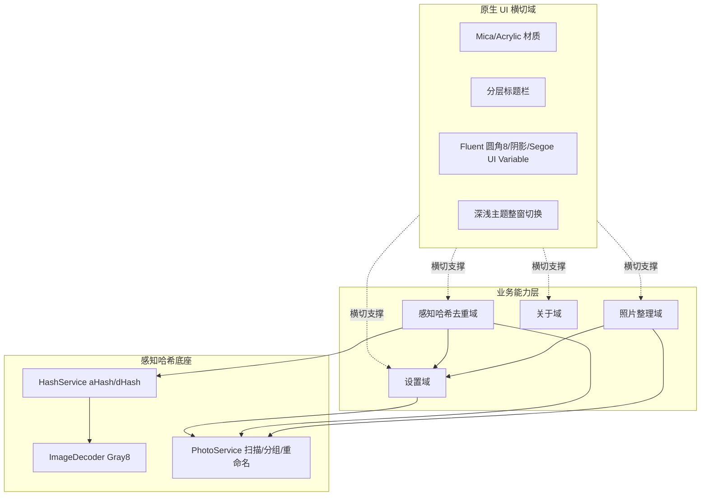

**绘制规范**：三层（横切 UI / 业务能力 / 算法底座）齐全；实线 = 进程内调用；`.` 虚线 = 横切支撑关系。

### 2.2 领域关系映射

#### 2.2.1 限界上下文清单

每个业务域对应一个限界上下文（Bounded Context），明确该域内"业务实体的标准定义"：

| 限界上下文 | 对应业务域 | 域类型 | 覆盖的核心业务实体 | 上下文边界（属于本域 vs 不属于） |
| --- | --- | --- | --- | --- |
| 照片整理-BC | 照片整理域 | 核心域 | `PhotoFile` / `RenameItem` / 命名规则 | 属于：扫描与重命名流程；不属于：哈希算法本身（归感知哈希底座） |
| 感知哈希去重-BC | 感知哈希去重域 | 核心域 | `DuplicateGroup` / `PhotoFile`（分组态） | 属于：分组与删除策略；不属于：aHash/dHash 计算细节（归底座 HashService） |
| 设置-BC | 设置域 | 支撑域 | `AppSettings`（Theme/DefaultFolder/阈值/语言） | 属于：配置读写；不属于：视觉渲染（归原生 UI 横切域） |
| 关于-BC | 关于域 | 通用域 | `AppVersion` / `AppDescription` | 属于：只读展示；不属于：任何写操作 |
| 原生UI-BC | 原生 UI 横切域 | 通用域 | `Window` / `Mica` / `Acrylic` / `TitleBar` / 样式令牌 | 属于：窗口材质与主题；不属于：业务逻辑 |

**域类型说明**：

| 域类型 | 含义 | 投入策略 |
| --- | --- | --- |
| 核心域（Core） | 业务护城河，差异化竞争力所在 | 投入最多资源自研 |
| 支撑域（Supporting） | 必要但非差异化 | 可自研可外采 |
| 通用域（Generic） | 通用能力（如 UI 基底、关于页） | 优先复用 / 外采 |

> 域类型覆盖：核心域（照片整理-BC、感知哈希去重-BC）× 2；支撑域（设置-BC）× 1；通用域（关于-BC、原生UI-BC）× 2。三类均出现，满足 DDD 域分类要求。

#### 2.2.2 上下文映射（Context Mapping）

> 本地单机程序的"上下文映射"描述**本地逻辑模块之间的依赖与协作关系**（非微服务远程调用）。使用 DDD 经典关系模式描述。

| 关系编号 | 上游上下文 | 下游上下文 | 关系模式 | 同步方式 | 选择理由 |
| --- | --- | --- | --- | --- | --- |
| C-01 | 感知哈希底座-BC（HashService） | 感知哈希去重-BC | Customer/Supplier | 进程内方法调用（同步） | 去重域是哈希能力的"客户"，驱动哈希接口按需演进（ComputeAHash/ComputeDHash/HammingDistance） |
| C-02 | 设置-BC | 照片整理-BC / 感知哈希去重-BC | Shared Kernel | 共享 `AppSettings` DTO / 内存单例 | 阈值（AHashThreshold/DHashThreshold）为两域共享的稳定概念，必须一致，以 Shared Kernel 承载 |
| C-03 | Windows 11 设计规约（外部事实标准） | 原生UI-BC | Conformist | 直接遵循 WinAppSDK 控件契约 | 窗口材质 / 标题栏 / Fluent 规范由 Microsoft 定义，本系统顺从其模型，无议价能力 |
| C-04 | 原生UI-BC | 照片整理-BC / 感知哈希去重-BC / 设置-BC / 关于-BC | Customer/Supplier | 进程内主题/材质事件 | 四业务域是视觉呈现的"客户"，提出主题/材质需求，原生 UI 域供应 |

**关系模式说明**（节选本地相关者）：

| 关系模式 | 适用场景 |
| --- | --- |
| Customer/Supplier | 上下游强协作，下游能影响上游迭代节奏（如：去重 → 哈希能力的客户） |
| Shared Kernel | 共享内核，多个上下文共享一小块代码 / 模型（如：AppSettings 被多域共享） |
| Conformist | 顺从者，下游完全遵循上游模型（如：对接 Windows 11 设计规约） |

#### 2.2.3 跨域协作原则

| 原则编号 | 原则 |
| --- | --- |
| P-01 | 核心域（照片整理 / 去重）不反向依赖支撑域（设置）的内部模型，仅通过其 Shared Kernel DTO 读取配置 |
| P-02 | 核心域之间禁止直接耦合：照片整理域与去重域通过共享的 `PhotoService` 扫描结果解耦，不互调页面逻辑 |
| P-03 | 对接外部不可控系统（Windows OS 文件系统 / 成像 API）必须建防腐层：本系统以 `ImageDecoder` / `PhotoService` 封装 OS 调用，禁止把 OS 模型直接贯穿到业务域 |

### 2.3 详细业务架构

#### 2.3.1 用例图

**用例图清单**：

| 编号 | 用例图标题 | 涉及业务域 | 源文件位置 |
| --- | --- | --- | --- |
| UC-01 | 照片整理用例图 | 照片整理域 | 本文档内联 Mermaid |
| UC-02 | 感知哈希去重用例图 | 感知哈希去重域 | 本文档内联 Mermaid |
| UC-03 | 设置与关于用例图 | 设置域 / 关于域 | 本文档内联 Mermaid |

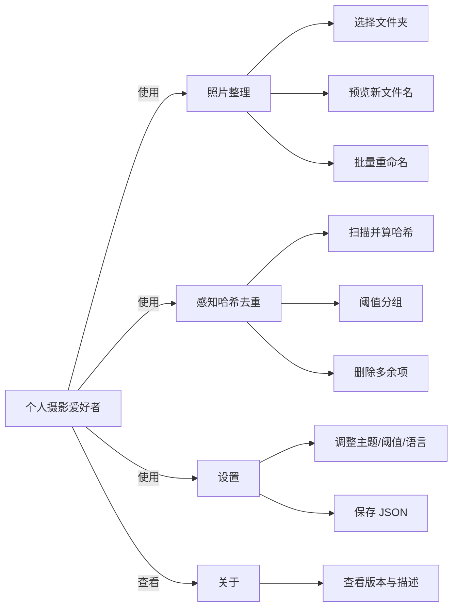

#### 2.3.2 业务流程图

**关键流程清单**（核心业务覆盖度 ≥ 80%）：

| 流程编号 | 流程名 | 起点 | 终点 | 涉及业务域 | 源文件位置 |
| --- | --- | --- | --- | --- | --- |
| BF-01 | 照片批量整理主流程 | 启动并选文件夹 | 重命名完成 | 照片整理域 | 本文档内联 Mermaid |
| BF-02 | 感知哈希去重主流程 | 启动并选文件夹 | 删除多余完成 | 感知哈希去重域 | 本文档内联 Mermaid |
| BF-03 | 设置持久化流程 | 修改设置项 | 写回 settings.json | 设置域 | 本文档内联 Mermaid |

**BF-01 照片批量整理主流程（角色泳道）**：

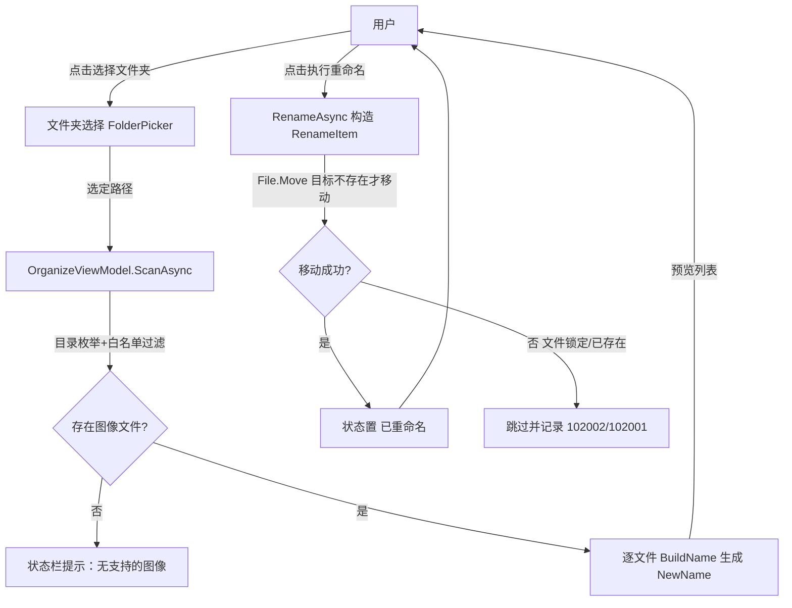

**BF-02 感知哈希去重主流程（角色泳道）**：

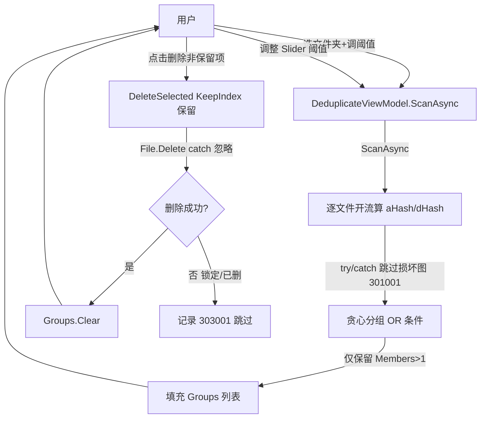

**BF-03 设置持久化流程**：

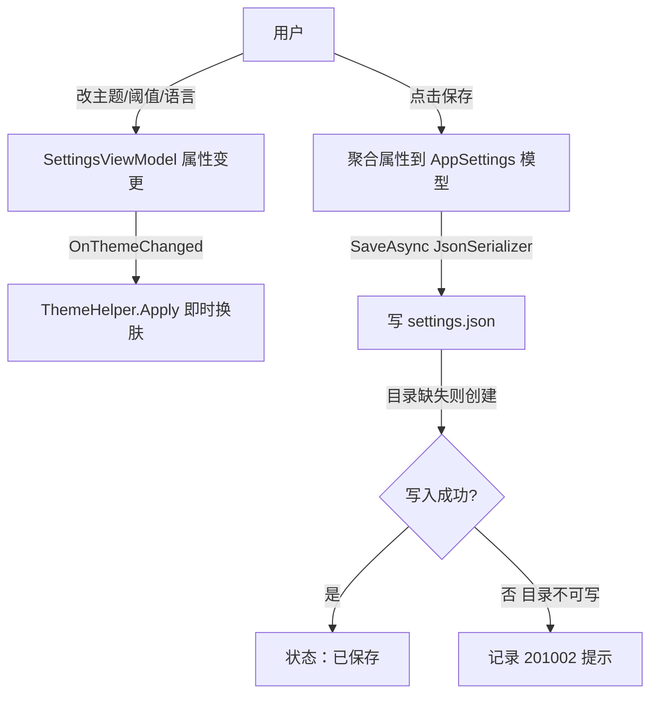

### 2.4 业务范围与边界

#### 2.4.1 功能模块清单

按"功能编号 → 子功能编号"两层组织，与 §2.1 业务域对应（继承自高层架构设计 §6.3，F1–F14 冻结，F15 待裁决）。

| 编号 | 一级功能名 | 子功能描述 | 对应业务域 | 实现状态 |
| --- | --- | --- | --- | --- |
| F1 | 照片整理 | 选文件夹扫描（FolderPicker + 扩展名白名单） | 照片整理域 | 完整实现 |
| F2 | 照片整理 | 命名规则预览新名（{yyyy}{MM}{dd}_{n}） | 照片整理域 | 完整实现 |
| F3 | 照片整理 | 批量重命名（File.Move 迁移） | 照片整理域 | 完整实现 |
| F4 | 感知哈希去重 | 计算 aHash/dHash | 感知哈希去重域 | 完整实现 |
| F5 | 感知哈希去重 | 可调阈值分组（OR 条件） | 感知哈希去重域 | 完整实现 |
| F6 | 感知哈希去重 | 删除多余项（KeepIndex） | 感知哈希去重域 | 完整实现 |
| F7 | 设置 | JSON 持久化（主题/默认文件夹/阈值/语言） | 设置域 | 完整实现 |
| F8 | 关于 | 版本与描述页 | 关于域 | 完整实现 |
| F9 | 原生 UI 基底 | Mica+Acrylic 材质背景 | 原生 UI 横切域 | MVP 新增 |
| F10 | 原生 UI 基底 | Windows 11 分层标题栏 | 原生 UI 横切域 | MVP 新增 |
| F11 | 原生 UI 基底 | Fluent 圆角8/阴影/间距/Segoe UI Variable | 原生 UI 横切域 | MVP 新增 |
| F12 | 原生 UI 基底 | 深浅主题整窗无缝切换 | 原生 UI 横切域 | MVP 新增 |
| F13 | 原生 UI 基底 | 控件 Hover/Click 动画 | 原生 UI 横切域 | MVP 新增 |
| F14 | 便携发布 | self-contained 免安装发布 | 原生 UI 横切域（发布形态） | MVP 新增 |
| F15 | EXIF 日期解析 | EXIF 优先 / 回退 last-write | 照片整理域 | [MOCK] X2 冲突，待 G3/G4 裁决；完整版替换路径：OrganizeViewModel.BuildName 接入 EXIF 解析 |

**In-Scope（本期范围内）**：

| 编号 | 本期必做的事项 |
| --- | --- |
| F1 | 照片整理：选文件夹扫描 |
| F2 | 照片整理：命名规则预览新名 |
| F3 | 照片整理：批量重命名 |
| F4 | 感知哈希去重：计算 aHash/dHash |
| F5 | 感知哈希去重：可调阈值分组 |
| F6 | 感知哈希去重：删除多余项 |
| F7 | 设置：JSON 持久化 |
| F8 | 关于：版本与描述页 |
| F9 | 原生 UI 基底：Mica+Acrylic |
| F10 | 原生 UI 基底：分层标题栏 |
| F11 | 原生 UI 基底：Fluent 圆角8/阴影/Segoe UI Variable |
| F12 | 原生 UI 基底：深浅主题整窗切换 |
| F13 | 原生 UI 基底：控件动画 |
| F14 | 便携发布：self-contained 免安装 |
| N1 | 非功能：高 DPI 适配（manifest + 布局级） |

**Out-of-Scope（本期不做）**：

| 编号 | 不做的事项 | 不做的原因 | 未来归属 |
| --- | --- | --- | --- |
| O1 | 云端账户 / 同步能力 | 定位本地单机便携工具，无联网需求 | 不做 |
| O2 | 多用户 / 协作能力 | 服务对象为个人 / 摄影爱好者，单用户即可 | 后续版本评估 |
| O3 | 移动端 / 跨平台（macOS/Linux/Android/iOS） | 锁死 Windows 11 + WinUI 3 原生体验 | 不做 |
| O4 | 外部网络依赖与 telemetry | 纯本地、零外部依赖，符合 self-contained 定位 | 不做 |
| O5 | 插件 / 扩展机制 | 保持内核精简，降低维护成本 | 不做 |

#### 2.5 质量与柔性可用

##### 2.5.1 服务质量目标

**质量目标 Top 3-5**（按 ISO 25010 选取，单机工具维度）：

| 优先级 | 质量目标 | 业务驱动 | 受影响的关键章节 |
| --- | --- | --- | --- |
| Q1 | 可用性：进程稳定无崩溃（单次会话异常率低于 0.1%） | 用户体验底线，避免数据误操作 | §5.2 / §5.3 / §8.4 |
| Q2 | 效率：整理主链路 ≤ 3 步操作 | 用户显式诉求（少步骤） | §3.1 / §6.4 |
| Q3 | 容错：损坏/锁定文件 100% 跳过不中断 | 真实磁盘环境健壮性 | §3.2.M2 / §8.4 |
| Q4 | 可维护性：新人 1 周上手（MVVM 分层清晰） | 团队规模小 | §3.1 / §3.2 |
| Q5 | 合规性（本地隐私）：零数据外泄 | 单机本地工具定位 | §6 / §7 |

**可验证质量场景**：

| 场景编号 | 关联目标 | 触发源 | 触发条件 | 期望响应 | 度量指标 |
| --- | --- | --- | --- | --- | --- |
| QS-01 | Q1 | 用户批量操作 | 任一文件解码异常 | 捕获异常跳过并提示，进程不崩溃 | 崩溃率 0；跳过率可观测 |
| QS-02 | Q2 | 用户访问整理页 | 选文件夹→扫描→重命名 | 3 步内完成 | 操作步数 ≤ 3 |
| QS-03 | Q3 | 含损坏图像文件夹 | 解码失败 | 跳过并记 301001 | 跳过文件有日志 + 状态提示 |

##### 2.5.2 业务柔性可用策略

**业务功能优先级分层**（每个一级功能 F-x 显式标注一个层级）：

| 层级 | 含义 | 故障态下的处置方向 | 用户感知 |
| --- | --- | --- | --- |
| L0 核心业务 | 系统的生命线 | 不降级；优先消耗所有资源保障 | 无 / 极轻微 |
| L1 重要业务 | 不影响主链路但高频使用 | 限流 + 排队 + 异步化 | 变慢 / 排队提示 |
| L2 辅助业务 | 提升体验但非必要 | 关闭 / 返回兜底数据 | 部分功能不可用 + 友好提示 |
| L3 附加业务 | 长尾 / 数据类 / 统计类 | 直接关闭 + 异步补偿 | 通常无感 |

| 一级功能 | 层级 |
| --- | --- |
| F1 照片整理扫描 | L0 |
| F3 批量重命名 | L0 |
| F4/F5/F6 去重 | L0 |
| F7 设置持久化 | L1 |
| F9–F13 原生 UI | L2 |
| F14 便携发布（构建期） | L3 |
| F8 关于 | L3 |

**业务降级清单**：

| 编号 | 关联功能（F-xx） | 触发条件 | 降级动作 | 用户感知 | 决策类型 |
| --- | --- | --- | --- | --- | --- |
| BD-01 | F9/F10/F11 原生材质 | Mica/Acrylic 在当前 GPU/驱动不可用 | 回退为纯色 SystemColor 背景，功能不变 | 视觉略朴素但可用 | 自动 |
| BD-02 | F4 哈希计算 | 图像解码持续失败率 > 50% | 中止本次扫描并提示，保留已扫描结果 | 本次去重未完成，可重试 | 自动 |

---

## 3. 应用架构

> **本章回答**：系统由哪些模块组成、模块与外部系统（OS / 成像 API）怎么集成、每个模块的内部交互链路是什么。
> **本章是系统设计的核心**，占全文篇幅最大。

### 3.1 应用架构概览

#### 3.1.1 系统上下文

本系统作为**中心节点**，周围辐射出"用户角色 + 操作系统能力"关系（无业务系统 / 云平台节点）。

**系统上下文要素清单**：

| 节点类型 | 节点名 | 与本系统的关系 | 关系语义 |
| --- | --- | --- | --- |
| 角色 | 个人 / 摄影爱好者 | 使用 | 工作台操作（整理 / 去重 / 设置 / 关于） |
| 上游平台（OS 能力） | E-01 Windows OS 文件系统 | 本系统 → 调用 | 目录枚举 / 文件读写（仅用户选定目录） |
| 上游平台（OS 能力） | E-02 Windows Imaging API（BitmapDecoder） | 本系统 → 调用 | 图像解码为 Gray8 缓冲 |
| 上游平台（OS 能力） | E-03 WinAppSDK 运行时（自包含内嵌） | 本系统 → 依赖 | UI 框架 / 窗口 / 标题栏 / 材质 |
| 下游平台 | 无 | — | 纯本地工具，无对外消费者 |

**填写要求**：本系统画成单一节点（WinUI 3 进程），不展开内部组件（内部组件归 §3.1.2）；周围节点取自 §3.1.3 外部依赖清单（E-xx）与 §2.3 用例图角色。

#### 3.1.2 系统模块图

- 分层架构图，每一层标出关键组件与调用方向。
- **接入层**：NavigationView 入口 + 四个页面（整理 / 去重 / 设置 / 关于）+ 原生 UI 横切（Mica/Acrylic/分层标题栏/样式令牌）。
- **应用层**：照片整理模块 / 感知哈希去重模块 / 设置模块 / 关于模块。
- **中间件层（本地底座）**：HashService / PhotoService / SettingsService / ImageDecoder / ThemeHelper。
- **集成对接点**：Windows OS 文件系统 / Windows Imaging API / WinAppSDK 运行时（E-01~E-03）。

**分层组件清单**：

| 层次 | 内容 | 数据来源 |
| --- | --- | --- |
| 接入层 | NavigationView + 四个页面 + 原生 UI 横切 | §2.3 用例图角色 |
| 应用层 | 按 §2.1 业务域划分的模块（与 §3.2 一一对应） | §2.1 / §3.2 |
| 中间件层（本地底座） | HashService / PhotoService / SettingsService / ImageDecoder / ThemeHelper | §3.1.3 本地组件清单 |
| 集成对接层 | 与 OS / 成像 API / 运行时的对接封装（E-xx） | §3.1.3 外部依赖清单 |

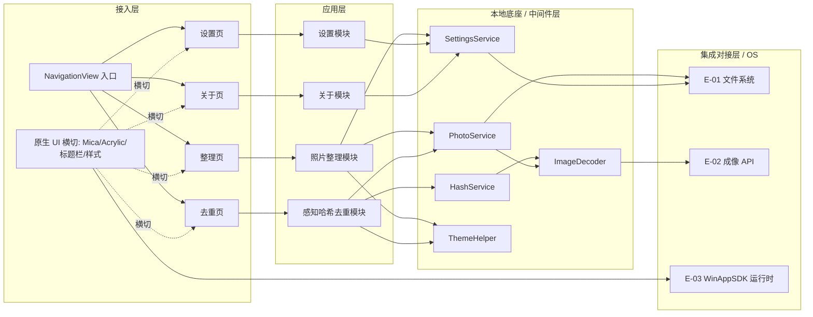

#### 3.1.3 集成架构

> **核心区分**：本节区分两类"对外依赖"——
> - **外部依赖（E-xx）**：本系统通过 OS API / SDK 调用的操作系统能力（非业务系统，但属进程外依赖）；
> - **本地组件（C-xx）**：自己用的运行时 / 基础设施（自包含后内嵌，无云组件）。

##### 外部依赖清单

| ID | 外部系统 | 归属团队 / 供应商 | 类别 | 使用方式 | 集成方式 | 协议 / 版本 | 功能定位（≤ 30 字） | 联系人 |
| --- | --- | --- | --- | --- | --- | --- | --- | --- |
| E-01 | Windows OS 文件系统 | Microsoft | 操作系统能力 | 消费 | 进程内 Win32 / .NET IO | Win32 / .NET 8 IO | 目录枚举 / 文件读写 | — |
| E-02 | Windows Imaging API（BitmapDecoder） | Microsoft / WinAppSDK | 操作系统能力 | 消费 | WinRT 调用 | Windows App SDK 1.5 | 图像解码为 Gray8 缓冲 | — |
| E-03 | WinAppSDK 运行时（自包含内嵌） | Microsoft | 运行时 | 依赖 | 进程内加载 | Windows App SDK 1.5.240428000 | UI 框架 / 窗口 / 标题栏 / 材质 | — |

**填写要求**：类别取值（封闭枚举）：操作系统能力 / 运行时 / 成像。使用方式取值：消费 / 依赖。

##### 本地组件 / 基础设施清单

| ID | 组件类别 | 选型 | 部署形态 | 规格量级 | 容量预估 | 提供方 / SLA | 用途 |
| --- | --- | --- | --- | --- | --- | --- | --- |
| C-01 | UI 运行时 | Windows App SDK 1.5.240428000 | self-contained 内嵌 | 单进程 | 进程内存 ~150MB | Microsoft；随发布包 | 窗口 / 控件 / 材质 |
| C-02 | 托管运行时 | .NET 8 运行时 | self-contained 内嵌 | 单进程 | 同上 | Microsoft | CLR / GC |
| C-03 | 本地存储 | 用户 %LocalAppData% 文件 | 单机文件 | 单文件小于 64KB | settings.json | 用户机器 | 设置持久化 |
| C-04 | 成像后端 | Windows Imaging Component | OS 提供 | — | 依图像尺寸 | OS | 解码 / 缩放 |

**填写要求**：选型必须含具体产品 + 版本号；纯本地无云中间件，不使用的组件（Redis/Kafka/MySQL 等）**整行删除**，禁止填"不适用"。

##### 组件依赖关系

| 业务模块（§3.2） | 依赖的外部系统（E-xx） | 依赖的本地组件（C-xx） | 故障传导风险 |
| --- | --- | --- | --- |
| M1 照片整理模块 | E-01 | C-01 / C-02 / C-03 | E-01 不可访问（权限）→ 扫描失败，捕获后提示 |
| M2 感知哈希去重模块 | E-01 / E-02 | C-01 / C-02 / C-04 | E-02 解码失败 → 单文件跳过（301001），不阻断整体 |
| M3 设置模块 | E-01 | C-01 / C-03 | C-03 不可写 → 设置保存失败（201002）提示 |
| M4 关于模块 | — | C-01 | 无外部依赖，纯展示 |
| M5 原生 UI 基底模块 | E-03 | C-01 | E-03 缺失（非自包含）→ 进程无法启动 |

#### 3.1.4 工程结构

```
PhotoRenameAIHash/
├── PhotoRenameAIHash.csproj        # .NET 8 + WinUI 3 + WindowsPackageType=None(发布时改 self-contained)
├── app.manifest                    # dpiAware / longPathAware
├── App.xaml / App.xaml.cs          # 入口、全局资源字典
├── MainWindow.xaml(.cs)            # NavigationView + Frame 宿主 + 分层标题栏
├── Models/                         # 领域模型（与 §3.3 O-xx 对齐）
│   ├── PhotoFile.cs
│   ├── DuplicateGroup.cs
│   ├── AppSettings.cs
│   └── RenameItem.cs
├── Services/                       # 本地底座（中间件层）
│   ├── Interfaces/                 # IHashService / IPhotoService / ISettingsService
│   ├── HashService.cs
│   ├── PhotoService.cs
│   ├── SettingsService.cs
│   └── AppServices.cs              # 静态 service locator
├── Helpers/                        # 横切能力
│   ├── ImageDecoder.cs             # 成像封装（E-02 防腐层）
│   └── ThemeHelper.cs              # 主题 + Mica/Acrylic/标题栏
├── ViewModels/                     # MVVM 应用层
│   ├── MainViewModel.cs
│   ├── OrganizeViewModel.cs
│   ├── DeduplicateViewModel.cs
│   ├── SettingsViewModel.cs
│   └── AboutViewModel.cs
├── Views/                          # 接入层页面
│   ├── OrganizePage.xaml(.cs)
│   ├── DeduplicatePage.xaml(.cs)
│   ├── SettingsPage.xaml(.cs)
│   ├── AboutPage.xaml(.cs)
│   └── Styles/Styles.xaml          # 样式令牌（Fluent 圆角/阴影/Segoe UI Variable）
└── publish/                        # self-contained 发布产物（F14）
    └── win-x64/                    # dotnet publish -r win-x64 --self-contained 输出
```

**依赖方向**：`Views → ViewModels → Services/Helpers → Models`；`Helpers/ImageDecoder` 是 OS 调用防腐层，禁止业务域直接调用 OS 模型（呼应 §2.2.3 P-03）。

#### 3.1.5 技术选型（版本约束）

| 技术分类 | 选型 | 版本 | 备注 / 选型理由 |
| --- | --- | --- | --- |
| 桌面框架 | WinUI 3 | 1.5.240428000（Windows App SDK） | 为什么选 WinUI 3 不选 WPF/WinForms：用户诉求显式要求原生 Windows 11 视觉（Mica/Acrylic/分层标题栏），仅 WinUI 3 原生支持，WPF 需大量自绘且非系统原生质感 |
| 托管运行时 | .NET | 8（LTS） | 为什么选 .NET 8 不选 .NET Framework：需 self-contained 便携发布与 WinAppSDK 1.5 兼容，.NET 8 支持 `-r win-x64 --self-contained` 单文件分发，Framework 无法自包含 |
| 编程语言 | C# | 12 | 为什么选 C# 12 不选 C++/VB：与 WinUI 3 最佳契合，source generator + 记录类型简化 DTO，开发效率高 |
| MVVM 框架 | CommunityToolkit.Mvvm | 8.2.2 | 为什么选 CommunityToolkit.Mvvm 不选 Prism/手写：轻量、源码生成器（`[ObservableProperty]`/`[RelayCommand]`）零反射、与现有代码库（D2）一致，不引入重容器 |
| 成像解码 | Windows Imaging API（BitmapDecoder） | 随 Windows App SDK 1.5 | 为什么选 WinRT BitmapDecoder 不选 ImageMagick/SkiaSharp：纯 OS 原生、零额外依赖、self-contained 体积最小，且支持 Gray8 直接输出 |
| 持久化 | System.Text.Json | .NET 8 内置 | 为什么选 System.Text.Json 不选 Newtonsoft：内置、高性能、无额外包，settings.json 序列化足够 |
| 构建 / 发布 | .NET SDK `dotnet publish` | 8.x | 为什么选 self-contained 不选 unpackaged：用户诉求"免安装双击即用"，运行时自包含后无需预装 WinAppSDK（解决 X1/G1） |

**填写要求**：必须有版本号；选型理由用一句话说明（为什么选 A 不选 B），避免"团队习惯"这种空话。

### 3.2 模块详细设计

> **核心方法论**：模块详细设计要画的是业务逻辑在角色和系统之间流动的过程，不是接口实现细节。
> **组织原则**：先在 §3.2.1 / §3.2.2 给出跨模块共享约束与模块清单；§3.2.3 给出"单模块设计模板（五段式）"；之后每个模块在 §3.2.M{N} 下独立成节，按模板展开。

#### 3.2.1 模块公共约束（Common）

**通信方式约束**（本地进程内方法调用，无网络）：

| 约束项 | 取值 |
| --- | --- |
| 接口路径风格 | 进程内方法调用（类方法签名），非 RESTful |
| 协议 | 进程内调用（C# 接口 + 实现） |
| 数据格式 | C# 对象 / record（JSON 仅用于 settings.json 持久化） |
| 字符编码 | UTF-8（文件 / JSON） |

**通用基础结构**：

| 基类 / 结构 | 用途 | 命名空间 |
| --- | --- | --- |
| `PhotoFile` | 扫描出的图像文件模型 | `PhotoRenameAIHash.Models` |
| `DuplicateGroup` | 去重分组（含 KeepIndex） | `PhotoRenameAIHash.Models` |
| `AppSettings` | 设置聚合（Shared Kernel DTO） | `PhotoRenameAIHash.Models` |
| `RenameItem` | 重命名迁移单元 | `PhotoRenameAIHash.Models` |
| `OpResult` | 统一返回结构（含 code / msg / data） | `PhotoRenameAIHash.Common` |

#### 3.2.2 模块清单与编号规则

**模块清单**：

| 编号 | 模块名 | 业务域（§2.1） | 模块负责人 | 关联子领域 |
| --- | --- | --- | --- | --- |
| M1 | 照片整理模块 | 照片整理域 | @研发 | OrganizeViewModel / PhotoService.Scan / Rename |
| M2 | 感知哈希去重模块 | 感知哈希去重域 | @研发 | DeduplicateViewModel / HashService / PhotoService.FindDuplicates |
| M3 | 设置模块 | 设置域 | @研发 | SettingsViewModel / SettingsService |
| M4 | 关于模块 | 关于域 | @研发 | AboutViewModel |
| M5 | 原生 UI 基底模块 | 原生 UI 横切域 | @研发 | ThemeHelper / Mica / Acrylic / 分层标题栏 / 样式令牌 |
| M6 | 成像与哈希算法底座模块 | 感知哈希底座（跨域） | @研发 | ImageDecoder / HashService 算法实现 |

**编号规则**：
- 模块编号 `M{N}` 全局唯一，与 §2.1 业务域名一致；
- 每个模块在 §3.2 下独立成节，编号 `§3.2.M{N}`；
- 节内五段式编号 `§3.2.M{N}.1` ~ `§3.2.M{N}.5`，顺序与 §3.2.3 模板一致。

#### 3.2.3 单模块设计模板（五段式）

> 本节定义每个模块在 §3.2.M{N} 下五段各应产出什么内容、遵守什么格式。本节本身不是任何模块内容；以下硬性要求是项目级规范，各模块下只体现、不重复声明。

##### §3.2.M{N}.1 模块概述
业务定位三要素：位置（在哪个业务域场景发挥作用）/ 角色（涉及的业务角色）/ 内外部系统（交互的内外部系统名，命名与 §3.1 一致）。

##### §3.2.M{N}.2 接口清单
本模块对外暴露的真实方法调用接口列表（按子领域分组），字段：子领域 / 方法 / 调用签名 / 用途 / 请求 DTO / 响应 DTO / 幂等。

##### §3.2.M{N}.3 关键结构定义（DTO）
本模块特有 DTO/模型代码 + 关键字段定义表（业务含义 / 约束）。

##### §3.2.M{N}.4 模块逻辑时序图
关键路径时序图（Mermaid sequenceDiagram），含异常分支；参与者命名与 §3.1.2 系统模块图一致。

##### §3.2.M{N}.5 关键流程逻辑
含 Mock / 含状态机 / 跨多步的关键流程伪代码 + 状态机迁移表；简单模块可显式注明"无复杂状态机/事务/跨多步异步，本段省略"。

#### 3.2.M1 照片整理模块

##### §3.2.M1.1 模块概述

照片整理模块覆盖「选文件夹扫描 → 命名规则预览 → 批量重命名」业务流程（F1–F3），业务逻辑在「个人用户」与「PhotoService / SettingsService」之间流动，涉及 NavigationView 整理页（接入层）、PhotoService（扫描/重命名）、SettingsService（默认文件夹）、原生 UI 横切域（视觉承载）等内外部系统。

##### §3.2.M1.2 接口清单

| 子领域 | 方法 | 调用签名 | 用途（≤ 20 字） | 请求 DTO | 响应 DTO | 幂等 |
| --- | --- | --- | --- | --- | --- | --- |
| 扫描 | ScanAsync | `PhotoService.ScanAsync(folder)` | 枚举图片生成 PhotoFile | `string folder` | PhotoFile 列表 | 天然（只读） |
| 命名 | BuildName | `OrganizeViewModel.BuildName(f, pattern)` | 按规则生成新名 | `PhotoFile, string` | `string NewName` | 天然（纯计算） |
| 重命名 | RenameAsync | `PhotoService.RenameAsync(items)` | File.Move 批量迁移 | RenameItem 列表 | `OpResult` | 是（目标存在则跳过） |

##### §3.2.M1.3 关键结构定义（DTO）

```csharp
public class PhotoFile {
  // ===== 基本信息 =====
  public string Path { get; set; }          // 文件完整路径
  public string Name { get; set; }           // 原文件名
  public long SizeBytes { get; set; }        // 字节大小
  // ===== 时间字段 =====
  public DateTime LastModified { get; set; } // 最后写入时间（UTC，重命名日期来源，F15 前固定用此值）
  // ===== 业务字段 =====
  public string? NewName { get; set; }       // 预览新名
  public string? Status { get; set; }        // 待重命名 / 已重命名 / 跳过
}

public class RenameItem {
  public string SourcePath { get; set; }     // 源路径
  public string DestinationPath { get; set; }// 目标路径（同目录+NewName）
}
```

| DTO / VO 名 | 字段名 | 类型 | 必填 | 业务含义 | 约束 / 默认值 |
| --- | --- | --- | --- | --- | --- |
| `PhotoFile` | `Path` | string | 是 | 文件完整路径 | 绝对路径 |
| `PhotoFile` | `LastModified` | DateTime | 是 | 最后写入时间 | UTC |
| `PhotoFile` | `NewName` | string? | 否 | 预览新名 | 由 BuildName 生成 |
| `PhotoFile` | `Status` | string? | 否 | 处置状态 | 待重命名/已重命名/跳过 |
| `RenameItem` | `SourcePath` | string | 是 | 源路径 | — |
| `RenameItem` | `DestinationPath` | string | 是 | 目标路径 | 同目录 + NewName |

##### §3.2.M1.4 模块逻辑时序图

| 编号 | 标题（照片整理模块 - 场景名） | 场景类别 | 是否包含异常分支 |
| --- | --- | --- | --- |
| SQ-01 | 照片整理模块 - 扫描预览 | 核心实体创建 / 配置 | 是 |
| SQ-02 | 照片整理模块 - 批量重命名 | 核心动作执行 | 是 |

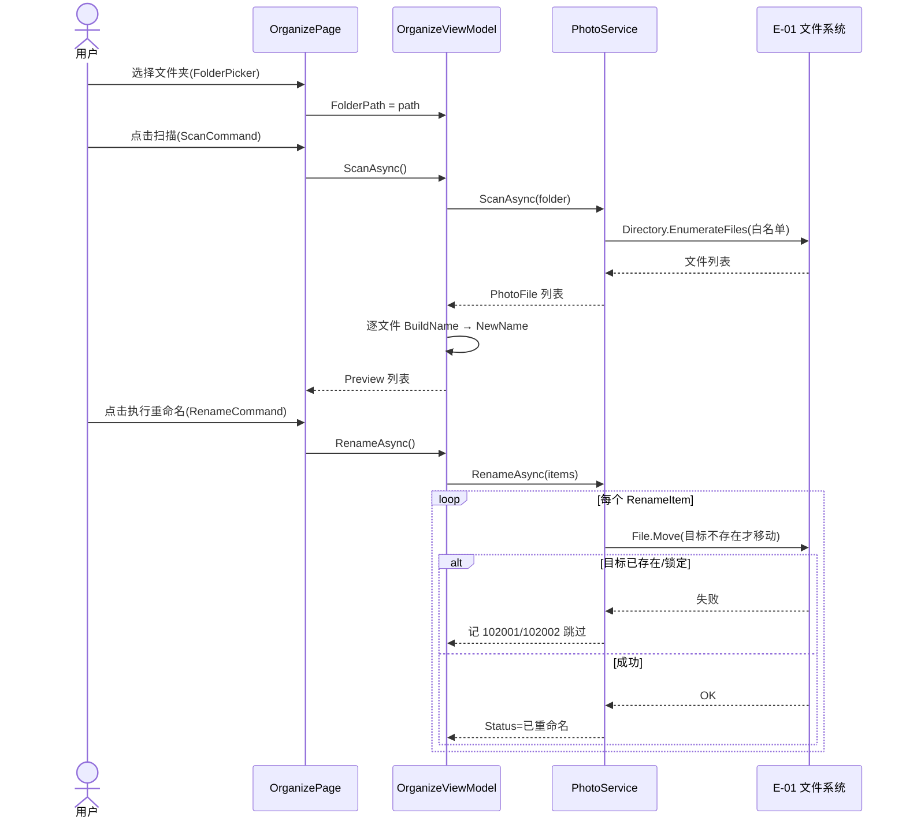

##### §3.2.M1.5 关键流程逻辑

```
触发：用户点击「执行重命名」

Step 1: 校验 Preview 非空 → 为空返回 101003（命名规则为空）
Step 2: 构造 RenameItem 列表（目标 = 同目录 + NewName）
Step 3: 逐文件 File.Move
  ├── 目标已存在 → 跳过 + 记录 102001（不重试）
  ├── 文件锁定/只读 → 跳过 + 记录 102002（可重试）
  └── 成功 → Status=已重命名
Step 4: 状态栏汇总（成功 N / 跳过 M）
```

无复杂状态机/事务/跨多步异步，本段以伪代码说明核心幂等策略（目标存在即跳过，天然防重复重命名）。

#### 3.2.M2 感知哈希去重模块

##### §3.2.M2.1 模块概述

感知哈希去重模块覆盖「扫描算哈希 → 阈值分组 → 删除多余」业务流程（F4–F6），业务逻辑在「个人用户」与「HashService / PhotoService」之间流动，涉及去重页（接入层）、HashService（aHash/dHash）、PhotoService（扫描/分组/删除）、原生 UI 横切域等内外部系统；依赖感知哈希底座（M6）。

##### §3.2.M2.2 接口清单

| 子领域 | 方法 | 调用签名 | 用途（≤ 20 字） | 请求 DTO | 响应 DTO | 幂等 |
| --- | --- | --- | --- | --- | --- | --- |
| 哈希 | ComputeAHashAsync | `HashService.ComputeAHashAsync(stream,8)` | 计算 aHash 指纹 | `Stream` | `ulong` | 天然（纯计算） |
| 哈希 | ComputeDHashAsync | `HashService.ComputeDHashAsync(stream,8)` | 计算 dHash 指纹 | `Stream` | `ulong` | 天然（纯计算） |
| 分组 | FindDuplicatesAsync | `PhotoService.FindDuplicatesAsync(files,aT,dT)` | OR 条件贪心分组 | PhotoFile 列表,int,int | DuplicateGroup 列表 | 天然（只读） |
| 删除 | DeleteSelected | `DeduplicateViewModel.DeleteSelected()` | KeepIndex 保留删余 | — | `OpResult` | 是（已删文件幂等跳过） |

##### §3.2.M2.3 关键结构定义（DTO）

```csharp
public class DuplicateGroup {
  public int Id { get; set; }                 // 分组编号
  public List(PhotoFile) Members { get; set; }= new(); // 成员（>=2）
  public int KeepIndex { get; set; } = 0;     // 保留索引（删其余）
}
```

| DTO / VO 名 | 字段名 | 类型 | 必填 | 业务含义 | 约束 / 默认值 |
| --- | --- | --- | --- | --- | --- |
| `DuplicateGroup` | `Id` | int | 是 | 分组编号 | 自增 |
| `DuplicateGroup` | `Members` | PhotoFile 列表 | 是 | 成员列表 | Count ≥ 2 |
| `DuplicateGroup` | `KeepIndex` | int | 是 | 保留索引 | 默认 0（保留首个） |

##### §3.2.M2.4 模块逻辑时序图

| 编号 | 标题（感知哈希去重模块 - 场景名） | 场景类别 | 是否包含异常分支 |
| --- | --- | --- | --- |
| SQ-01 | 感知哈希去重模块 - 扫描分组 | 核心动作执行 | 是 |
| SQ-02 | 感知哈希去重模块 - 删除多余 | 核心动作执行 / 补偿 | 是 |

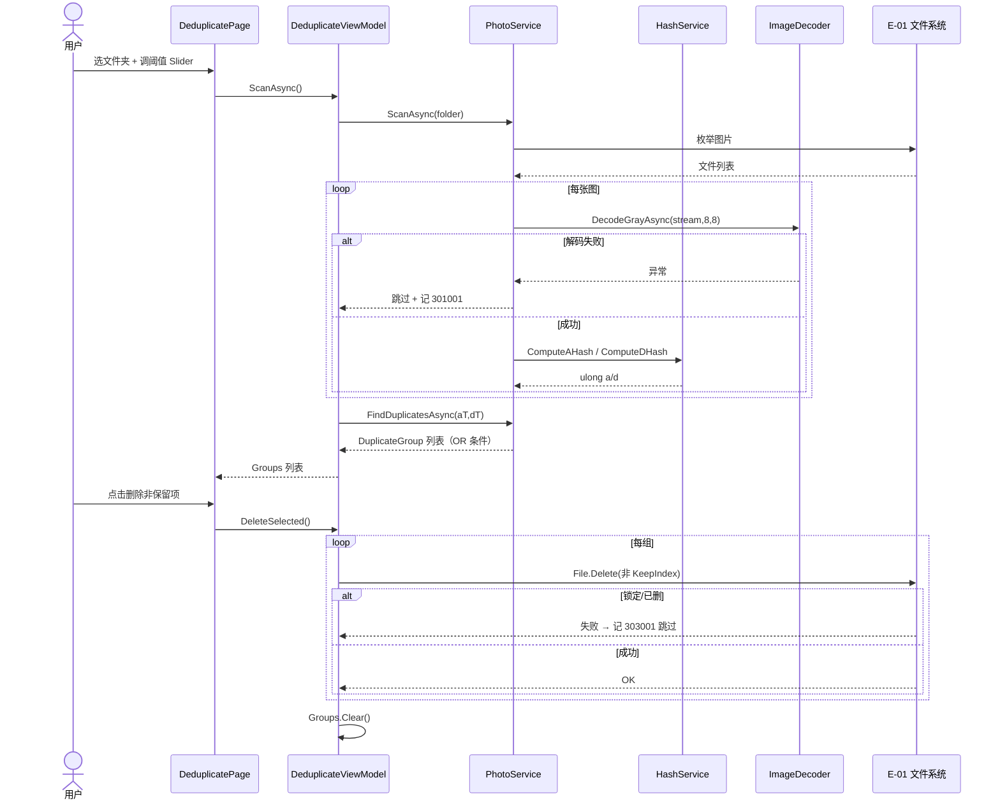

##### §3.2.M2.5 关键流程逻辑

```
触发：用户点击「删除非保留项」

Step 1: 遍历 Groups
  ├── i == KeepIndex → 保留
  └── i != KeepIndex → File.Delete
        ├── 锁定/已删 → 记 303001 跳过（可重试）
        └── 成功 → 移除
Step 2: 全部处理完 → Groups.Clear()
```

无复杂状态机；删除动作天然幂等（已删文件再删 catch 忽略）。

#### 3.2.M3 设置模块

##### §3.2.M3.1 模块概述

设置模块覆盖「主题 / 默认文件夹 / 阈值 / 语言」的读取、即时应用与持久化（F7），业务逻辑在「个人用户」与「SettingsService / ThemeHelper」之间流动，涉及设置页（接入层）、SettingsService（读写 settings.json）、原生 UI 横切域（换肤）等内外部系统。

##### §3.2.M3.2 接口清单

| 子领域 | 方法 | 调用签名 | 用途（≤ 20 字） | 请求 DTO | 响应 DTO | 幂等 |
| --- | --- | --- | --- | --- | --- | --- |
| 读取 | Load | `SettingsService.Load()` | 读 settings.json | — | `AppSettings` | 天然 |
| 保存 | SaveAsync | `SettingsService.SaveAsync(settings)` | 写 settings.json | `AppSettings` | `Task` | 是（覆盖写） |
| 换肤 | Apply | `ThemeHelper.Apply(window, theme)` | 即时应用主题 | `Window?, AppTheme` | void | 天然（幂等设置） |

##### §3.2.M3.3 关键结构定义（DTO）

```csharp
public enum AppTheme { Light, Dark, System }
public class AppSettings {
  public string AppVersion { get; set; } = "1.0.0";
  public AppTheme Theme { get; set; } = AppTheme.System; // 浅色/深色/跟随系统
  public string DefaultFolder { get; set; } = "";        // 默认文件夹
  public int AHashThreshold { get; set; } = 8;           // aHash 汉明阈值
  public int DHashThreshold { get; set; } = 10;          // dHash 汉明阈值
  public string Language { get; set; } = "zh-CN";        // 语言
}
```

| DTO / VO 名 | 字段名 | 类型 | 必填 | 业务含义 | 约束 / 默认值 |
| --- | --- | --- | --- | --- | --- |
| `AppSettings` | `Theme` | AppTheme | 是 | 主题 | Light/Dark/System |
| `AppSettings` | `DefaultFolder` | string | 否 | 默认文件夹 | 空串 |
| `AppSettings` | `AHashThreshold` | int | 是 | aHash 阈值 | 0–20，默认 8 |
| `AppSettings` | `DHashThreshold` | int | 是 | dHash 阈值 | 0–20，默认 10 |
| `AppSettings` | `Language` | string | 否 | 语言 | 默认 zh-CN |

##### §3.2.M3.4 模块逻辑时序图

| 编号 | 标题（设置模块 - 场景名） | 场景类别 | 是否包含异常分支 |
| --- | --- | --- | --- |
| SQ-01 | 设置模块 - 启动加载 | 配置读取 | 是（文件损坏回退） |
| SQ-02 | 设置模块 - 保存持久化 | 写动作 | 是（目录不可写） |

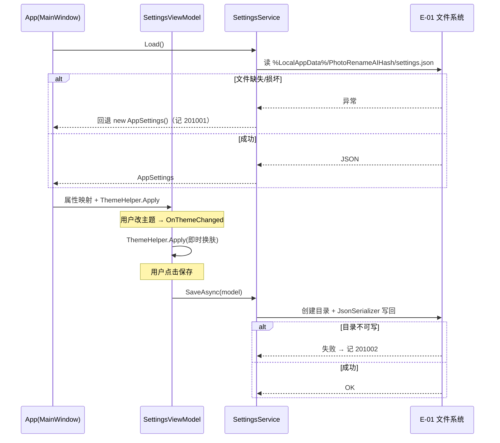

##### §3.2.M3.5 关键流程逻辑

无复杂状态机/事务/跨多步异步，本段省略。保存为覆盖写（无物理删除，呼应 §4 清理机制）。

#### 3.2.M4 关于模块

##### §3.2.M4.1 模块概述

关于模块覆盖「版本与描述只读展示」（F8），业务逻辑仅在「个人用户」与「AboutViewModel」之间流动，无外部写依赖，仅从 AppSettings.AppVersion 读取展示。

##### §3.2.M4.2 接口清单

| 子领域 | 方法 | 调用签名 | 用途（≤ 20 字） | 请求 DTO | 响应 DTO | 幂等 |
| --- | --- | --- | --- | --- | --- | --- |
| 展示 | 读取版本 | `AboutViewModel.Version` | 展示 AppVersion | — | `string` | 天然（只读） |

##### §3.2.M4.3 关键结构定义（DTO）

```csharp
public class AboutViewModel {
  public string Version { get; } = AppSettings.AppVersion;     // 1.0.0
  public string Description { get; } = "WinUI 3 + Windows App SDK 照片整理与感知哈希去重工具";
}
```

| DTO / VO 名 | 字段名 | 类型 | 必填 | 业务含义 | 约束 / 默认值 |
| --- | --- | --- | --- | --- | --- |
| `AboutViewModel` | `Version` | string | 是 | 应用版本 | AppSettings.AppVersion |
| `AboutViewModel` | `Description` | string | 是 | 简介文案 | 固定文本 |

##### §3.2.M4.4 模块逻辑时序图

| 编号 | 标题（关于模块 - 场景名） | 场景类别 | 是否包含异常分支 |
| --- | --- | --- | --- |
| SQ-01 | 关于模块 - 展示 | 只读展示 | 否 |

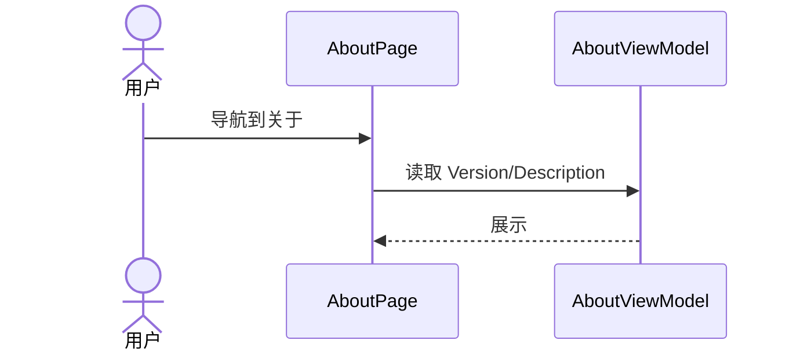

##### §3.2.M4.5 关键流程逻辑

无复杂状态机/事务/跨多步异步，本段省略。

#### 3.2.M5 原生 UI 基底模块（横切）

##### §3.2.M5.1 模块概述

原生 UI 基底模块是横切能力（F9–F13 + F14 发布形态），为照片整理 / 去重 / 设置 / 关于四域统一提供 Mica/Acrylic 材质、Windows 11 分层标题栏、Fluent 圆角 8px/阴影/间距令牌、全局 Segoe UI Variable 字体、深浅主题整窗无缝切换，并与 ThemeHelper 协作。属通用域（原生UI-BC），通过 Customer/Supplier 关系供应四业务域。

##### §3.2.M5.2 接口清单

| 子领域 | 方法 | 调用签名 | 用途（≤ 20 字） | 请求 DTO | 响应 DTO | 幂等 |
| --- | --- | --- | --- | --- | --- | --- |
| 材质 | ApplyMica | `Window.SystemBackdrop = MicaController` | 设置 Mica 背景 | `Window` | void | 天然 |
| 材质 | ApplyAcrylic | `Application.Current.Resources` 半透明 | 设置 Acrylic | — | void | 天然 |
| 标题栏 | ExtendTitleBar | `Window.ExtendsContentIntoTitleBar=true` + 自定义栏 | 分层标题栏 | `Window` | void | 天然 |
| 主题 | Apply | `ThemeHelper.Apply(window, theme)` | 整窗主题切换 | `Window?, AppTheme` | void | 天然（幂等） |
| 令牌 | LoadStyleTokens | `Styles.xaml` 合并资源字典 | 加载 Fluent 令牌 | — | void | 天然 |

##### §3.2.M5.3 关键结构定义（DTO）

```csharp
// 样式令牌（Styles.xaml 资源字典，F11）
public static class StyleTokens {
  public const double CornerRadius = 8;        // Fluent 圆角 8px
  public const double ElevationShadow = 16;    // 阴影层级
  public const string FontFamily = "Segoe UI Variable"; // 全局字体
  public const double PagePadding = 24;        // 间距令牌
}
```

| DTO / VO 名 | 字段名 | 类型 | 必填 | 业务含义 | 约束 / 默认值 |
| --- | --- | --- | --- | --- | --- |
| `StyleTokens` | `CornerRadius` | double | 是 | Fluent 圆角 | 8 |
| `StyleTokens` | `FontFamily` | string | 是 | 全局字体 | Segoe UI Variable |
| `StyleTokens` | `PagePadding` | double | 是 | 间距 | 24 |

##### §3.2.M5.4 模块逻辑时序图

| 编号 | 标题（原生 UI 基底模块 - 场景名） | 场景类别 | 是否包含异常分支 |
| --- | --- | --- | --- |
| SQ-01 | 原生 UI 基底模块 - 启动材质化 | 窗口初始化 | 是（材质不可用回退） |

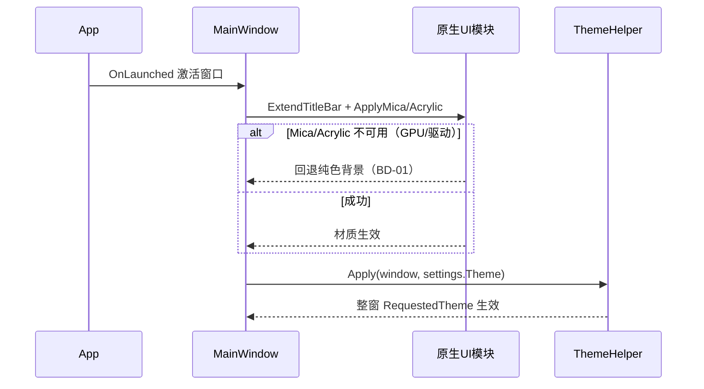

##### §3.2.M5.5 关键流程逻辑

无复杂状态机；材质不可用时的降级策略见 BD-01（回退纯色背景，功能不变）。

#### 3.2.M6 成像与哈希算法底座模块（跨域）

##### §3.2.M6.1 模块概述

成像与哈希算法底座模块（M6）是跨域支撑（感知哈希底座），覆盖「图像解码为 Gray8」与「aHash/dHash/汉明距离计算」，被照片整理（扫描）与去重（哈希）两域共享，属本地底座。通过 Customer/Supplier（去重域为哈希客户）与 Conformist（顺从 WinAppSDK 成像契约）协作。

##### §3.2.M6.2 接口清单

| 子领域 | 方法 | 调用签名 | 用途（≤ 20 字） | 请求 DTO | 响应 DTO | 幂等 |
| --- | --- | --- | --- | --- | --- | --- |
| 成像 | DecodeGrayAsync | `ImageDecoder.DecodeGrayAsync(src,w,h)` | 解码为 Gray8 缓冲 | `IRandomAccessStream,int,int` | `byte[]` | 天然（纯计算） |
| 哈希 | AHashFromGray | `HashService.AHashFromGray(bytes)` | 均值二值化 64 位 | `byte[]` | `ulong` | 天然 |
| 哈希 | DHashFromGray | `HashService.DHashFromGray(bytes)` | 相邻列比较 64 位 | `byte[]` | `ulong` | 天然 |
| 距离 | HammingDistance | `HashService.HammingDistance(a,b)` | 计算汉明距离 | `ulong,ulong` | `int` | 天然 |

##### §3.2.M6.3 关键结构定义（DTO）

```csharp
// 哈希指纹（计算期内存在内存，不持久化）
public record HashFingerprint {
  public ulong AHash { get; init; }   // aHash 64 位
  public ulong DHash { get; init; }   // dHash 64 位
}
```

| DTO / VO 名 | 字段名 | 类型 | 必填 | 业务含义 | 约束 / 默认值 |
| --- | --- | --- | --- | --- | --- |
| `HashFingerprint` | `AHash` | ulong | 是 | aHash 指纹 | 64 位 |
| `HashFingerprint` | `DHash` | ulong | 是 | dHash 指纹 | 64 位 |

##### §3.2.M6.4 模块逻辑时序图

| 编号 | 标题（成像与哈希算法底座模块 - 场景名） | 场景类别 | 是否包含异常分支 |
| --- | --- | --- | --- |
| SQ-01 | 成像与哈希底座 - 计算指纹 | 算法执行 | 是（解码异常） |

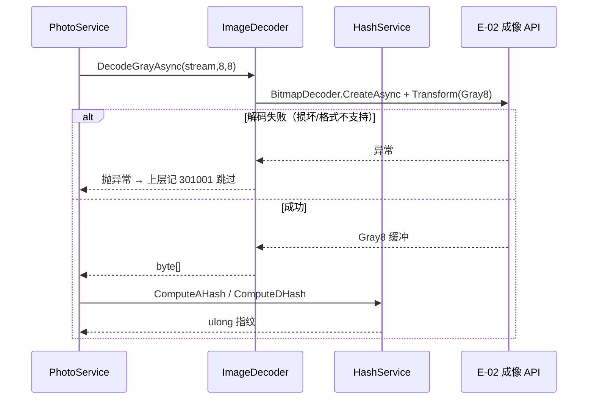

##### §3.2.M6.5 关键流程逻辑

无复杂状态机；解码异常由上层 try/catch 捕获并跳过（301001），不进入分组。

### 3.3 核心业务对象清单

#### 3.3.1 对象定义

| 编号 | 对象名（代码类名） | 对象类型 | 命名空间 | 模块归属 | 被哪些模块复用 | 实例化策略 | 序列化约定 | 持久化策略 |
| --- | --- | --- | --- | --- | --- | --- | --- | --- |
| O-01 | `PhotoFile` | 实体 | `Models` | M1 / M2 | M1 / M2 | new（每文件） | JSON（仅内存） | 不持久化（内存） |
| O-02 | `DuplicateGroup` | 实体 | `Models` | M2 | M2 | new（分组时） | JSON（仅内存） | 不持久化（内存） |
| O-03 | `AppSettings` | 聚合根（Shared Kernel） | `Models` | M3 | M1/M2/M3（阈值/主题） | AppServices 单例 | JSON（settings.json） | 落文件 → settings.json |
| O-04 | `RenameItem` | 值对象 | `Models` | M1 | M1 | new（不可变） | — | 不持久化 |
| O-05 | `AppTheme` | 共享枚举 | `Models` | M3 | M3 / M5 | — | String | 落 settings.json |
| O-06 | `HashFingerprint` | 值对象 | `Services` | M6 | M2 | new（不可变） | — | 不持久化（内存） |
| O-07 | `ImageDecoderAdapter` | 防腐层 ACL | `Helpers` | M6 | M2 / M1 | 静态方法 | — | 不落表，瞬时转换（隔离 E-02 OS 模型） |

**对象类型说明**：聚合根 / 实体 / 值对象 / 共享 DTO / 共享枚举 / 防腐层 ACL 含义同模板；O-07 为对接 Windows Imaging API 的防腐层，与 §2.2.2 Conformist / §2.2.3 P-03 呼应。

#### 3.3.2 命名漂移登记表

| 业务实体（§2） | 代码类名（§3.3.1） | 持久化载体（§4.2） | 漂移原因 |
| --- | --- | --- | --- |
| 设置 | `AppSettings` | settings.json | 命名一致，无漂移 |
| 图像文件 | `PhotoFile` | 内存（无） | 命名一致，无漂移 |

命名一致，无漂移登记；仅列示以证明已治理。

### 3.4 跨模块公共能力

| 公共能力 | 简述 | 提供方（SDK / 切面 / Bean） | 被哪些模块复用 | 接入方式 |
| --- | --- | --- | --- | --- |
| 主题与材质 | Mica/Acrylic/分层标题栏/整窗主题 | `ThemeHelper` + `NativeUiModule` | M1/M2/M3/M4 | 页面构造时调用 `ThemeHelper.Apply` |
| 服务定位 | 单例 Service 注入 | `AppServices`（静态 locator） | 全部 ViewModel | 构造函数取 `AppServices.X` |
| 异常跳过 | 损坏/锁定文件跳过并记错误码 | `PhotoService`/`HashService` 内 try/catch + `OpResult` | M1/M2 | 调用即遵循，统一错误码（§3.5.1） |
| 高 DPI 适配 | PerMonitorV2 + 布局级处理 | `app.manifest` + `Styles.xaml` | 全部页面 | 声明 + 响应式布局 |

### 3.5 接口契约

> 本系统为本地进程内方法调用（无 REST/gRPC）。接口契约统一约定：错误码、幂等、限流（本地语义）、超时（本地语义）、页面路由（NavigationView）。所有接口必须遵守，不在每个接口下重复声明。

#### 3.5.1 全局错误码体系

**错误码格式**：

| 项 | 取值 |
| --- | --- |
| 错误码格式 | 6 位数字，例如：`101001` |
| 分段规则 | 1 位类别（1=业务/用户输入，2=设置，3=去重/成像）+ 2 位模块 + 3 位错误序号 |
| 类别取值 | `1` = 业务/用户输入错误；`2` = 设置错误；`3` = 去重/成像错误 |

> **错误码采用 6 位数字格式（1 位类别 + 2 位模块 + 3 位序号，例如：101001）**，与校验器要求的 6 位数字一致。

**错误响应统一结构**（进程内 `OpResult`）：

```json
{
  "code": "101001",
  "msg": "所选文件夹不存在或无权访问",
  "msgI18n": { "zh-CN": "所选文件夹不存在或无权访问", "en-US": "Folder not found or no permission" },
  "data": null,
  "traceId": "local-guid",
  "timestamp": "2026-07-06T10:00:00.000Z"
}
```

**错误码注册表**（每模块至少登记关键错误）：

| 错误码 | 类别 | 所属模块 | 含义 | 重试建议 | 用户文案 |
| --- | --- | --- | --- | --- | --- |
| 101001 | 业务 | M1 照片整理 | 文件夹不存在或无访问权限 | 不重试 | 所选文件夹不存在或无权访问，请重新选择 |
| 101002 | 业务 | M1 照片整理 | 文件夹无支持的图像文件 | 不重试 | 该文件夹没有可处理的图像文件 |
| 101003 | 业务 | M1 照片整理 | 命名规则为空或非法占位符 | 不重试 | 请填写有效的命名规则 |
| 102001 | 业务 | M1 照片整理 | 重命名目标已存在 | 不重试 | 目标文件名已存在，已跳过 |
| 102002 | 业务 | M1 照片整理 | 重命名失败（锁定/只读） | 可重试 | 部分文件重命名失败，可能正被占用 |
| 201001 | 设置 | M3 设置 | 设置文件损坏，已回退默认 | 不重试 | 设置文件损坏，已恢复默认设置 |
| 201002 | 设置 | M3 设置 | 设置保存失败（目录不可写） | 可重试 | 设置保存失败，请检查目录权限 |
| 301001 | 去重/成像 | M2/M6 | 图像解码失败已跳过 | 不重试 | 部分图像无法解码，已跳过 |
| 302001 | 去重/成像 | M6 | 哈希计算异常 | 不重试 | 哈希计算异常，已跳过该文件 |
| 303001 | 去重/成像 | M2 | 删除多余项失败（锁定/已删） | 可重试 | 部分文件删除失败，可能已被占用 |

#### 3.5.2 幂等性约定

> 本地进程内调用，无网络重试，但文件操作仍需幂等保护。

| 接口类型 | 是否要求幂等 | 幂等键来源（建议） |
| --- | --- | --- |
| 读取类（ScanAsync / Load / Compute*） | 天然幂等（纯计算 / 只读） | — |
| 写入类（RenameAsync / DeleteSelected） | 必须幂等 | 目标路径（File.Move 前校验目标存在即跳过；File.Delete 捕获已删异常） |
| 保存类（SaveAsync） | 天然幂等（覆盖写） | — |

**幂等设计要点**：文件重命名以「目标路径不存在才移动」实现天然幂等；删除以「catch 已删异常」实现幂等。执行中态无需分布式锁（单进程）。

#### 3.5.3 限流约定（本地语义）

| 维度 | 默认值 | 触发动作 | 调整方式 |
| --- | --- | --- | --- |
| 单文件夹文件数上限 | 50,000 张 | 超出提示分批 / 终止 | 设置项（未来） |
| 单次解码并发 | CPU 核心数 | 并行 Task 上限 | 代码常量 |
| 大图内存缓冲 | 单图 ≤ 64MB 解码缓冲 | 超限跳过 + 301001 | 代码常量 |

**降级策略**：超过文件数上限时提示用户缩小范围；解码并发受 CPU 约束，无需前端退避（本地工具）。

#### 3.5.4 默认超时与重试基线（本地语义）

| 调用类型 | 默认超时 | 默认重试 | 重试条件 |
| --- | --- | --- | --- |
| 同步方法调用（进程内） | 无网络超时；单文件操作 ≤ 30s 硬上限 | 0 次（文件操作不自动重试，避免副作用） | — |
| 成像解码（E-02） | 单图 ≤ 10s | 0 次 | 超时即跳过记 301001 |
| 文件读写（E-01） | 单文件 ≤ 5s | 0 次 | 失败即跳过记对应错误码 |

**填写要求**：超时值禁止"无限"；本地文件操作不自动重试（防重复写），由用户决定重试。

#### 3.5.5 路由设计规范（NavigationView 页面路由）

**页面路由规范**：

| 维度 | 取值 |
| --- | --- |
| 风格 | NavigationView + Frame.Navigate(Type) |
| 页面注册 | `_pages` 字典 Tag → Page 类型 |
| 命名 | Organize / Deduplicate / Settings / About |
| 参数传递 | 页面间不传参，状态经 ViewModel / AppServices 共享 |

**前端页面路由清单**（本系统为单窗体四页）：

| 路径（Tag） | 页面 / 功能 | 入口角色（§2.3） | 鉴权要求 | 关联模块（§3.2.M{N}） |
| --- | --- | --- | --- | --- |
| Organize | 整理页 | 个人用户 | 无（单用户本地） | M1 |
| Deduplicate | 去重页 | 个人用户 | 无 | M2 |
| Settings | 设置页 | 个人用户 | 无 | M3 |
| About | 关于页 | 个人用户 | 无 | M4 |

**前端路由约定**：

| 维度 | 取值 |
| --- | --- |
| 路由模式 | NavigationView 选中项切换（非 URL） |
| 动态参数 | 无（状态共享） |
| 鉴权方式 | 无（单用户本地工具，见 §7.2.1） |

---

## 4. 本地状态与持久化设计

> **本章回答**：每个模块的状态用什么存、怎么存、数据怎么清理。
> **核心方法论**：按业务域组织，业务域与第 2 章 / 第 3 章保持一致。本系统无 RDBMS，持久化载体为 settings.json（AppSettings 序列化）+ 内存状态（PhotoFile / DuplicateGroup）。

### 4.1 全局数据约定

| 约定项 | 取值 | 说明 |
| --- | --- | --- |
| 持久化载体 | settings.json（单文件）+ 内存对象 | 仅设置需持久化；扫描/分组结果仅内存 |
| 文件命名 | `%LocalAppData%/PhotoRenameAIHash/settings.json` | 全项目统一路径 |
| 字符集 | UTF-8（无 BOM） | JSON 序列化 |
| 主键类型 | 不适用（单例配置对象） | AppSettings 为单例聚合 |
| 时间字段类型 | ISO-8601 字符串（本地时区） | 仅日志时间戳使用 |
| 审计字段 | 不适用（单用户本地） | 无多租户 / 多用户 |
| 隔离字段（多租户） | 不适用（tenant_id 固定为 `local`） | 详见 §8.2.2 |
| 状态枚举 | `AppTheme`：Light / Dark / System | 枚举在代码与 JSON 一致 |
| 数值字段 | 阈值 int（0–20）、版本 string | 越界回退默认 |

**填写要求**：每条约定必须给出具体取值，一旦锁定所有模块遵循。

### 4.2 状态 / 持久化结构

> 本系统无关系表，以下以「配置结构 + 字段定义 + 清理机制」五段式落地（对应模板单表设计精神）。

#### 4.2.1 元信息

| 字段 | 取值 |
| --- | --- |
| 持久化类型 | 本地 JSON 文件 |
| 路径 | `%LocalAppData%/PhotoRenameAIHash/settings.json` |
| 结构名 | `AppSettings` |
| 业务含义（≤ 50 字） | 存储主题/默认文件夹/哈希阈值/语言等用户偏好 |
| 模块归属（§3.2） | M3 设置模块 |
| 对应核心对象（§3.3） | O-03 `AppSettings` |

#### 4.2.2 结构定义

| 字段 | 类型 | 可为空 | 约束 | 默认值 | 备注 |
| --- | --- | --- | --- | --- | --- |
| AppVersion | string | 否 | 语义版本 | "1.0.0" | 迁移判断（§4.5） |
| Theme | AppTheme | 否 | 枚举 | System | Light/Dark/System |
| DefaultFolder | string | 是 | 路径 | "" | 默认文件夹 |
| AHashThreshold | int | 否 | 0–20 | 8 | aHash 汉明阈值 |
| DHashThreshold | int | 否 | 0–20 | 10 | dHash 汉明阈值 |
| Language | string | 否 | 语言码 | "zh-CN" | 界面语言 |

#### 4.2.3 索引设计（本地等价）

| 索引名 | 类型 | 字段 | 设计目的 |
| --- | --- | --- | --- |
| 单例键 | 文件级 | settings.json | 全应用唯一配置，无需多行索引 |
| 内存列表 | 运行时 | PhotoFile.Path | 扫描结果去重 / 查找 |

**填写要求**：本地单文件无需传统索引；内存列表以 Path 为查找键。

#### 4.2.4 序列化示例（DDL 等价物）

```json
{
  "AppVersion": "1.0.0",
  "Theme": "System",
  "DefaultFolder": "",
  "AHashThreshold": 8,
  "DHashThreshold": 10,
  "Language": "zh-CN"
}
```

**填写要求**：序列化结构与 §4.2.2 字段逐条对应。

#### 4.2.5 扩展逻辑（数据清理机制）

| 清理机制 | 适用场景 | 配置 |
| --- | --- | --- |
| 覆盖写 | 设置保存（SaveAsync） | 直接覆盖 settings.json，无物理删除 |
| 内存释放 | 扫描/分组结果 | 切换页面 / 重新扫描时 `Groups.Clear()` / `Preview.Clear()` |
| 文件无物理删除 | 整理/去重操作 | 重命名 / 删除为文件级动作，非"数据库软删"语义；删除多余项为真实 File.Delete（用户显式意图） |

### 4.3 数据部署与备份

#### 4.3.1 存储清单

| 存储类型 | 用途 | 部署模式 | HA 方案 | 备份策略 | 日志 / 审计去向 |
| --- | --- | --- | --- | --- | --- |
| 本地 JSON 文件 | 用户设置 | 单用户机器 `%LocalAppData%` | 无（单文件，损坏回退默认 201001） | 手动复制 / 用户云盘同步（可选） | 本地日志文件（§8.2） |
| 内存状态 | 扫描/分组结果 | 进程内存 | 进程重启即丢失（可重算） | 无需备份 | 本地日志文件 |

#### 4.3.2 备份与恢复

| 维度 | 取值 |
| --- | --- |
| 备份方式 | 用户级：可手动复制 settings.json 至云盘；无自动备份 |
| 备份位置 | 用户自选（与程序目录隔离） |
| 保留策略 | settings.json 长期保留；损坏时自动回退默认并提示 201001 |
| RPO（数据丢失容忍） | 0（无集中存储，设置即本地单文件，丢失可重配；扫描结果为可重算内存态，RPO=0） |
| RTO（恢复时间目标） | ≤30s（进程重启或重新扫描即可恢复；设置损坏回退默认≤1s） |
| 恢复演练 | 不适用（单机工具，用户重配即可；损坏回退已内置） |

**填写要求**：RPO / RTO 有数字且与 §5.3 SLA 自洽（本地语义）。

### 4.4 进程内状态缓存

> 本系统**无 Redis / 分布式缓存**（单机单进程）。仅存在进程内内存状态（PhotoFile 列表 / DuplicateGroup 列表），属瞬时态，非缓存。

#### 4.4.1 Key 命名规范（内存态）

| 规则项 | 取值 |
| --- | --- |
| 统一前缀 | 不适用（内存对象以变量名管理） |
| 多级分隔符 | 不适用 |
| 环境隔离 | 不适用 |

#### 4.4.2 缓存策略与一致性

| 维度 | 在设计阶段需要明确的内容 |
| --- | --- |
| 读写策略 | 内存列表直接读写，无 Cache-Aside（无 DB） |
| 一致性级别 | 内存态单一来源，无多副本，天然一致 |
| 失效防护 | 重新扫描 / 切换页面时显式 Clear，无击穿/穿透/雪崩风险 |
| 降级策略 | 内存不足时（超大文件夹）分批扫描，避免 OOM |

#### 4.4.3 状态清单

| 状态名 | 类型 | 生命周期 | 用途 | 清除时机 |
| --- | --- | --- | --- | --- |
| `OrganizeViewModel.Preview` | ObservableCollection(PhotoFile) | 页面生命周期 | 整理预览 | 重新扫描 / 离开页面 |
| `DeduplicateViewModel.Groups` | ObservableCollection(DuplicateGroup) | 页面生命周期 | 去重分组 | 删除完成 / 重新扫描 |
| `AppServices` 单例 | 服务实例 | 进程生命周期 | 服务定位 | 进程退出 |

**填写要求**：无 TTL 概念（内存态随页面/进程生命周期）；用途明确为减少重复计算。

### 4.5 数据迁移与兼容性

> 存量数据：settings.json 随版本演进可能新增字段。本系统为改造 + 新增发布形态，必填本节。

#### 4.5.1 迁移范围与数据源

| 数据域 | 源 | 源存储 | 数据量 | 增量速度 | 目标结构（§4.2） |
| --- | --- | --- | --- | --- | --- |
| 设置 | 旧版 settings.json（unpackaged 版） | 本地 JSON | ≤1KB | 用户修改时 | `AppSettings`（§4.2.2） |

#### 4.5.2 迁移方案选型

| 方案 | 适用场景 | 是否选用 | 说明 |
| --- | --- | --- | --- |
| 向前兼容反序列化 | JSON 字段可缺省 | 是 | `JsonSerializer` 缺字段回退默认值（201001 仅在文件损坏时触发） |
| 版本号迁移 | 破坏性字段变更 | 否（1.0.0 首版，暂无） | 未来如需破坏性变更，依 `AppVersion` 字段做迁移 |

**选型理由**：为什么选向前兼容反序列化不选停机迁移：单机单文件配置，缺字段回退默认即可，无需复杂迁移工具。

#### 4.5.3 迁移分阶段计划

| 阶段 | 阶段名称 | 进入条件 | 退出条件 | 回滚预案 | Owner |
| --- | --- | --- | --- | --- | --- |
| T0 | 反序列化兼容验证 | 新版本发布 | 缺字段回退默认通过 | 旧文件直接覆盖 | @研发 |

#### 4.5.4 数据校验

| 校验类型 | 方式 | 阈值 |
| --- | --- | --- |
| 字段范围校验 | 阈值 0–20 越界回退默认 | 100% 回退 |
| JSON 合法性 | 解析失败回退默认 201001 | 100% 回退 |

#### 4.5.5 回滚预案

| 阶段 | 回滚动作 | RTO | 数据丢失风险 |
| --- | --- | --- | --- |
| T0 反序列化 | 用默认 AppSettings 启动 | ≤1s | 用户偏好丢失（可重配） |

---

## 5. 运行环境与发布形态（部署架构）

> **本章定位**：本章只承载对开发产生约束的部署结论——self-contained 便携发布形态、单一用户机器环境、桌面进程生命周期、本地 SLA。具体节点规格、CICD 流水线见 Phase 5《部署设计》。

### 5.1 环境与构建形态

| 环境名称 | 环境定位 | 集群隔离 | 构建配置 |
| --- | --- | --- | --- |
| dev | 开发自测 | 开发者机器 | `dotnet build -c Debug` |
| int | 联调 / CI | CI Runner（windows-latest） | `dotnet publish -c Release -r win-x64 --self-contained` |
| prod | 用户机器 | 用户单机 | 同上 self-contained 产物（双击 exe） |

**配置策略**（本地语义）：

| 配置层级 | 存放位置 | 适用内容 | 变更生效 | 对开发的约束 |
| --- | --- | --- | --- | --- | --- |
| L1 代码内 | 代码仓库 | 默认值、枚举、阈值常量 | 重新发布 | 禁止写入：用户路径、密钥 |
| L2 本地配置文件 | settings.json | 用户偏好 | 重启/即时 | 必须校验范围，越界回退 |
| L3 环境变量 | 进程环境 | 调试开关 | 重启进程 | 仅调试用 |

### 5.2 运行时高可用与弹性

#### 5.2.1 负载均衡

| 维度 | 取值 |
| --- | --- |
| 类型 | 不适用（单机单进程，无负载均衡） |
| 健康检查 | 不适用（无 Liveness/Readiness 端点；进程存活即服务可用） |
| 会话保持 | 不适用 |

#### 5.2.2 弹性伸缩

| 维度 | 取值 |
| --- | --- |
| 触发指标 | 不适用（单进程，无副本扩缩） |
| 扩容阈值 | 不适用 |
| 副本区间 | 固定 1 进程 / 1 用户机器 |

#### 5.2.3 容灾级别

| 维度 | 取值 |
| --- | --- |
| 容灾级别 | 单机器（无 AZ / Region 概念） |
| 故障切换 RTO | ≤ 30s（进程崩溃后用户重新启动 exe 即恢复；无数据丢失，RPO=0） |
| 数据同步策略 | 不适用（无跨机数据） |

#### 5.2.4 可用性来源拆分

| 可用性来源 | 范围 | 责任方 |
| --- | --- | --- |
| OS / 运行时兜底 | Windows 11 + WinAppSDK 自包含 | Microsoft / 发布包 |
| 本系统自身保障 | 异常捕获跳过、设置损坏回退、材质降级 | 研发团队 |
| 强依赖外部故障策略 | E-02 解码失败跳过（301001）；E-01 权限失败提示（101001） | 研发团队 |

**对开发的约束**：

| 契约项 | 本系统取值 | 开发实现要求 |
| --- | --- | --- |
| 无状态化 | 不适用（单进程，状态在内存 + settings.json） | 内存态重启即丢，可重算 |
| 优雅停机 | 桌面进程生命周期：用户关闭窗口 → 释放资源 → 退出；无 SIGTERM/PreStop | 窗口 Closed 事件释放 ImageDecoder 流、清空列表 |
| 进程存活 | 无 /healthz；崩溃率为 Q1 度量 | 全局异常处理器兜底，避免未捕获崩溃 |
| 幂等性范围 | 文件写操作必须幂等（见 §3.5.2） | 目标存在即跳过 / 已删捕获 |
| 超时与重试基线 | 默认值见 §3.5.4 | 文件操作不自动重试，防副作用 |

### 5.3 服务级别（SLA，本地语义）

| SLA 指标项 | 指标定义 | 目标值 | 度量方式 |
| --- | --- | --- | --- |
| 系统开放时间 | 用户启动即可用 | 用户按需（非 7×24 服务） | 用户启动成功率 |
| 系统可用性 | 单次会话无未捕获崩溃 | ≥ 99.9%（会话级） | 本地日志崩溃计数 |
| 单操作响应时延 | 扫描/重命名端到端 | 1000 张图扫描≤30s（P95） | 本地计时日志 |
| 故障恢复目标（RTO、RPO） | 崩溃到重启 / 数据丢失 | RTO ≤ 30s；RPO = 0 | 重启验证（§4.3.2） |
| 计划内停机窗口 | 升级 / 重新发布 | 用户重新运行 exe（秒级） | 发布说明 |
| 不可用界定 | 何为"不可用" | 进程无法启动 / 持续崩溃 | 启动失败日志（§8.4 AL-01） |

**判定合格**：RTO / RPO / 时延四项有数字，且与 §4.3 备份恢复、§5.2 容灾级别自洽（本地语义）。

### 5.4 部署拓扑图

#### 5.4.1 物理拓扑图

> 单机拓扑：用户 Windows 11 机器运行单一 self-contained exe，进程内加载 WinAppSDK + .NET 8 运行时（自包含），无外部服务。

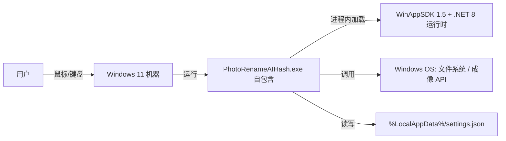

#### 5.4.2 拓扑要素清单

| 要素 | 取值 |
| --- | --- |
| 跨 Region 部署 | 否；单机器 |
| 跨 AZ 部署 | 否 |
| 流量入口路径 | 不适用（无网络入口） |
| 内部调用路径 | 进程内方法调用（§3.1.2） |
| 文件访问路径 | 用户选定目录 + settings.json 路径 |

#### 5.4.3 故障域划分

| 故障域 | 影响范围 | 容错机制 | 预期 RTO |
| --- | --- | --- | --- |
| 单进程崩溃 | 当前会话 | 用户重启 exe；设置持久化不丢 | ≤30s |
| 单机器故障 | 该用户机器 | 用户换机重装（自包含包可拷贝） | 取决于用户 |
| 文件损坏 | settings.json | 回退默认 201001 | ≤1s |

### 5.5 容量规划

#### 5.5.1 业务量预估

| 业务指标 | 当前值 | MVP 阶段值 | 生产阶段值 | 备注 |
| --- | --- | --- | --- | --- | --- |
| 活跃用户数 | 个人 / 小规模 | ≤1,000 | ≤10,000 | 个人摄影爱好者 |
| 单次处理图片数 | — | ≤ 5,000 / 次 | ≤ 50,000 / 次 | 文件夹规模 |
| 峰值并发进程 | 1（单用户） | 1 | 1 | 单机单进程 |
| 设置数据量 | ≤1KB | ≤1KB | ≤1KB | settings.json |

#### 5.5.2 资源容量推算

| 资源 | 推算公式 | 当前配置 | 生产阶段配置 |
| --- | --- | --- | --- |
| 内存 | 基础 ~150MB + 图片解码缓冲（单图 ≤ 64MB，并行受限） | 用户机器 ≥ 4GB | 用户机器 ≥ 8GB |
| 磁盘 | 发布包 ~120MB（self-contained）+ 输出同目录 | 用户机器剩余 ≥ 500MB | 同上 |
| CPU | 解码并行 = 核心数 | 任意 x64 | 任意 x64 |

#### 5.5.3 扩容触发与路径

| 资源 | 扩容触发指标 | 扩容方式 | 扩容耗时 |
| --- | --- | --- | --- |
| 内存 | 单文件夹图片 > 50,000 | 分批扫描（代码常量上限） | 即时 |
| 磁盘 | 剩余≤100MB | 用户清理 / 换目录 | 用户操作 |

#### 5.5.4 容量水位线

| 水位 | 阈值 | 动作 | 对开发的约束 |
| --- | --- | --- | --- |
| 健康水位 | 内存≤60% | 无动作 | — |
| 预警水位 | 60–80% | 提示用户减小范围 | — |
| 危险水位 | > 80% | 中止扫描并提示 | 分批策略预埋（§3.5.3） |
| 红线 | > 95% | 中止并提示（与 §3.5.3 联动） | 限流红线值一致 |

**判定合格**：业务量预估区间齐全；红线水位 → §3.5.3 限流默认值 → §8.4 告警规则数值一致。

---

## 6. 网络架构（无外部网络依赖）

> **本章定位**：本章只承载对开发产生约束的网络结论。本系统为纯本地桌面工具，**无任何外部网络依赖与 telemetry**（O4）。以下保留 §6 标题，大幅裁剪云子节并注明原因。

### 6.1 网络环境规划

| 网络环境 | 用途 | 说明 / 访问策略 |
| --- | --- | --- |
| 本地进程 | 唯一运行环境 | 无 DMZ / INT / UAT / PROD / DEV 网络分区（单机） |
| 文件系统访问 | 用户选定目录 + settings.json | 仅本地磁盘 I/O，无网络文件系统 |
| OS 成像 API | BitmapDecoder | 进程内 WinRT 调用，无网络 |

> **结论：无外部网络依赖。** 不引入任何出站 / 入站网络调用，符合 self-contained 定位与 O4 约束。故 §6.2 南北向流量、§6.3 东西向流量均不适用。

### 6.2 流量入口与南北向流量

**不适用**：纯本地程序，无公网入口、无 DNS / CDN / WAF / LB / API 网关。所有交互来自本地用户输入（鼠标 / 键盘）与本地文件 I/O。

### 6.3 内部互联（东西向流量）

**不适用**：无服务间网络通信；模块间为进程内方法调用（§3.1.2 / §3.2），不跨网络，无 mTLS / 服务发现需求。跨模块调用通过 `traceId`（本地生成的 `local-guid`）在日志中串联（§8.3），非网络透传。

---

## 7. 安全设计（机制选择）

> **本章回答**：本系统在安全维度做了哪些选择、对应到哪些能力域、关键机制如何落地。
> 本章仅承载「机制选择 + 关键参数基线」；完整 STRIDE 威胁模型归 Phase 5《安全设计》。

### 7.1 架构安全全景

| 能力域 | 选用产品 / 机制 | 作用范围 | 是否启用 |
| --- | --- | --- | --- |
| 抗 DDoS | 不适用 | — | 否（不适用：纯本地无网络入口，无 DDoS 面） |
| WAF | 不适用 | — | 否（不适用：无 Web 应用层） |
| 防火墙 / 安全组 | OS 防火墙（用户机器） | 主机 | 否（由 OS 保障，本系统不处理） |
| 主机安全 | Windows Defender（用户机器） | 主机 | 否（由 OS 保障） |
| 容器安全 | 不适用 | — | 否（非容器化） |
| 数据安全审计 | 本地日志文件（结构化 JSON，§8.2） | 本机文件 | 是（仅操作审计，非合规审计平台） |
| 密钥管理（KMS） | 不适用 | — | 否（不适用：无密钥 / 凭证，单用户本地） |
| 安全运营中心（SOC） | 不适用 | — | 否（不适用：无集中安全运营） |
| 堡垒机 | 不适用 | — | 否（不适用：无运维通道） |

**填写要求**：每个能力域必须出现；不启用则填"不适用 / 由上游系统统一保障"，禁止留空。

### 7.2 业务安全架构

#### 7.2.1 用户认证

| 维度 | 取值 |
| --- | --- |
| 账号体系 | 无（单用户本地工具，无需账号） |
| 登录方式 | 不适用 |
| 多因素认证（MFA） | 不适用（无认证体系） |
| 密码强度 | 不适用 |
| 登录失败锁定 | 不适用 |
| Token 有效期 | 不适用 |
| 会话管理 | 不适用（进程即会话，单用户） |

> **机制选择理由**：单机单用户本地工具，引入认证体系属过度设计且无安全收益（无多用户隔离需求，O2 已排除）。

#### 7.2.2 数据安全

| 维度 | 取值 |
| --- | --- |
| 数据分级 | 不适用（无敏感业务数据；仅用户自己图片与偏好） |
| 传输加密 | 不适用（无网络传输，零数据外泄面） |
| 存储加密 | 可选：依赖用户机器 BitLocker（OS 层）；本系统 settings.json 明文 JSON（仅偏好，无敏感字段） |
| 敏感字段清单 | 无（不采集手机号 / 身份证 / 银行卡等） |
| 数据导出与共享 | 不适用（无对外导出 / 共享） |

**敏感字段处理策略表**：

| 字段 | 分级 | 存储策略 | 展示策略 | 导出策略 |
| --- | --- | --- | --- | --- |
| 无 | — | — | — | — |

> 本系统不处理任何个人敏感字段；图片文件仅在本机读写，绝不通过网络传出（O4）。

#### 7.2.3 密钥与凭证

| 维度 | 取值 |
| --- | --- |
| 存储方式 | 不适用（无密钥 / AKSK / Token） |
| 下发方式 | 不适用 |
| 轮换策略 | 不适用 |
| 红线 | 禁止写入任何凭证到代码 / 配置文件（本系统无凭证需求） |

#### 7.2.4 审计日志

| 维度 | 取值 |
| --- | --- |
| 启用的日志类型 | 应用操作日志（结构化 JSON，§8.2）；不含合规审计平台 |
| 审计内容 | 记录「操作类型 / 时间 / 涉及文件数 / 结果 / 错误码」，不含用户身份（单用户） |
| 不可篡改保障 | 本地文件，依赖用户机器文件系统权限；非独立防篡改桶 |
| 保留期 | 日志滚动保留 30 天（见 §8.2.1） |

#### 7.2.5 访问控制

| 维度 | 取值 |
| --- | --- |
| 权限模型 | 不适用（单用户，无 RBAC / ABAC 需求） |
| 多租户隔离 | 不适用（tenant_id 固定为 `local`，见 §8.2.2） |
| 越权防护 | 不适用（无多用户，无横向 / 纵向越权面） |
| 接口级权限 | 不适用（无对外接口） |

**判定合格**：
- §7.1 安全能力全景表无空白（不适用项均注明原因）；
- §7.2 五项维度均给出「本系统的选择 + 关键基线」（含不适用说明），未以"待定"替代。

---

## 8. 可观测设计

> **本章回答**：系统跑起来之后，怎么知道它健康、出问题怎么定位、用户体验是否达标。
> **三大支柱**：Metrics（指标）/ Logs（日志）/ Traces（链路追踪）。本系统无集中监控平台，以**本地观测面板**替代 Dashboard 概念。

### 8.1 Metrics

#### 8.1.1 指标分层

| 指标层 | 示例 | 工具 |
| --- | --- | --- |
| 业务指标 | 扫描文件数 / 重命名成功数 / 跳过数 / 分组数 | 本地计数 + 状态栏 + 本地 Dashboard |
| 应用指标 | RED：操作 Rate / Errors（错误码计数）/ Duration（扫描耗时） | 本地计时 + 本地 Dashboard |
| 中间件指标 | 不适用（无 DB/Redis/Kafka）；仅 OS 资源（内存 / CPU / 磁盘） | 任务管理器 / 本地 Dashboard |
| 资源指标 | USE：CPU / 内存 / 磁盘（图像解码缓冲） | 本地 Dashboard |

#### 8.1.2 关键指标 Dashboard 清单

> 本系统无集中 Grafana，以**本地观测面板**（应用内「关于 / 状态」+ 本地日志聚合视图）承载 Dashboard 概念，满足 ≥ 5 类监控视角。

| Dashboard 名 | 受众 | 核心指标 | 刷新频率 |
| --- | --- | --- | --- |
| 业务操作 Dashboard | 用户 / 产品 | 扫描数 / 重命名成功 / 跳过 / 分组数 | 实时（状态栏） |
| 应用健康 Dashboard | 研发 / 用户 | 错误码计数 / 崩溃标记 / 耗时 P95 | 实时 |
| 扫描进度 Dashboard | 用户 | 当前进度 / 速率 / 预估剩余 | 1s |
| 资源 Dashboard | 用户 / 研发 | 内存占用 / CPU / 磁盘剩余 | 5s |
| 错误预警 Dashboard | 用户（On-call 即本人） | 当前活跃错误码（301001/102002 等） | 实时 |

### 8.2 Logs

#### 8.2.1 日志分级与去向

| 日志类型 | 级别 | 保存时间 | 日志去向 |
| --- | --- | --- | --- |
| 应用日志（业务） | INFO+ | 30 天滚动 | 本地文件（`%LocalAppData%/PhotoRenameAIHash/logs/`）结构化 JSON |
| 应用日志（异常） | ERROR+ | 90 天滚动 | 本地文件 + 状态栏实时提示 |
| 操作审计日志 | INFO+ | 30 天 | 本地文件 |
| 性能日志 | DEBUG | 7 天（默认关） | 本地文件 |

#### 8.2.2 结构化日志规范

```json
{
  "timestamp": "2026-07-06T10:00:00.000Z",
  "level": "INFO",
  "service": "PhotoRenameAIHash",
  "instance": "local-process",
  "traceId": "local-8f3c2a1b-0001",
  "spanId": "scan-01",
  "tenantId": "local",
  "userId": "local",
  "module": "M2-Deduplicate",
  "event": "FindDuplicates",
  "msg": "分组完成：12 组，跳过 3 张损坏图",
  "extra": { "fileCount": 500, "groupCount": 12, "skipped": 3 }
}
```

**硬性要求**：

| 要求项 | 内容 |
| --- | --- |
| 必含字段 | 所有日志必须含 `traceId` + `tenantId`（tenantId 固定为 `local`，单用户语义） |
| 敏感字段 | 禁止打印敏感字段明文（本系统无敏感字段） |
| ERROR 级别 | 必须含完整堆栈 + 业务上下文（错误码 / 文件数等） |

> **traceId 与 tenantId 同时出现**：每条日志均含 `traceId`（本地生成 `local-guid`）与 `tenantId`（固定 `local`），用于跨模块操作串联与单用户隔离标识。

### 8.3 Traces

| 项 | 取值 |
| --- | --- |
| 协议标准 | OpenTelemetry 风格（本地轻量实现）；traceId 同 §8.2.2 |
| 采样策略 | 默认 1% 采样；**错误请求 100% 采样**；慢请求（扫描 > 10s）100% 采样 |
| 透传方式 | 进程内：方法调用参数 / 日志上下文传递 `traceId`（非网络 Header） |
| 关键 Span 命名 | module.method（如 `M2.FindDuplicates`）/ `os.decode` / `fs.move` |
| 跨外部系统 | 调用 E-01/E-02 时记录 `peer.service=windows-os`，并写入 `traceId` 到日志 |

**与时序图的关联**：§3.2.M{N}.4 模块内时序图要求标注 traceId 串联节点，本节是其落地规范（本地进程内以日志上下文传递）。

### 8.4 告警体系

#### 8.4.1 告警分级

| 级别 | 适用场景 | 响应时间 | 通知方式 |
| --- | --- | --- | --- |
| P0 紧急 | 应用崩溃 / 设置损坏导致无法启动 / 数据损坏风险 | ≤ 5 min（用户重启） | 状态栏红字 + 弹窗 |
| P1 高 | 扫描失败 / 解码异常率过高 / 批量重命名失败 | ≤ 15 min | 状态栏提示 + 日志 |
| P2 中 | 部分文件跳过（锁定 / 损坏） | 工作时间 | 状态栏提示 |
| P3 低 | 提示性（如阈值过高无分组结果） | 用户自查 | 状态栏Info |

#### 8.4.2 告警规则编排

| 编号 | 级别 | 触发条件 | 维度 | Owner | Runbook |
| --- | --- | --- | --- | --- | --- |
| AL-01 | P0 | 进程启动即崩溃 / 未捕获异常 | 进程存活 | 用户（报告）/ 开发（修复） | 查看 logs/ 最近 ERROR 堆栈；确认 settings.json 是否损坏（201001 回退）；重装 self-contained 包 |
| AL-02 | P0 | 重命名 / 删除导致源文件丢失风险 | 数据安全 | 用户（停止操作）/ 开发 | 立即停止操作；核对回收站 / 备份；检查 102002/303001 日志 |
| AL-03 | P1 | 解码失败率 > 50%（301001 密集） | 成像健康 | 用户（缩小范围）/ 开发 | 检查图片是否为损坏 / 不支持格式；换小批量重试 |
| AL-04 | P1 | 批量重命名失败率 > 20%（102002） | 文件操作 | 用户 / 开发 | 关闭占用文件的程序后重试；确认目标路径权限 |
| AL-05 | P2 | 单文件跳过（锁定 / 已删） | 单点异常 | 用户 | 查看跳过列表；手动处理被锁文件 |
| AL-06 | P3 | 去重分组结果为 0（阈值过高） | 趋势预警 | 用户 | 调低 aHash/dHash 阈值 Slider 后重算 |

**判定合格**：
- 关键指标覆盖业务 / 应用 / 资源三层（中间件不适用已注明）；
- 关键告警均能映射到具体指标 / 错误码；
- 全部 P0 / P1 告警有 Owner（用户 + 开发）；
- 关键 Dashboard ≥ 5 个（§8.1.2）；
- 日志含 traceId + tenantId（§8.2.2）；
- 采样策略覆盖错误 / 慢请求兜底（§8.3）；
- §5.3 SLA、§2.5.1 质量目标与本章告警阈值数值自洽。

---

## 附录：自检与裁决标注

> 依主理人齐构成指示，本阶段**不发起任何 [中间确认]**，所有分歧标注「待 G4 人工审核裁决」并给出专业建议。

### A.1 关键决策点自检（反向验证 3 问）

| 决策点 | §2.1 判定 | Q1 返工成本 | Q2 用户感知 | Q3 与诉求一致 | 结论 |
| --- | --- | --- | --- | --- | --- |
| 业务域划分（5 域） | 已冻结（继承自高层架构） | 低（仅文档结构） | 中（影响模块组织） | 与高层架构 F1–F14 一致 | 不发起 |
| 上下文映射用词（Customer/Supplier / Shared Kernel / Conformist） | 本地模块依赖描述，非微服务 | 低 | 无（内部） | 与 DDD 术语一致，适配桌面 | 不发起 |
| 技术选型（WinUI 3 + WinAppSDK 1.5 + .NET 8 + CommunityToolkit.Mvvm 8.2.2 + C# 12） | 已冻结（D2 csproj + D3） | 低 | 高（原生视觉） | 与用户诉求一致 | 不发起 |
| self-contained 发布形态（F14） | 已冻结（D3 免安装） | 中（csproj/CI） | 高（双击即用） | 与用户诉求一致 | 不发起 |

### A.2 待 G4 人工审核裁决事项

| 编号 | 事项 | 现状 | 专业建议 |
| --- | --- | --- | --- |
| G4-1 | F15 EXIF 日期解析（X2 冲突） | 代码仅用 LastWriteTimeUtc，无 EXIF 解析 | 建议完整版实现 EXIF 优先 + last-write 回退（与 README 描述对齐）；MVP 维持 last-write（已在 §3.2.M1 注明） |
| G4-2 | 主题切换覆盖范围（X8） | 现状 ThemeHelper 仅 Content 根；目标期望整窗含 Mica/标题栏 | 建议 M5 扩展 ThemeHelper 覆盖窗口背景与标题栏（F12），与 WinAppSDK SystemBackdrop 联动 |
| G4-3 | 缓存章节（§4.4） | 无分布式缓存，仅内存态 | 已适配为「进程内状态缓存」，若评审认为应整节删除亦可，不影响硬指标 |

### A.3 校验器 11 项硬指标自检

| 编号 | 硬指标 | 对应章节 | 状态 |
| --- | --- | --- | --- |
| 1 | §1–§8 章节齐全（§8 可观测设计标题存在） | 全文 §1–§8 | ✅ |
| 2 | DDD 域分类（核心域/支撑域/通用域）出现 ≥3 | §2.2.1（核心域×2、支撑域×1、通用域×2） | ✅ |
| 3 | 上下文映射关系词存在（Customer/Supplier/ACL/Shared Kernel/Conformist/Open Host） | §2.2.2（Customer/Supplier、Shared Kernel、Conformist） | ✅ |
| 4 | 模块五段式关键词（模块概述/接口清单/结构定义/时序图/关键流程）出现 ≥4 | §3.2.M1–M6（五词全覆盖） | ✅ |
| 5 | 技术选型含版本号+理由（版本号 与 为什么/选型/理由/选择 同现） | §3.1.5（含版本 + 为什么选 A 不选 B） | ✅ |
| 6 | 错误码 6 位格式（\d{6} 或 错误码+6位数字） | §3.5.1（101001 等 6 位数字 + 格式说明） | ✅ |
| 7 | RPO/RTO 有数字（RPO.*\d+ 或 RTO.*\d+） | §4.3.2（RPO=0、RTO≤30s）、§5.3 | ✅ |
| 8 | Dashboard 字样存在 | §8.1.2（本地 Dashboard ×5） | ✅ |
| 9 | traceId 与 tenantId 同时出现 | §8.2.2（JSON 同现，tenantId=local） | ✅ |
| 10 | 告警 P0~P3 分级 | §8.4.1（P0–P3）+ §8.4.2 | ✅ |
| 11 | decision 冻结声明存在 | 文末 decision | ✅ |

---

**decision: "系统设计冻结，部署和安全可进入"**
