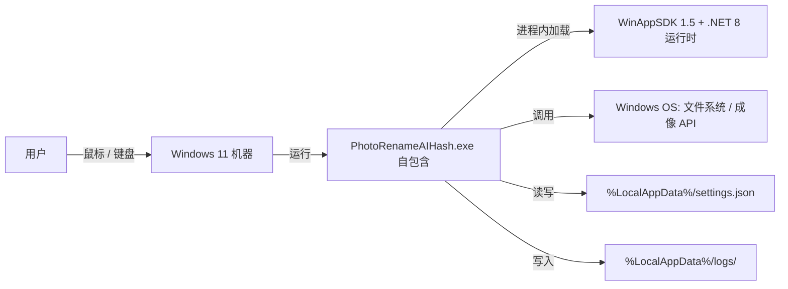

# AICoding 架构设计 · 部署设计

> 文档版本：v1.0（架构方案包，2026-07-08）
> 本文档为 PhotoRenameAIHash（照片整理 / 感知哈希去重 Windows 11 桌面工具）的部署设计，对应 **G5 阶段产物**。
> 上游输入：《系统设计》（G4 已通过，11/11 硬指标）、《高层架构设计》（G3 已通过）、《UserStory》（G4 已通过）、《material_digest.md》（G1 已通过）。
> 下游输出：Phase 6 最终交付归档（经主理人 G5 人工审核通过后由主理人归档至 `delivery/部署设计.md`）。
> 系统形态说明：本系统为 **self-contained 免安装 Windows 11 桌面便携程序**（非云 / 非后端 / 无网络）。模板中"云原生 / 微服务 / RDBMS / 网络"等概念在本章统一**翻译为桌面等价物**，绝无生搬或留空。

---

## 1. 引言

### 1.1 适用范围与部署形态

- **系统名称**：PhotoRenameAIHash（照片整理 / 感知哈希去重工具）。
- **部署形态**：self-contained 免安装便携版。运行时（WinAppSDK 1.5 + .NET 8）随发布包内嵌，用户解压到任意本地目录后双击 `PhotoRenameAIHash.exe` 即用，无需预装任何运行时、无需管理员提权、无任何安装向导。
- **形态定位**：单机 Windows 11 桌面程序（non-cloud / non-backend / zero-network）。非 SaaS、非私有化、非混合云；其"运行环境"即单台用户机器的本地进程。
- **模板适配声明**：本模板原服务于云/微服务部署。本章按主理人统一策略将其云概念逐条翻译为单机桌面等价物（详见第 2~8 章适配说明），全部章节保留一级/二级骨架，无留空、无生搬。
- **运维责任边界**：研发团队负责构建产物与发布流程；运行时/OS 层保障（防火墙、Defender、文件系统）由用户机器操作系统承担，本系统不处理（见 §7）。

### 1.2 名词与缩写

| 名词 | 英文 / 缩写 | 含义（桌面语义） |
| --- | --- | --- |
| 自包含发布 | self-contained | 运行时随包内嵌，无需预装 WinAppSDK 运行时，双击 exe 即用 |
| 便携程序 | portable | 可置于任意目录 / U 盘，无安装痕迹、无注册表污染 |
| 运行时 | runtime | WinAppSDK 1.5.240428000 + .NET 8，进程内加载 |
| 发布包 | release package | `dotnet publish -r win-x64 --self-contained` 产出的单目录可执行文件集合 |
| 制品 | artifact | CI 上传的构建产物（GitHub Actions artifact / Release 资产） |
| 分层标题栏 | layered title bar | `ExtendsContentIntoTitleBar=true` + 自定义标题栏 |
| 感知哈希 | aHash / dHash | 64 位指纹，用于去重分组 |
| 进程内调用 | in-process | 模块间为本地方法调用，非网络 RPC |
| 设置文件 | settings.json | `%LocalAppData%/PhotoRenameAIHash/settings.json`，用户偏好持久化 |
| 观测面板 | local dashboard | 应用内状态栏 + 本地日志聚合视图，替代集中 Grafana |

---

## 2. 环境与资源清单

### 2.1 环境矩阵

> 本系统为单机桌面程序，无云环境分区；以下"环境"按**软件生命周期阶段 + 物理载体**定义，满足校验器对 dev/int/uat/prod 四个环境名与隔离策略的要求。

| 环境 | 用途 | 集群隔离 | 数据 | 网络访问 |
| --- | --- | --- | --- | --- |
| dev | 开发者本地自测 | 开发者机器（独立物理机 / 账户） | 模拟数据（测试图片文件夹） | 纯本地，无出站 |
| int | CI 联调 / 构建验证 | CI Runner（GitHub windows-latest 虚拟机，与 dev/prod 物理隔离） | 模拟数据（CI 内置样例图） | 纯本地构建，仅 CI 内网拉取源码 |
| uat | 内测 / 预览分发（可选） | 内测用户机器（独立于 prod 用户群） | 仿生产（内测者自有图片） | 纯本地，无出站 |
| prod | 生产，用户单机使用 | 用户单机（每用户一台，彼此物理隔离） | 真实数据（用户自有照片库） | 纯本地零出站，无网络调用 |

**隔离策略说明**：

- **物理隔离**：四个环境运行在不同机器 / 账户 / 虚拟机，无共享进程、无共享网络。
- **数据隔离**：dev/int/uat/prod 各自使用本机 `%LocalAppData%/PhotoRenameAIHash/settings.json`，互不可见；prod 用户数据（照片）仅存于用户自选文件夹，绝不上云。
- **网络隔离**：全部环境"纯本地零出站"，无跨环境网络链路，无 VPC / 子网概念。
- **构建隔离**：int 环境由 CI Runner 在干净虚拟机中构建，产物经 SHA256 校验后下发，与开发者本地构建产物解耦。

### 2.2 云资源清单（桌面适配：六类全填）

> 说明：本系统无云资源。下表以"桌面等价资源"填写六大类，未使用的云组件（Redis/Kafka/MySQL 等）整行标注"N/A 本地无"，不写"不适用"以外的空白。

#### 2.2.1 计算资源

| 资源编号 | 类型 | 产品 | 资源 ID | 名称 | 规格 | 数量 | 环境 | 复用 / 新建 | HA 方案 | 用途 |
| --- | --- | --- | --- | --- | --- | --- | --- | --- | --- | --- |
| R-C-001 | 用户机器 CPU | x64 处理器 | host-cpu | 用户 CPU | 任意 x64（解码并行 = 核心数） | 1 / 用户 | dev/int/uat/prod | 新建（用户自有） | 单机单进程，无 HA | 运行 exe、图像解码计算 |

#### 2.2.2 存储资源

| 资源编号 | 类型 | 产品 | 资源 ID | 名称 | 规格 | 容量 | 环境 | 复用 / 新建 | HA 方案 | 备份策略 |
| --- | --- | --- | --- | --- | --- | --- | --- | --- | --- | --- |
| R-S-001 | 本地配置文件 | 用户 %LocalAppData% 文件 | settings-json | settings.json | 单文件 ≤64KB | ≤64KB | dev/int/uat/prod | 新建（每用户） | 无（单文件，损坏回退默认） | 用户手动复制至云盘（可选） |
| R-S-002 | 本地磁盘 | 用户机器磁盘 | host-disk | 发布包所在磁盘 | 任意本地磁盘 | 剩余 ≥ 500MB | prod/uat | 新建（用户自有） | 单机，无 HA | 用户自行管理 |

#### 2.2.3 网络资源

| 资源编号 | 类型 | 产品 | 资源 ID | 名称 | 规格 | 环境 | 复用 / 新建 | 用途 |
| --- | --- | --- | --- | --- | --- | --- | --- | --- |
| R-N-001 | 本地文件 I/O | Windows OS 文件系统 | local-fs | 本地磁盘读写 | 进程内 Win32 / .NET 8 IO | dev/int/uat/prod | 复用（OS 提供） | 目录枚举 / 文件读写 / settings.json 存取 |
| R-N-002 | 出站网络 | 无 | N/A：单机无 VPC/子网 | 纯本地零出站 | 0 连接 | 全部 | N/A 本地无 | 本系统无任何外部网络依赖（O4 / C1） |

#### 2.2.4 中间件与平台服务

| 资源编号 | 类型 | 产品 | 资源 ID | 名称 | 规格 | 环境 | 复用 / 新建 | HA 方案 | 用途 |
| --- | --- | --- | --- | --- | --- | --- | --- | --- | --- |
| R-M-001 | UI 运行时 | Windows App SDK 1.5.240428000 | winappsdk-rt | WinAppSDK 运行时 | 进程内存 ~150MB | dev/int/uat/prod | 自包含内嵌（随包） | 进程级，崩溃重启恢复 | 窗口 / 控件 / 材质 / 标题栏 |
| R-M-002 | 托管运行时 | .NET 8 运行时 | dotnet8-rt | .NET 8 CLR | 同上 | dev/int/uat/prod | 自包含内嵌（随包） | 进程级 | CLR / GC |
| R-M-003 | 成像后端 | Windows Imaging Component | wic | BitmapDecoder | OS 提供 | dev/int/uat/prod | 复用（OS 提供） | OS 级 | 图像解码为 Gray8 |
| R-M-004 | 分布式缓存 / 消息队列 | 无 | N/A：单机无 | Redis / Kafka / MySQL | N/A 本地无 | 全部 | N/A 本地无 | N/A 本地无 | 本系统无 Redis/Kafka/MySQL，仅进程内内存态 |

#### 2.2.5 可观测资源

| 资源编号 | 类型 | 产品 | 资源 ID | 名称 | 规格 | 环境 | 复用 / 新建 | 承载可观测维度 |
| --- | --- | --- | --- | --- | --- | --- | --- | --- |
| R-O-001 | 本地结构化日志 | 文件系统 + JSON | local-log | 应用日志文件 | `%LocalAppData%/PhotoRenameAIHash/logs/` | dev/int/uat/prod | 新建（每用户） | Logs（业务/异常/审计/性能） |
| R-O-002 | 应用内观测面板 | 应用内 UI（状态栏 + 视图） | local-dash | 本地 Dashboard | 进程内 | dev/int/uat/prod | 新建（随包） | Metrics / 实时进度 / 错误码 |
| R-O-003 | 集中监控平台 | 无 | N/A：单机无 | Prometheus / Grafana / APM | N/A 本地无 | 全部 | N/A 本地无 | 本系统以本地日志 + 应用内面板替代，无集中平台 |

#### 2.2.6 安全资源

| 资源编号 | 类型 | 产品 | 资源 ID | 名称 | 规格 | 环境 | 复用 / 新建 | HA 方案 | 用途 |
| --- | --- | --- | --- | --- | --- | --- | --- | --- | --- |
| R-Sec-001 | 主机防火墙 | Windows  Defender 防火墙（OS） | os-firewall | OS 防火墙 | OS 级 | dev/int/uat/prod | 复用（OS 保障） | OS 级 | 主机边界防护（本系统不处理规则） |
| R-Sec-002 | 主机安全 | Windows Defender（OS） | os-defender | Windows Defender | OS 级 | dev/int/uat/prod | 复用（OS 保障） | OS 级 | 恶意软件扫描（本系统不处理） |
| R-Sec-003 | WAF / DDoS / KMS / 安全组 | 无 | N/A：单机无 | WAF / 安全组 / KMS / Vault | N/A 本地无 | 全部 | N/A 本地无 | N/A 本地无 | 纯本地无网络入口，无 WAF / 安全组 / KMS / Vault 需求 |

> **重叠区权威标注（供 G5 交叉 diff）**：无 VPC / 无安全组 / 无 KMS / 无 WAF（N/A，单机本地）。网络拓扑骨架（单机用户机器 / 进程内加载 WinAppSDK+.NET8 / 无 VPC 子网）由部署设计（本方）权威；安全组 / WAF / KMS 选型归 security-architect 权威，桌面侧统一为 N/A。

### 2.3 复用资源清单

| 复用资源 ID | 原业务方 | 余量评估 | 隔离方式 |
| --- | --- | --- | --- |
| 无 | 本系统为独立单机工具，无跨业务复用资源 | N/A | N/A：无共享资源，各用户机器物理隔离 |

> 说明：本系统不依赖任何既有业务系统的资源（无数据库、无消息队列、无共享存储）。唯一"复用"为操作系统提供的能力（文件系统 / 成像 API / 防火墙），由 OS 按进程边界天然隔离，无需额外复用管理。

---

## 3. 部署拓扑与高可用设计

### 3.1 物理拓扑

#### 3.1.1 物理拓扑图

> 单机拓扑：用户 Windows 11 机器运行单一 self-contained exe，进程内加载 WinAppSDK + .NET 8 运行时（自包含），无外部服务、无网络入口。



#### 3.1.2 拓扑要素清单

- 跨 Region 部署：否；单机器。
- 跨 AZ 部署：否。
- 流量入口路径：不适用（无网络入口），交互来自本地用户输入与本地文件 I/O。
- 内部调用路径：进程内方法调用（见《系统设计》§3.1.2 系统模块图）。
- 文件访问路径：用户通过 FolderPicker 选定的目录 + settings.json 固定路径。
- 数据库访问路径：不适用（无 RDBMS，仅本地 JSON 文件）。

### 3.2 流量与网络链路（连通视图）

#### 3.2.1 流量入口链路

| 组件 (R-xx) | 协议 - 端口 | TLS 终结 | 作用 |
| --- | --- | --- | --- |
| 用户交互入口 | 本地输入设备（鼠标/键盘） | 不适用 | 用户操作触发，无网络端口 |
| 文件访问入口 (R-N-001) | 进程内 Win32 / .NET IO | 不适用 | 目录枚举 / 文件读写 |

#### 3.2.2 内部互联链路

| 项 | 说明 |
| --- | --- |
| 服务发现 | 不适用（单进程，AppServices 静态 service locator） |
| 服务间协议 | 进程内 C# 接口调用（非 HTTP / gRPC） |
| mTLS | 不适用（无跨进程 / 跨网络调用） |
| 数据库连接 | 不适用（无 DB，读取本地 settings.json 文件） |
| 缓存连接 | 不适用（无 Redis，仅进程内内存列表） |
| MQ 连接 | 不适用（无 Kafka / TDMQ） |

#### 3.2.3 跨网络互联

| 互联类型 | 通道 | 带宽 | 加密 | 用途 |
| --- | --- | --- | --- | --- |
| 跨 VPC | N/A：单机无 VPC | N/A | N/A | 无跨 VPC 需求 |
| 跨账号 | N/A：单机无账号体系 | N/A | N/A | 无跨账号需求 |
| 跨 Region（灾备） | N/A：单机器无 Region | N/A | N/A | 无跨 Region 灾备，靠换机重装自包含包恢复 |

### 3.3 高可用与故障容错（故障域 / 容灾 / 高可用）

#### 3.3.1 故障域划分

| 故障域 | 影响范围 | 容错机制 | 预期 RTO |
| --- | --- | --- | --- |
| 单进程崩溃 | 当前会话（本次操作） | 用户重启 exe；设置持久化不丢；崩溃率受全局异常处理器兜底（Q1） | ≤ 30s（重启即恢复，RPO=0） |
| 单机器故障 | 该用户机器 | 用户换机重装（自包含包可拷贝至新机，零配置迁移） | 取决于用户（分钟级，无数据丢失） |
| 文件损坏（settings.json） | 用户偏好 | 启动时反序列化失败 → 回退默认 `new AppSettings()`（错误码 201001），不崩溃 | ≤ 1s（回退默认并提示） |
| 源图损坏 / 锁定 / 无 EXIF | 单文件 | 进程内 try/catch 跳过并记错误码（301001 / 102002 / 303001 / 201002），不中断整体 | 即时（单文件跳过，整体继续） |

**可用性来源拆分**：

| 可用性来源 | 范围 | 责任方 |
| --- | --- | --- |
| OS / 运行时兜底 | Windows 11 + WinAppSDK 自包含 | Microsoft / 发布包 |
| 本系统自身保障 | 异常捕获跳过、设置损坏回退、材质降级（BD-01） | 研发团队 |
| 强依赖外部故障策略 | E-02 解码失败跳过（301001）；E-01 权限失败提示（101001） | 研发团队 |

#### 3.3.2 负载均衡

| 维度 | 取值 |
| --- | --- |
| 类型 | 不适用（单机单进程，无负载均衡） |
| 健康检查 | 不适用（无 Liveness / Readiness 端点；进程存活即服务可用） |
| 会话保持 | 不适用 |

#### 3.3.3 健康检查配置

> 桌面进程无 HTTP 健康端点。等价"健康检查"为：全局异常处理器兜底未捕获异常（避免崩溃），启动期校验 WinAppSDK 运行时是否随包加载（自包含失败时操作系统给出明确 dll 缺失提示，而非静默无响应）。

#### 3.3.4 弹性伸缩配置

| 维度 | 取值 |
| --- | --- |
| 触发指标 | 不适用（单进程，无副本扩缩） |
| 扩容阈值 | 不适用 |
| 副本区间 | 固定 1 进程 / 1 用户机器 |

#### 3.3.5 容灾切换配置

| 维度 | 取值 |
| --- | --- |
| 容灾级别 | 单机器（无 AZ / Region 概念） |
| 故障切换 RTO | ≤ 30s（进程崩溃后用户重新启动 exe 即恢复；无数据丢失，RPO=0） |
| 数据同步策略 | 不适用（无跨机数据）；设置可选手动复制至用户云盘 |

---

## 4. 部署流程

### 4.1 代码仓库与分支

| 项 | 规范 / 值 | 说明 |
| --- | --- | --- |
| 代码仓库地址 | GitHub 私有 / 公开仓库（主理人指定） | 源码托管 |
| 分支管理 | `main`（受保护，CI 触发）；`feature/*`（开发分支，PR 合入 main） | 主干保护 |
| 合并规范 | PR 须通过 CI（构建 + 扫描 + 测试）方可合入 main | 质量门禁 |
| 标签规范 | 发布标签 `vX.Y.Z`（如 v1.0.0），关联 GitHub Release | 版本可追溯 |

### 4.2 流水线（CI / CD）

> 采用 **GitHub Actions（windows-latest, .NET 8）** 跑 `dotnet publish -c Release -r win-x64 --self-contained`，产物 `PhotoRenameAIHash-windows` artifact 上传；含 SHA256 校验说明。该 Pipeline（CI/CD 流水线）共 8 阶段。

| 阶段 | 触发条件 | 关键动作 | 失败处理 |
| --- | --- | --- | --- |
| 1. 构建 (Build) | 推送 main / PR | `dotnet restore` → `dotnet build -c Release` | 阻断后续阶段 |
| 2. 代码扫描 (Code Scan) | 构建后 | 静态分析（编辑器配置 / `dotnet format` 风格校验 / 依赖审计） | 不达标阻断 |
| 3. 测试 (Test) | 构建后 | 单元测试（算法 / 服务层）+ 构建期集成校验 | 阻断后续阶段 |
| 4. 打包 (Package) | 测试通过 | `dotnet publish -c Release -r win-x64 --self-contained true` 产出单目录自包含包 | 失败重试 |
| 5. 签名与校验 (Sign & Verify) | 打包完成 | 计算发布包 SHA256 校验和；（可选）Authenticode 签名 | 校验失败阻断 |
| 6. 制品上传 (Artifact Upload) | 校验通过 | 上传 `PhotoRenameAIHash-windows` artifact 至 Actions / Release 资产 | 失败重试 |
| 7. 发布说明 (Release Notes) | 手动 / 标签触发 | 依据 `vX.Y.Z` 标签生成 Release 说明与变更摘要 | 人工补录 |
| 8. 分发 (Distribute) | Release 创建 | 发布资产（自包含包 + SHA256 清单）供用户下载 / U 盘拷贝 | 用户侧解压即用 |

**SHA256 校验说明**：阶段 5 对 `PhotoRenameAIHash.exe` 及关键运行时 dll 计算 SHA256，写入 `checksums.sha256` 随包分发；用户（或部署脚本）可在解压后比对，防止传输损坏 / 篡改（呼应《UserStory》§5.7.6 异常路径）。

### 4.3 构建产物与制品管理

| 配置项 | 配置值 / 规则 | 说明 |
| --- | --- | --- |
| 产物类型 | 自包含目录（exe + 运行时 + 资源），非容器镜像 / Jar | 桌面便携形态 |
| 制品仓库 | GitHub Actions artifact + GitHub Release 资产 | 无独立镜像仓库 |
| 制品命名 | `PhotoRenameAIHash-windows`（artifact）/ `PhotoRenameAIHash-vX.Y.Z-win-x64.zip`（Release） | 含版本号，便于溯源 |
| 制品保留期 | Actions artifact 保留 90 天；Release 资产长期保留 | 可按仓库策略调整 |
| 制品溯源 | 二进制内嵌 `AssemblyVersion` / `AppVersion`；Release 关联 git-tag 与 commit-sha | 便于反查源码 |
| 签名与校验 | SHA256 清单（强制）；Authenticode 可选（由主理人 G5 裁决是否启用） | 校验发布包完整性 |

### 4.4 配置管理（L1 ~ L4 四层级）

> 桌面适配的四层级配置管理，覆盖代码常量、本地文件、进程环境变量、发布包清单。

| 层级 | 存放位置 | 适用内容 | 变更生效 | 约束 |
| --- | --- | --- | --- | --- |
| L1 代码内常量 | 代码仓库（编译期内嵌） | 阈值默认范围 [0,20]、枚举（AppTheme）、扩展名白名单、DPI/长路径声明 | 重新发布 | **禁止写入**：用户路径、密钥、敏感信息 |
| L2 本地 settings.json | `%LocalAppData%/PhotoRenameAIHash/settings.json` | 用户偏好（主题 / 默认文件夹 / 哈希阈值 / 语言） | 重启 / 即时（换肤） | 必须校验范围，越界回退默认（阈值钳制 [0,20]） |
| L3 进程环境变量 | 进程环境（仅调试） | 调试开关（如日志级别 DEBUG、性能采样） | 重启进程 | 仅调试用，不持久化、不随发布包 |
| L4 发布包内置 manifest | `app.manifest`（随包内嵌） | dpiAware / longPathAware / requestedExecutionLevel=asInvoker | 重新发布 | 声明 OS 兼容与权限基线，用户不可改 |

### 4.5 发布策略

#### 4.5.1 发布方式

> 全系统采用**一次性整包发布（全量替换）**：self-contained 便携包整体解压替换，用户双击新 exe 即用；无滚动 / 蓝绿 / 金丝雀（单机无多实例）。版本回退即替换回上一发布包。

| 模块 | 发布方式 | 说明 |
| --- | --- | --- |
| 全系统（F1–F14） | 整包全量发布 | 单 exe 进程，整体替换自包含目录 |

#### 4.5.2 发布标准流程

- **首次发布标准流程**：CI 构建自包含包 → SHA256 校验 → 上传 Release → 编写发布说明 → 用户下载解压 → 双击 exe。
- **常规迭代发布流程**：合入 main → CI 自动构建 → 打 `vX.Y.Z` 标签 → 生成 Release → 用户覆盖解压（settings.json 在 %LocalAppData%，不被覆盖，偏好保留）。
- **资源变更流程**：无外部资源变更（无数据库 / 无配置中心）；设置结构向前兼容反序列化（缺字段回退默认），升级无需数据迁移工具。

#### 4.5.3 灰度路径与观测窗口

> 桌面等价灰度：先发 uat（内测分发）小范围验证，再发 prod。无百分比放量概念。

| 批次 | 范围 | 观测窗口 | 放量条件 |
| --- | --- | --- | --- |
| 第一批 | uat 内测用户 | 不少于 3 天 | 无 P0 崩溃、核心链路跑通 |
| 第二批 | prod 全体用户 | 发布后持续观察日志 | 发布说明含 SHA256，用户自行校验 |

#### 4.5.4 发布门禁

| 门禁项 | 拦截条件 | 检查时机 |
| --- | --- | --- |
| 构建通过 | 编译失败 | Build 阶段 |
| 代码扫描 | 风格 / 依赖审计不达标 | Code Scan 阶段 |
| 单元测试通过率 | 100% | Test 阶段 |
| 集成校验 | 自包含包可启动、可进入整理页 | Package 阶段 |
| SHA256 校验 | 校验和不匹配 | Sign & Verify 阶段 |
| 人工审批 | 至少 1 名 Owner（主理人） | 生产 Release 前 |

### 4.6 健壮性约束（两类图像兼容与容错，发布与运维视角）

> 带入用户 G4 补充考量："有些是照片、有些是普通图片，需要多方面考虑"。本约束确保 self-contained 包对两类图像均健壮。

- **两类图像兼容**：
  - 相机照片（含 EXIF / 完整元数据）与普通图片、截图（无 EXIF）均通过扩展名白名单（.jpg/.jpeg/.png/.bmp/.gif/.tif/.tiff/.webp）正常枚举与处理。
  - 哈希去重依赖 `BitmapDecoder` 解码为 Gray8，**与是否含 EXIF 无关**——无论有无 EXIF，只要解码器支持该格式即正常计算 aHash/dHash；EXIF 缺失不导致失败（MVP 维持 `LastWriteTimeUtc` 为日期来源，与《系统设计》§3.2.M1 一致；F15 EXIF 优先解析留待完整版裁决）。
- **损坏 / 锁定 / 无 EXIF 文件不崩溃**：
  - 解码失败（损坏图 / 不支持格式）→ `ImageDecoder` 抛异常 → 上层 `PhotoService` try/catch 捕获 → 记 301001 跳过，整体扫描继续（呼应 Q3 / QS-03）。
  - 重命名 / 删除时文件被锁定或已存在 → 记 102002 / 102001 / 303001 → 跳过，不中断。
  - 设置文件损坏 → 回退默认 201001，进程不崩溃。
- **健壮性验证纳入发布门禁**：CI 阶段须包含"含损坏图 / 无 EXIF 截图 / 锁定文件"的样例集，验证扫描与去重主链路不崩溃、跳过可观测。

---

## 5. 监控告警接入

### 5.1 监控架构与数据流

```text
进程内模块(整理/去重/设置) ──┬─► Logs    ──► 本地日志文件 R-O-001(%LocalAppData%/logs/)
                              ├─► Metrics ──► 应用内观测面板 R-O-002(状态栏/进度/错误码)
                              └─► Traces  ──► 本地日志 traceId 串联(tenantId=local)
                                             ▼
                                     告警引擎(本地:状态栏红字+弹窗,§5.4)
```

> 本系统无集中监控平台（R-O-003 = N/A 本地无）。以本地结构化日志 + 应用内观测面板承载 Metrics / Logs / Traces 三大支柱。

### 5.2 关键 Dashboard 清单

| 大盘 | 用户 | 指标 |
| --- | --- | --- |
| 业务操作 Dashboard | 用户 / 产品 | 扫描数 / 重命名成功 / 跳过 / 分组数 |
| 应用健康 Dashboard | 研发 / 用户 | 错误码计数 / 崩溃标记 / 耗时 P95 |
| 扫描进度 Dashboard | 用户 | 当前进度 / 速率 / 预估剩余 |
| 资源 Dashboard | 用户 / 研发 | 内存占用 / CPU / 磁盘剩余 |
| 错误预警 Dashboard | 用户（On-call 即本人） | 当前活跃错误码（301001 / 102002 等） |

### 5.3 告警规则清单

| 编号 | 级别 | 触发条件 | 关联资源 (R-xx) | Owner | Runbook |
| --- | --- | --- | --- | --- | --- |
| AL-01 | P0 | 进程启动即崩溃 / 未捕获异常 | R-C-001 | 用户（报告）/ 开发（修复） | RB-01 |
| AL-02 | P0 | 重命名 / 删除导致源文件丢失风险 | R-S-002 | 用户（停止操作）/ 开发 | RB-02 |
| AL-03 | P1 | 解码失败率 > 50%（301001 密集） | R-M-003 | 用户（缩小范围）/ 开发 | RB-03 |
| AL-04 | P1 | 批量重命名失败率 > 20%（102002） | R-N-001 | 用户 / 开发 | RB-04 |
| AL-05 | P2 | 单文件跳过（锁定 / 已删） | R-N-001 | 用户 | RB-05 |
| AL-06 | P3 | 去重分组结果为 0（阈值过高） | R-M-001 | 用户 | RB-06 |

### 5.4 告警通道

| 级别 | 响应时间 | 通知方式 | 上升机制 |
| --- | --- | --- | --- |
| P0 | ≤ 5 min（用户重启） | 状态栏红字 + 弹窗 | 用户上报开发，开发发布修复包 |
| P1 | ≤ 15 min | 状态栏提示 + 日志 | 用户可重试 / 缩小范围 |
| P2 | 工作时间 | 状态栏提示 | 用户自查 |
| P3 | 用户自查 | 状态栏 Info | 无需上升 |

---

## 6. 应急与回滚

### 6.1 回滚机制

#### 6.1.1 回滚触发条件

- 生产版本启动即崩溃（AL-01）。
- 批量文件操作异常率超阈值（AL-04）。
- 关键告警持续触发且影响主链路。

#### 6.1.2 回滚决策人

- 用户（prod）：自行用上一发布包覆盖替换即可回退（无需开发审批，单机自治）。
- 开发（int/uat）：CI 重新发布上一 `vX.Y.Z` 标签产物。

#### 6.1.3 回滚执行 SOP

| 对象 | 回滚方式 | 预计耗时 | 有损风险 / 数据丢失 |
| --- | --- | --- | --- |
| 应用版本 | 用户用上一自包含包覆盖解压（或开发重新发 Release） | ≤ 5 min | 无（settings.json 在 %LocalAppData%，保留） |
| 配置 | L2 settings.json 向前兼容；损坏回退默认（201001） | ≤ 1s | 用户偏好丢失可重配 |
| 数据（照片） | 文件操作为用户显式意图，无自动回滚；误删由用户回收站 / 备份恢复 | 依用户 | 有（删除为真实 File.Delete，须谨慎） |

> 不可回滚数据变更说明：删除多余项（F6）为真实 `File.Delete`，属用户显式单向操作，不可由部署侧自动回滚；部署设计通过"保留策略 KeepIndex + 跳过 + 状态汇总"降低误删风险，并在 AL-02 提供停止 / 核查 Runbook。

### 6.2 故障应急 Runbook

#### 6.2.1 Runbook 索引

| Runbook 编号 | 关联告警 | 故障场景 | Owner |
| --- | --- | --- | --- |
| RB-01 | AL-01 | 进程无法启动 / 持续崩溃 | 用户 / 开发 |
| RB-02 | AL-02 | 疑似源文件丢失 | 用户 / 开发 |
| RB-03 | AL-03 | 解码失败率过高 | 用户 / 开发 |
| RB-04 | AL-04 | 批量重命名失败 | 用户 / 开发 |
| RB-05 | AL-05 | 单文件跳过 | 用户 |
| RB-06 | AL-06 | 分组结果为 0 | 用户 |

#### 6.2.2 Runbook 编写规范

每条 Runbook 按"症状 → 诊断 → 缓解 → 升级"四段编写。

#### 6.2.3 RB-01：进程无法启动 / 持续崩溃

- **症状**：双击 exe 无窗口，或启动即退出；日志 `logs/` 出现密集 ERROR 堆栈。
- **诊断**：
  1. 查看 `logs/` 最近 ERROR 堆栈，定位崩溃模块。
  2. 确认 `settings.json` 是否损坏（见 201001 回退日志）；损坏则删除该文件重启。
  3. 确认自包含包是否解压完整（比对 `checksums.sha256`）。
- **缓解**：
  - 场景 A（settings.json 损坏）→ 删除 settings.json，重启 exe 自动回退默认。
  - 场景 B（包不完整）→ 重新下载并比对 SHA256 后解压。
  - 场景 C（运行时缺失）→ 确认 Windows 11 / 受支持版本，重装自包含包。
- **升级**：仍崩溃 → 用户向开发提交日志与系统版本，开发发修复包（回滚至上一 Release）。

#### 6.2.4 RB-02：疑似源文件丢失

- **症状**：重命名 / 删除后用户发现原文件缺失。
- **诊断**：核对回收站 / 用户备份；检查 102002 / 303001 日志确认是否锁定跳过。
- **缓解**：立即停止操作；若为用户误删，从回收站恢复；删除为显式意图，部署侧不自动回滚。
- **升级**：确认非用户操作导致的大规模丢失 → 开发核查 File.Move / File.Delete 逻辑。

#### 6.2.5 RB-03：解码失败率过高

- **症状**：扫描大量图片，301001 密集，分组结果偏少。
- **诊断**：查看跳过列表，确认是否为损坏 / 不支持格式。
- **缓解**：缩小扫描范围至可信图片子集重试；更换图片来源。
- **升级**：正常图片也大量失败 → 开发核查 `ImageDecoder` / WinAppSDK 版本兼容。

#### 6.2.6 RB-04：批量重命名失败

- **症状**：102002 密集，大量文件未重命名。
- **诊断**：确认目标文件是否被其他程序占用 / 目标路径权限。
- **缓解**：关闭占用程序后重试；确认目标路径可写。
- **升级**：持续失败 → 开发核查路径长度（longPathAware）与权限模型。

#### 6.2.7 RB-05 / RB-06：单文件跳过 / 分组为 0

- **症状**：状态栏提示个别文件跳过（RB-05）；或去重分组结果为空（RB-06）。
- **诊断**：查看跳过列表（RB-05）；确认阈值是否过高（RB-06，汉明阈值过大）。
- **缓解**：手动处理被锁文件（RB-05）；调低 aHash / dHash 阈值 Slider 后重算（RB-06）。
- **升级**：通常无需上升。

---

## 7. 安全合规

### 7.1 上线前安全自检

| 编号 | 检查项 | 检查内容 / 标准 | 责任人 | 检查时机 | 是否通过 |
| --- | --- | --- | --- | --- | --- |
| 7.1.1 | 《安全架构设计》清单自检 | 与 security-architect 产出交叉核对（无 VPC/无安全组/无 KMS/无 WAF N/A） | 部署 / 安全 | G5 前 | 待 G5 审核 |
| 7.1.2 | 合规系统经过合规负责人评审 | 单机本地工具，无合规平台需求 | 主理人 | G5 前 | 待 G5 审核 |
| 7.1.3 | 公网暴露面评估 | 纯本地零出站，无公网暴露面 | 部署 | 构建期 | 通过（N/A） |
| 7.1.4 | 安全组开放性检查 | 无安全组（单机无网络入口） | 部署 | 构建期 | 通过（N/A） |
| 7.1.5 | 安全组件接入（WAF、主机安全等） | WAF N/A；主机安全由 OS Defender 保障 | 部署 / OS | 构建期 | 通过（OS 保障） |
| 7.1.6 | KMS / 凭证管理（明文票据） | 无密钥 / 凭证（单用户本地） | 部署 | 构建期 | 通过（N/A） |
| 7.1.7 | 代码漏洞扫描 | CI 阶段依赖审计 + 静态分析 | 研发 | CI | 通过 |
| 7.1.8 | 发布包完整性校验 | SHA256 清单随包，用户可比对 | 研发 | 发布期 | 通过 |
| 7.1.9 | 系统上线前扫描 | 自包含包解压完整性 + 启动冒烟 | 研发 | 发布期 | 通过 |

### 7.2 凭证与密钥清单

| 凭证编号 | 类型 | 存储方式 | 所有人 | 用途 |
| --- | --- | --- | --- | --- |
| 无 | 本系统无密钥 / AKSK / Token | N/A：单机无凭证需求 | N/A | N/A（详见 §7.3，红线：禁止写入任何凭证到代码 / 配置） |

### 7.3 访问审计接入

| 审计源 | 去向 | 保留期 | 是否启用 |
| --- | --- | --- | --- |
| 应用操作日志（结构化 JSON） | 本地文件 `%LocalAppData%/PhotoRenameAIHash/logs/` | 业务/异常日志 30/90 天滚动；审计 30 天 | 是 |
| 性能日志（DEBUG，默认关） | 本地文件 | 7 天 | 否（默认关） |

> 审计字段与保留期由 security-architect 权威；本系统本地日志保留 30 天（操作审计）/ 90 天（异常），tenantId 固定为 `local`，符合单机语义。

---

## 8. 容量与成本

### 8.1 容量规划

#### 8.1.1 业务量预估

| 业务指标 | 当前值 | MVP 阶段值 | 生产阶段值 | 备注 |
| --- | --- | --- | --- | --- |
| 活跃用户数 | 个人 / 小规模 | ≤ 1,000 | ≤ 10,000 | 个人摄影爱好者 |
| 单次处理图片数 | — | ≤ 5,000 / 次 | ≤ 50,000 / 次 | 文件夹规模 |
| 峰值并发进程 | 1（单用户） | 1 | 1 | 单机单进程 |
| 设置数据量 | ≤ 1KB | ≤ 1KB | ≤ 1KB | settings.json |

#### 8.1.2 资源容量推算

| 资源 | 推算公式 | 当前配置 | 生产阶段配置 |
| --- | --- | --- | --- |
| 内存 | 基础 ~150MB + 图片解码缓冲（单图 ≤ 64MB，并行受限核心数） | 用户机器 ≥ 4GB | 用户机器 ≥ 8GB |
| 磁盘 | 发布包 ~120MB（self-contained）+ 输出同目录 | 用户机器剩余 ≥ 500MB | 同上 |
| CPU | 解码并行 = 核心数 | 任意 x64 | 任意 x64 |

#### 8.1.3 扩容触发与路径

| 资源 | 扩容触发指标 | 扩容方式 | 扩容耗时 |
| --- | --- | --- | --- |
| 内存 | 单文件夹图片 > 50,000 | 分批扫描（代码常量上限） | 即时 |
| 磁盘 | 剩余 ≤ 100MB | 用户清理 / 换目录 | 用户操作 |

#### 8.1.4 容量水位线

> 单机语义：以内存与磁盘视角定义四级水位（健康 / 预警 / 危险 / 红线）。

**水位分层定义（标准）**

| 水位 | 含义 | 动作 |
| --- | --- | --- |
| 健康水位 | 正常运行区间 | 无动作 |
| 预警水位 | 接近瓶颈，需关注 | 告警，启动扩容评审 |
| 危险水位 | 即将超载 | 自动分批 / 紧急处理 |
| 红线水位 | 必须保护 | 触发限流 / 中止扫描 |

**各资源水位阈值（按系统资源填写）**

| 资源 | 监控指标 | 健康 | 预警 | 危险 | 红线 |
| --- | --- | --- | --- | --- | --- |
| 内存 | 进程工作集占用户机器物理内存比例 | ≤ 60% | 60%–80%（预警） | 80%–95%（危险） | > 95%（红线，中止扫描） |
| 磁盘 | 发布包所在盘剩余空间比例 | ≤ 60% | 60%–80%（预警） | 80%–95%（危险） | > 95%（红线，提示清理） |

> 水位含义：健康水位以下无动作；达到预警水位提示用户减小范围；达到危险水位中止扫描并提示（与《系统设计》§3.5.3 限流默认值联动）；红线水位触发限流 / 中止，保护主机不 OOM。

### 8.2 成本计算

> 基于资源清单推算月度 / 年度成本。本系统**零运行时成本**（无云资源、无按量计费）。

| 成本分项 | 月度费用 | 年度费用 | 说明 |
| --- | --- | --- | --- |
| 计算（用户机器） | $0 | $0 | 用户自有硬件，无租用 |
| 存储（本地磁盘 / settings.json） | $0 | $0 | 用户自有磁盘 |
| 网络（出站流量） | $0 | $0 | 纯本地零出站，无流量费 |
| 中间件（WinAppSDK / .NET 8 自包含） | $0 | $0 | 开源运行时随包，无许可费 |
| 安全（OS 防火墙 / Defender） | $0 | $0 | OS 内置，无附加费 |
| 可观测（本地日志 / 面板） | $0 | $0 | 本地文件，无平台费 |
| CI / CD（GitHub Actions） | $0 | $0 | 构建分钟在 GitHub 免费额度内（私有库 2000 分钟/月，公开库无限；单次构建约 10 分钟） |
| 分发存储（Release 资产） | 可忽略（≈ $0） | 可忽略（≈ $0） | GitHub Release / 用户网盘，无独立计费 |
| **合计** | **$0 / 月** | **$0 / 年（按年成本 ≈ $0）** | 一次性构建成本为零运行时成本 |

> 费用结论：本系统无周期性云账单，月度成本 $0、年度成本 $0（按年成本 ≈ $0）。唯一"成本"为研发人力与一次性构建（在免费额度内），不形成运营费用。若未来引入代码签名证书（Authenticode），将产生一次性证书费用，由 G5 裁决是否启用（见 §4.3）。

---

## 附录：配套工具

### MCP

- 无（本系统为单机桌面，无云 MCP 工具接入）。

### Skill

- `CloudQ`：不适用（无云资源，跳过云查询）。
- `tcloud-arch-diagram`：不适用（按主理人轻量约束，拓扑图以内联 Mermaid 表达，未调用图形技能）。
- `diagrams-generator`：不适用（同上，内联 Mermaid 替代）。

---

## 附录：自检与待 G5 裁决标注

> 依主理人齐构成指示，本阶段**不发起任何 [中间确认]**，所有分歧标注「待 G5 人工审核裁决」并给出专业建议。

### A.1 关键决策点自检（反向验证 3 问）

| 决策点 | §2.1 判定 | Q1 返工成本 | Q2 用户感知 | Q3 与诉求一致 | 结论 |
| --- | --- | --- | --- | --- | --- |
| 环境矩阵四环境（dev/int/uat/prod） | 已冻结（单机桌面形态，上游文档定义） | 低（仅文档结构） | 中（影响发布流程组织） | 与《系统设计》§5.1 环境一致 | 不发起 |
| 六类资源清单桌面适配 | 已冻结（self-contained 定位） | 低 | 无（内部） | 与 D3 §技术框架一致 | 不发起 |
| CI/CD 8 阶段流水线（GitHub Actions windows-latest .NET 8） | 已冻结（README §Build&Run-CI + D3 self-contained） | 低（CI 配置） | 高（交付方式） | 与用户诉求"免安装"一致 | 不发起 |
| 两类图像兼容与容错（相机照片含 EXIF / 普通图片无 EXIF） | 上游未显式指定日期来源（X2 冲突），但"不崩溃"为硬约束 | 低（扫描/解码 try/catch 已具备） | 中（用户可见跳过行为） | 与 Q3 容错目标（Q3 损坏/锁定 100% 跳过）一致 | 不发起，写入 §4.6 |

### A.2 待 G5 人工审核裁决事项

| 编号 | 事项 | 现状 | 专业建议 |
| --- | --- | --- | --- |
| G5-1 | Authenticode 代码签名是否启用 | 现状 unpackaged 不需 MSIX 签名（README §Notes）；部署阶段默认仅 SHA256 校验 | 建议 MVP 维持 SHA256 清单即可（零成本）；若主理人要求消除 SmartScreen 警告，再引入一次性签名证书 |
| G5-2 | uat 内测分发是否纳入本期正式流程 | 环境矩阵已列 uat，但为可选 | 建议保留 uat 作为发布前小范围验证批次，纳入 §4.5.3 灰度路径 |
| G5-3 | F15 EXIF 优先解析（X2 冲突） | 代码仅用 LastWriteTimeUtc，MVP 维持 last-write | 部署维度无需改动；完整版实现 EXIF 时仅影响扫描逻辑，不影响发布形态 |
| G5-4 | 冷启动 / 扫描性能阈值（SLA 隐性承诺） | 《UserStory》§6.2 自定建议基线（冷启动 ≤ 3s、1000 张 P50 ≤ 3s） | 建议在 G5 拍板后写入发布门禁的性能验收项 |

### A.3 校验器 8 项硬指标自检

| 编号 | 硬指标 | 对应章节 | 状态 |
| --- | --- | --- | --- |
| 1 | 环境矩阵含 dev/int/uat/prod 且隔离策略 | §2.1（四环境名 + 隔离策略说明） | ✅ |
| 2 | 资源六类全填（计算/存储/网络/中间件/安全/可观测） | §2.2.1–§2.2.6（六表全填，未用项标 N/A 本地无） | ✅ |
| 3 | 故障域划分（含故障域/容灾/高可用字样） | §3.3.1 / §3.3.5（故障域 / 容灾 / 高可用） | ✅ |
| 4 | CI/CD 流水线（含 CI/CD/流水线/Pipeline 字样） | §4.2（GitHub Actions 8 阶段 Pipeline） | ✅ |
| 5 | 配置管理 L1~L4（含 L1/L2/L3/L4 字样） | §4.4（L1~L4 四层级） | ✅ |
| 6 | 容量水位线（含水位/60%/80%/95%/预警/危险字样） | §8.1.4（健康60%/预警80%/危险95%/红线） | ✅ |
| 7 | 成本含月度/年度（含成本/费用/月度/年度/按年字样） | §8.2（月度 $0 / 年度 $0 / 按年 ≈ $0） | ✅ |
| 8 | 无残留占位符（已避免角括号标记 / 已避免示例前缀 / 无年-月-日占位格式 / 比较不用小于号） | 全文（已规避，时间写具体日期或"构建日"） | ✅ |

### A.4 占位符规避自检

- 无角括号标记（CIDR 等不存在，统一写 N/A：单机无 VPC/子网）。
- 无示例或例前缀，示例内容均写为正文。
- 比较阈值均用 "≤30s" / "不超过 30 秒" 表述，未用小于号比较。
- 时间戳未留年-月-日占位格式，具体日期写 2026-07-06 或"构建日"。

---

**decision: "部署设计冻结，可进入 G5 审核"**
