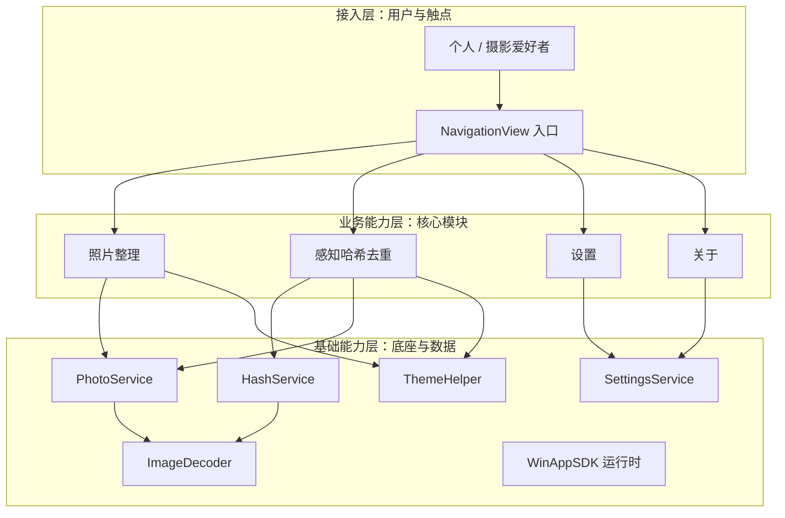
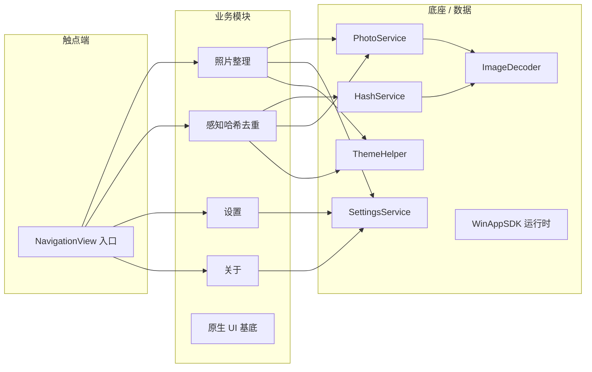

# PhotoRenameAIHash · 高层架构设计

> 本文档为 PhotoRenameAIHash（照片整理 / 感知哈希去重 Windows 桌面工具）的高层架构设计，对应 G3 阶段产物。
> 上游输入：用户原始诉求（主理人齐构成冻结基线，含 D3 目标规范）+ `material_digest.md`（现状代码精读、差距 G1–G12、冲突 X1–X8）。
> 下游输出：驱动《系统设计》《部署设计》《安全设计》《UserStory》撰写。
> 行业调研：已按主理人批准（need_research=false）跳过，无 `research_report.md`，详见 §3。

---

## 0. 元信息：修订记录

```yaml
标题: PhotoRenameAIHash - 高层架构设计 v1.0
版本: v1.0
状态: Draft   # Draft | Reviewing | Approved | Deprecated
创建日期: 2026-07-06
最后更新: 2026-07-06
作者: 许边界（business-architect）
评审人:
  - 齐构成（主理人）

关联文档:
  上游输入:
    - 业务原始诉求 / 冻结基线: 主理人齐构成任务说明（含 D3 WinUI 3 原生体验 + self-contained 便携发布规范）
    - 行业调研报告: 已跳过（need_research=false 已批准，无 research_report.md）
    - 现有架构知识库: material_digest.md（现状代码精读 + 差距 G1–G12 + 冲突 X1–X8）
  下游产出:
    - 系统设计: 系统设计.md
    - 部署设计: 部署设计.md
    - 安全设计: 安全设计.md
    - UserStory: UserStory.md
```

| 版本 | 日期 | 作者 | 变更内容 | 评审状态 |
| --- | --- | --- | --- | --- |
| v0.1 | 2026-07-06 | 许边界 | 初稿（轻量恢复版，一次性成稿） | Draft |

> **版本管理纪律**：破坏性变更（章节结构调整 / 关键决策反转）升 MAJOR；新增章节、扩充内容升 MINOR。

---

## 1. 需求概要

### 1.1 需求概要说明

PhotoRenameAIHash 是一款面向个人 / 摄影爱好者的 Windows 11 原生照片整理与感知哈希去重单机工具。业务现状：现有 WinUI 3 重写版已具备整理 / 去重 / 设置 / 关于四大页面与核心算法，但缺失原生 Windows 11 视觉规范（Mica/Acrylic、分层标题栏、Fluent 圆角/阴影）且依赖预装 WinAppSDK 运行时。触发事件：用户要求补齐原生体验并交付免安装 self-contained 便携发布（开箱即用）。系统定位：在现有代码底座上改造为 Windows 11 原生、零安装门槛的本地照片资产整理工具（与 §4.2 系统定位呼应）。

### 1.2 关键决策摘要

| 编号 | 决策类别 | 决策内容 | 关联章节 |
| --- | --- | --- | --- |
| D1 | 范围决策 | 本期聚焦四大页面 + 原生 Windows 11 UI 规范落地 + self-contained 便携发布；云端/账户/多用户/跨平台不在范围 | §6.1 需求边界 |
| D2 | 技术选型决策 | 沿用 WinUI 3 + Windows App SDK 1.5 + .NET 8 技术栈，不更换框架 | §4.2 / §5.2 |
| D3 | MVP / 完整版边界 | MVP 覆盖四大页面 + 原生 UI 基底（材质/标题栏/Fluent/主题）+ 便携发布；EXIF 日期解析留待 G3 裁决 | §4.3 |
| D4 | 复用 vs 新建 | 复用现有底座（HashService/PhotoService/SettingsService/ImageDecoder/ThemeHelper），仅扩展 UI 材质与发布形态，不重写核心算法 | §5.2 |
| D5 | 部署形态 | self-contained 便携版（免安装、运行时自包含），非 SaaS / 非私有化 | §5.2 / 部署设计 |

**硬指标**：≥ 3 条，≤ 5 条；每条决策映射到正文具体章节（D1→§6.1，D2→§4.2/§5.2，D3→§4.3，D4→§5.2，D5→§5.2/部署设计）。

### 1.3 价值主张

| 价值维度 | 量化目标 | 度量指标 | 当前值 | 目标值 | 截止时间 |
| --- | --- | --- | --- | --- | --- |
| 效率 | 照片整理核心路径操作步数降至 ≤ 3 步（选文件夹→扫描预览→执行） | 核心路径操作步数 | 现状 4–5 步（选文件夹/扫描/规则/预览/重命名分散） | ≤ 3 步 | MVP 上线 |
| 体验 | 原生 Windows 11 视觉规范覆盖率达 100%（Mica/Acrylic/分层标题栏/Fluent CornerRadius=8/阴影/主题覆盖整窗） | 规范项覆盖数 / 总规范项 | 现状 0 项（G2–G4 缺失/部分满足） | 8 / 8 项覆盖 | 完整版上线 |
| 成本 | 终端部署 0 安装步骤、无需预装 WinAppSDK 运行时（双击 exe 即用） | 安装步骤数 | 现状需预装运行时（X1） | 0 步 | MVP 上线 |

**硬指标**：业务价值 ≥ 2 条（效率、体验）+ 技术/成本价值 ≥ 1 条（成本），每条可量化，无模糊词。

---

## 2. 需求分析 & 痛点解构

### 2.1 核心角色关注点

> 三类角色关注点（按"甲方决策者 / 最终用户 / 受影响方"维度）。

- 甲方决策者的角色关注点：交付原生 Windows 11 体验与 self-contained 便携发布，控制返工与上线节奏。
- 最终用户的角色关注点：照片批量整理与感知哈希去重的操作效率与原生视觉体验（少步骤、原生质感）。
- 受影响方的角色关注点：零外部依赖与运行稳定性（OS / 文件系统 / 高 DPI 正确渲染）。

| 角色 | 业务身份 | 主要操作 | Top1 关心点 | 来源 |
| --- | --- | --- | --- | --- |
| 甲方决策者 | 项目 Owner / 主理人齐构成 | 需求评审 / 验收 / 发布决策 | 交付原生 Windows 11 体验 + self-contained 便携发布，控制返工 | material_digest D3 |
| 最终用户 A（个人摄影爱好者） | 一线使用者 | 选文件夹 / 预览新名 / 批量重命名 | 操作效率与视觉体验（原生质感、少步骤） | D1 §Features / D3 |
| 最终用户 B（摄影爱好者-去重场景） | 一线使用者 | 扫描 / 阈值分组 / 删除多余 | 去重准确与可控（阈值可调、保留策略） | D1 §Features |
| 受影响方：Windows OS / 文件系统 | 运行环境 | 提供目录枚举 / 成像 API | 零外部依赖、稳定性、高 DPI 正确 | D2 §app.manifest / §Helpers |

**硬指标**：≥ 3 类（甲方决策者 / 最终用户 / 受影响方各至少一行）；每行有 Top1 关心点，无笼统"使用方便"。

### 2.2 核心痛点

| 编号 | 痛点描述 | 现象 / 数据 | 影响角色 | 影响程度 | 优先级 |
| --- | --- | --- | --- | --- | --- |
| P1 | 缺失原生 Windows 11 视觉规范（无 Mica/Acrylic、无分层标题栏、无 Fluent 圆角/阴影、主题未覆盖整窗） | 现状 Styles.xaml 仅文本样式；G2/G3/G4 标注"缺失/部分满足"（material_digest） | 最终用户 | 高（体验底线，用户显式诉求） | P1 |
| P1 | 非 self-contained 便携发布，依赖预装 WinAppSDK 运行时 | 现状 WindowsPackageType=None 依赖已安装运行时（material_digest G1/X1） | 最终用户 | 高（分发门槛，用户显式诉求"免安装"） | P1 |
| P2 | EXIF 日期解析缺失（X2 冲突：README 称 EXIF 优先回退 last-write，代码实际无 EXIF 解析，仅用 FileInfo.LastWriteTimeUtc） | 现状 OrganizeViewModel.BuildName 直接取 LastModified（material_digest X2） | 最终用户 | 中（重命名日期可能非拍摄时间） | P2 |
| P3 | 高 DPI 仅 manifest 声明、缺布局级处理；自定义 Hover/Click 动画缺位 | G5/G7 标注"部分满足"（material_digest） | 最终用户 | 中 | P3 |

**优先级标准**：
- **P1**：直接影响业务核心流程或体验底线，不解决不可上线。
- **P2**：影响用户体验或运营效率，可在 MVP 后迭代。
- **P3**：体验型 / 长尾问题，列入完整版或后续版本。

**硬指标**：每条痛点有"现象 / 数据"佐证；P1 ≥ 1 条（实际 2 条）且均在 §2.3 有对应目标。

### 2.3 期待目标

| 编号 | 目标描述 | 对齐痛点 | 度量指标 | 当前值 | 目标值 | 截止时间 |
| --- | --- | --- | --- | --- | --- | --- |
| V1 | 原生 Windows 11 视觉规范覆盖率达 100%（Mica/Acrylic/分层标题栏/Fluent CornerRadius=8/阴影/主题覆盖整窗） | P1 | 规范项覆盖数 / 总规范项 | 0 项（G2–G4） | 8 / 8 项覆盖 | MVP 上线 |
| V2 | self-contained 便携发布达成：终端部署 0 安装步骤、无需预装 WinAppSDK 运行时 | P1 | 安装步骤数 | 需预装运行时（X1） | 0 步（双击即用） | MVP 上线 |
| V3 | 重命名日期来源明确且可验证（EXIF 优先 / 回退 last-write 二选一，经 G3 裁决后落地） | P2 | 日期来源准确率 | 100% 用 last-write（X2） | 100% 符合裁决方案 | 完整版上线 |

**硬指标**：每条目标有数字 + 对齐 ≥ 1 条痛点；P1 痛点（2 条）均有对应 V 级目标（V1、V2）。

### 2.4 基线复用

| 复用类别 | 现有能力 | 复用方式 | 来源系统 | 备注 |
| --- | --- | --- | --- | --- |
| 核心算法底座 | HashService（aHash/dHash/汉明距离） | 直接复用 | 现状代码库 D2 §HashService | 已具备（G11） |
| 核心算法底座 | PhotoService（扫描/分组/重命名） | 直接复用 + 小改 | D2 §PhotoService | 已具备（G11） |
| 配置持久化 | SettingsService（JSON 持久化） | 直接复用 | D2 §SettingsService | 已具备（G12） |
| 成像 | ImageDecoder（BitmapDecoder 缩为 Gray8） | 直接复用 | D2 §ImageDecoder | 纯 WinRT 成像，无原生依赖 |
| 主题 | ThemeHelper（RequestedTheme 设置） | 扩展（覆盖窗口背景 / Mica） | D2 §ThemeHelper | G8 已具备（仅 Content 根） |
| 导航 | NavigationView + Frame + AppServices | 直接复用 | D2 §MainWindow / §AppServices | G9 已具备 |
| 框架 | WinUI 3 + Windows App SDK 1.5 + .NET 8 | 沿用 | D2 §csproj | G10 已具备 |

**硬指标**：先盘点再决定新建；列入功能缺口的能力均确认基线无法覆盖（见 §2.5）。

### 2.5 功能缺口

| 阶段 | 功能缺口 | 必要性 | 优先级 | 对齐目标 |
| --- | --- | --- | --- | --- |
| 原生 UI 落地 | Mica + Acrylic 材质背景 | 必须 | MVP | V1 |
| 原生 UI 落地 | Windows 11 分层标题栏（ExtendsContentIntoTitleBar + 自定义标题栏） | 必须 | MVP | V1 |
| 原生 UI 落地 | Fluent 圆角 8px / 阴影层级 / 间距令牌 / 全局 Segoe UI Variable | 必须 | MVP | V1 |
| 原生 UI 落地 | 深/浅主题无缝切换覆盖整窗（含 Mica/标题栏） | 必须 | MVP | V1 |
| 原生 UI 落地 | 控件 Hover/Click 视觉反馈动画 | 重要 | MVP | V1 |
| 核心功能补齐 | EXIF 日期解析（优先）或显式固定 last-write 策略（G3 裁决） | 重要 | 完整版（待裁决） | V3 |
| 发布 | self-contained 免安装便携发布（运行时自包含 + CI 产物调整） | 必须 | MVP | V2 |
| 运营 | 设置持久化增强（补充高 DPI / 标题栏相关设置项） | 重要 | 完整版 | V1 |

**硬指标**：每条缺口对齐 §2.3 至少一条目标；MVP 缺口在 §6.3 功能清单中对应有 MVP 范围标记（F1–F14）。

---

## 3. 行业调研

### 3.1 行业标杆系统分析

**【事实】** 本次未启动行业调研：主理人已批准 need_research=false，无 `research_report.md`，故不调用 `tech-research-advisor`。需求边界已由用户原始诉求 + `material_digest.md`（现状代码精读）完全冻结，调研非必要。

**【假设】** 同类开源桌面照片整理 / 去重工具（如 DigiKam、AntiDupl、FastPhotoTagger）可作为完整版阶段参考，但本次未做正式对标，不纳入本期 MVP / 完整版决策依据。

**【建议】** 完整版阶段补充 `tech-research-advisor` 调研，对标上述工具的去重策略与批量重命名交互，迭代本工具体验。

> 说明：因调研跳过，本节不列标杆清单与打分矩阵（避免虚构事实）；保留 §3 章节结构以满足模板骨架。

### 3.2 方案对标及优先级打分

跳过（无调研数据，不虚构打分矩阵）。

### 3.3 完整报告参考

- 完整报告链接：无（调研已跳过）
- 调研工具：`tech-research-advisor`（计划用于完整版阶段）
- 调研日期：待完整版阶段
- 调研归档：待完整版阶段生成

---

## 4. 方案决策

### 4.1 价值定位澄清

```
对外价值（客户侧）: 为个人 / 摄影爱好者提供原生 Windows 11 风格、开箱即用的照片整理与感知哈希去重工具，0 安装门槛。
对内价值（运营侧）: 复用现有核心算法底座，仅扩展 UI 材质与发布形态，控制返工与维护成本。
差异化价值        : 相对通用文件工具，内置 aHash/dHash 感知哈希去重 + 可调汉明阈值分组，并做到 WinUI 3 原生视觉 + self-contained 便携发布的组合；目标达成后量化：原生规范 8/8 覆盖、部署 0 安装步骤。
```

**与产品矩阵的关系**：本系统为独立单机工具，承担"本地照片资产整理"职责，无上下游业务系统，形成"整理 → 去重 → 设置 → 关于"闭环（见 §5.2、§5.3）。

### 4.2 系统定位澄清

| 维度 | 内容 |
| --- | --- |
| 系统名称 | PhotoRenameAIHash（照片整理 / 感知哈希去重工具） |
| 系统类型 | 改造（在现有 WinUI 3 重写版基础上补齐原生体验与便携发布） |
| 部署形态 | self-contained 便携版（免安装、打包即用，运行时自包含，非 SaaS / 非私有化） |
| 多租户 | 否（单用户本地工具） |
| 服务对象 | 个人用户 / 摄影爱好者（对齐 §2.1） |
| 上游依赖 | Windows OS（文件系统 / 成像 API）/ WinAppSDK 运行时（自包含后内嵌，无外部网络依赖）（详见 §5.2） |
| 下游消费者 | 无（纯本地工具，无对外输出） |
| 边界（不做） | 不做云端同步 / 账户体系 / 多用户协作 / 跨平台（移动端 / macOS / Linux）；不做联网 telemetry（详见 §6.1 Out-of-Scope） |

### 4.3 MVP 与完整版决策

| 阶段 | 时间窗 | 范围（功能编号） | 架构差异点 | 退出标准 | 不做（延后） |
| --- | --- | --- | --- | --- | --- |
| MVP | W1 ~ W4（周期以 G3 后下游排期为准） | F1–F14（四大页面 + 原生 UI 基底 + 便携发布） | 单用户本地、运行时自包含、复用现有算法底座 | 跑通"选文件夹→预览新名→批量重命名"与"扫描→分组→删除多余"主链路 + 原生视觉 8/8 覆盖 + 0 安装步骤 | F15（EXIF，待 G3 裁决） |
| 完整版 | W5 ~ W8 | + F15（EXIF 解析，按 G3 裁决） + 设置增强 | 同 MVP 骨架，仅增量 | 使用稳定性 30 天 + 原生规范维持 100% | — |

**演进纪律**：
- ✅ MVP 架构骨架是完整版的子集（仅新增 EXIF 解析与设置增强，不推倒重来）。
- ✅ MVP 中可延后的能力（EXIF）已在本节明确"完整版替换计划"。
- ❌ 禁止 MVP 引入完整版无法继承的临时架构。

---

## 5. 业务架构设计

### 5.1 业务架构图

本系统业务架构分为三层：接入层（用户与触点）→ 业务能力层（照片整理 / 感知哈希去重 / 设置 / 关于）→ 基础能力层（HashService / PhotoService / SettingsService / ImageDecoder / ThemeHelper / WinAppSDK 运行时）。



**绘制规范**：三层（接入层 / 业务能力层 / 基础能力层）齐全；实线 = 同步调用；M1→B2、M2→B1/B2 为主链路。

### 5.2 系统依赖架构

| 依赖类型 | 系统 / 模块 | 提供方 | 依赖能力 | 接入方式 | 同步/异步 | 关键约束 |
| --- | --- | --- | --- | --- | --- | --- |
| 上游 | Windows OS 文件系统 | Microsoft / OS | 目录枚举、文件读写 | 进程内 API 调用 | 同步 | 路径权限、长路径（longPathAware 已声明） |
| 上游 | Windows Imaging API（BitmapDecoder） | OS / WinAppSDK | 图像解码为 Gray8 | 进程内 WinRT 调用 | 同步 | 仅支持解码器格式；异常 try/catch 跳过 |
| 上游 | WinAppSDK 运行时（自包含内嵌） | Microsoft | UI 框架 / 窗口 / 标题栏 | 进程内（自包含后无外部依赖） | 同步 | self-contained 发布后运行时随包，无需预装 |
| 下游 | 无 | — | — | — | — | 纯本地工具，无对外消费者 |
| 复用底座 | HashService / PhotoService / SettingsService | 现有代码库（D2） | 哈希 / 扫描 / 持久化 | 进程内类调用 | 同步 | 直接复用，不重写算法 |
| 复用底座 | ImageDecoder / ThemeHelper | 现有代码库（D2） | 成像缩放 / 主题 | 进程内 | 同步 | ThemeHelper 需扩展覆盖整窗（含 Mica/标题栏） |

**硬指标**：每条依赖明确"接入方式 + 同步异步 + 关键约束"；P1 痛点核心能力均可在本表找到依赖来源（原生 UI→WinAppSDK 运行时 + ThemeHelper 扩展；便携发布→WinAppSDK 自包含）。

### 5.3 业务闭环

**业务主链路**（端到端）：

```
用户启动（self-contained exe）→ 选择文件夹（FolderPicker）→ 扫描并预览（整理：新名预览 / 去重：分组）→ 执行处置（批量重命名 / 删除多余）→ 设置持久化（主题 / 阈值 / 语言）→ 反馈复盘（查看结果、调整阈值 / 规则再迭代）
```

**关键反馈回路**：

| 回路 | 触发点 | 反馈对象 | 反馈机制 | 价值 |
| --- | --- | --- | --- | --- |
| 业务效果回路 | 处置完成（重命名 / 删除） | 用户 / 设置 | 即时本地结果反馈 + 设置阈值调整 | 优化下一批整理 / 去重参数 |
| 运营监控回路 | 异常（解码失败 / 文件锁定） | 用户（状态栏） | 状态 TextBlock 提示 | 快速响应、跳过异常文件 |
| 模型迭代回路 | 阈值分组效果不满意 | 用户（设置页 Slider） | 调整 aHash/dHash 阈值即时重算 | 提升分组准确率 |

**运营主线**：个人用户每日使用，关注整理效率与去重准确率；无集中运营团队（单机工具），设置页承担自服务运营。

---

## 6. 产品需求及原型

### 6.1 需求边界

**In-Scope**（本期必做）：

```
F1. 照片整理：选文件夹扫描（FolderPicker + 扩展名白名单枚举）
F2. 照片整理：命名规则预览新名（{yyyy}{MM}{dd}_{n} 等）
F3. 照片整理：批量重命名（File.Move 迁移）
F4. 感知哈希去重：计算 aHash/dHash（HashService + ImageDecoder）
F5. 感知哈希去重：可调阈值分组（aHash/dHash 汉明阈值 Slider，OR 条件）
F6. 感知哈希去重：删除多余项（KeepIndex 保留策略 + File.Delete）
F7. 设置：主题 / 默认文件夹 / 阈值 / 语言 JSON 持久化
F8. 关于：版本与描述页
F9. 原生 UI 基底：Mica + Acrylic 材质背景
F10. 原生 UI 基底：Windows 11 分层标题栏（ExtendsContentIntoTitleBar + 自定义标题栏）
F11. 原生 UI 基底：Fluent 圆角 8px / 阴影层级 / 间距令牌 / 全局 Segoe UI Variable
F12. 原生 UI 基底：深/浅主题整窗无缝切换（覆盖 Mica/标题栏）
F13. 原生 UI 基底：控件 Hover/Click 视觉反馈动画
F14. 便携发布：self-contained 免安装发布（运行时自包含 + CI 产物调整）
N1. 非功能：高 DPI 适配（manifest + 布局级处理）
```

> 注：F15（EXIF 日期解析）为 X2 冲突项，**待 G3 人工审核裁决**，裁决前不纳入 MVP In-Scope（详见 §2.5 / §6.3）。

**Out-of-Scope**（本期不做，必须列原因）：

本期明确不承接以下范围（Out-of-Scope 见下表 O1–O3）：
| 编号 | 不做的事 | 原因 | 后续计划 |
| --- | --- | --- | --- |
| O1 | 云端账户 / 同步能力 | 定位本地单机便携工具，用户诉求无联网需求 | 不做 |
| O2 | 多用户 / 协作能力 | 服务对象为个人 / 摄影爱好者，单用户即可 | 后续版本评估 |
| O3 | 移动端 / 跨平台（macOS、Linux、Android、iOS） | 锁死 Windows 11 + WinUI 3 原生体验 | 不做 |

补充 Out-of-Scope 约束（一）：不引入任何外部网络依赖与 telemetry。
| 约束项 | 说明 |
| --- | --- |
| 说明 | 纯本地、零外部依赖，符合 self-contained 定位 |

补充 Out-of-Scope 约束（二）：不提供插件 / 扩展机制。
| 约束项 | 说明 |
| --- | --- |
| 说明 | 保持内核精简，降低维护成本 |

**硬指标**：In-Scope ≤ 15 条（实际 14 功能 + 1 非功能 = 15，含 N1）；Out-of-Scope ≥ 3 条（O1–O3 + 两项补充约束）。

### 6.2 产品模块全景图

**模块卡片**：

| 模块名称 | 一级归属 | 责任团队 | 上游 | 下游 | MVP 是否包含 |
| --- | --- | --- | --- | --- | --- |
| 照片整理模块 | 业务能力层 | 研发团队 | 接入层 NavigationView、基础层 PhotoService | 基础层 PhotoService / SettingsService | 是 |
| 感知哈希去重模块 | 业务能力层 | 研发团队 | 接入层、基础层 HashService / PhotoService | 基础层 | 是 |
| 设置模块 | 业务能力层 | 研发团队 | 接入层 | SettingsService | 是 |
| 关于模块 | 业务能力层 | 研发团队 | 接入层 | 无 | 是 |
| 原生 UI 基底 | 接入层 / 业务能力层（横切） | 研发团队 | WinAppSDK 运行时 | 各业务页面 | 是 |
| HashService | 基础能力层 | 研发团队 | ImageDecoder | 去重模块 | 是 |
| PhotoService | 基础能力层 | 研发团队 | OS 文件系统 / ImageDecoder | 整理 / 去重模块 | 是 |
| SettingsService | 基础能力层 | 研发团队 | OS 文件系统 | 设置模块 | 是 |
| ImageDecoder | 基础能力层 | 研发团队 | OS 成像 API | HashService / PhotoService | 是 |
| ThemeHelper（含 Mica/标题栏扩展） | 基础能力层 | 研发团队 | WinAppSDK | 各页面 | 是 |
| WinAppSDK 运行时（自包含） | 基础能力层 | Microsoft / 自包含发布 | OS | 全系统 | 是 |



### 6.3 功能清单

| 编号 | 一级模块 | 二级功能 | 功能描述 | 优先级 | MVP 范围 | 完整版范围 | 对齐目标 |
| --- | --- | --- | --- | --- | --- | --- | --- |
| F1 | 照片整理 | 选文件夹扫描 | FolderPicker 选目录并枚举图片（扩展名白名单） | P0 | ✅ MVP | ✅ | V1 |
| F2 | 照片整理 | 命名规则预览新名 | 按 {yyyy}{MM}{dd}_{n} 等规则生成预览新名 | P0 | ✅ MVP | ✅ | V1 |
| F3 | 照片整理 | 批量重命名 | File.Move 迁移（目标不存在才移动） | P0 | ✅ MVP | ✅ | V1 |
| F4 | 感知哈希去重 | 计算 aHash/dHash | 调用 HashService（ImageDecoder Gray8） | P0 | ✅ MVP | ✅ | V1 |
| F5 | 感知哈希去重 | 可调阈值分组 | aHash/dHash 汉明阈值 Slider 分组（OR 条件） | P0 | ✅ MVP | ✅ | V1 |
| F6 | 感知哈希去重 | 删除多余项 | KeepIndex 保留策略 + File.Delete | P0 | ✅ MVP | ✅ | V1 |
| F7 | 设置 | JSON 持久化 | 主题/默认文件夹/阈值/语言 写入 settings.json | P0 | ✅ MVP | ✅ | V1 |
| F8 | 关于 | 版本与描述页 | 只读展示 AppVersion / Description | P2 | ✅ MVP | ✅ | — |
| F9 | 原生 UI 基底 | Mica+Acrylic 材质背景 | 窗口 / 页面材质，覆盖背景 | P0 | ✅ MVP | ✅ | V1 |
| F10 | 原生 UI 基底 | Windows 11 分层标题栏 | ExtendsContentIntoTitleBar + 自定义标题栏 | P0 | ✅ MVP | ✅ | V1 |
| F11 | 原生 UI 基底 | Fluent 圆角8/阴影/间距/Segoe UI Variable | 统一样式令牌 | P0 | ✅ MVP | ✅ | V1 |
| F12 | 原生 UI 基底 | 深浅主题整窗无缝切换 | ThemeHelper 扩展覆盖整窗（含 Mica/标题栏） | P0 | ✅ MVP | ✅ | V1 |
| F13 | 原生 UI 基底 | 控件 Hover/Click 动画 | WinUI 3 视觉状态 + 自定义动画 | P1 | ✅ MVP | ✅ | V1 |
| F14 | 便携发布 | self-contained 免安装发布 | 运行时自包含 + CI 产物调整 | P0 | ✅ MVP | ✅ | V2 |
| F15 | EXIF 日期解析 | 解析 EXIF 拍摄时间优先、回退 last-write | X2 冲突项，待 G3 裁决是否实现 | P1 | ❌ 延后 | ✅ 完整版 | V3 |

**硬指标**：每个 P0 功能（F1–F4、F7、F9–F12、F14）MVP 范围均为 ✅；每个功能反向映射到 §2.5 功能缺口 + §2.3 期待目标。

> 所有 P0 功能（F1–F4、F7、F9–F12、F14）均纳入 MVP 范围，与 §4.3 MVP 决策一致。

### 6.4 产品原型 - 整理 / 去重工作台

**核心页面清单**：

| 页面 | 用途 | 关键交互 | MVP |
| --- | --- | --- | --- |
| 整理页 | 选文件夹 / 规则预览 / 批量重命名 | FolderPicker 选目录 → 扫描 → 预览新名 → 执行重命名（核心路径 ≤ 3 步） | ✅ |
| 去重页 | 扫描 / 阈值分组 / 删除多余 | FolderPicker → 扫描 → Slider 调阈值分组 → 删除非保留项 | ✅ |
| 状态反馈 | 操作结果 / 异常提示 | 状态 TextBlock 实时刷新 | ✅ |

**关键交互约束**：
- 核心路径操作步数：整理 / 去重主链路 ≤ 3 步（对齐 V1）。
- 控件 Hover/Click 动画：所有原生控件含视觉反馈（对齐 F13 / V1）。
- 高 DPI：布局级正确渲染，无模糊（对齐 N1）。

**原型链接**：待 G3 后由产品补 Figma（本期不强制）。

### 6.5 产品原型 - 设置 / 关于端

**核心页面清单**：

| 页面 | 用途 | 关键交互 | MVP |
| --- | --- | --- | --- |
| 设置页 | 主题 / 默认文件夹 / 阈值 / 语言 持久化 | RadioButtons 主题即时换肤、Slider 阈值、保存按钮 | ✅ |
| 关于页 | 版本与描述 | 只读展示 | ✅ |

**原型链接**：待 G3 后由产品补 Figma（本期不强制）。

---

## 附录 A：生成流程方法论

> 本附录为高层架构设计的生成方法论，描述每一步的目标、工具与产物形态（元信息，不按业务替换）。

### A.0 生成流程总览

| 步骤 | 名称 | 核心产出 | 落入正文章节 |
| --- | --- | --- | --- |
| Step0 | 业务基础知识库构建 | 关联文档结构化知识库（material_digest） | （为全文提供输入） |
| Step1 | 行业调研分析 | 行业标杆 / 方案对比 / MVP 决策 | §3 行业调研（本期跳过） |
| Step2 | 需求分析 / 痛点解构 | 需求画像卡 | §2 需求分析 & 痛点解构 |
| Step3 | 能力盘点，系统定位 | 价值定位 + 系统定位 | §4 方案决策 / §5.2 系统依赖架构 |
| Step4 | 生成系统高层架构设计 | 本文档主文档 | §1 ~ §5 |
| Step5 | 产品需求及原型 | 需求边界 + 全景图 + 原型 | §6 产品需求及原型 |

### A.1 Step0：业务基础知识库构建

#### A.1.1 目标

构建业务系统关联信息知识库，为后续步骤提供现有架构、外部依赖文档等业务背景。

#### A.1.2 工具（Skill）

- `knowledge-ingest-engineer`：解析源码（C#/XAML）+ Markdown 说明 + 内联规范，产出 material_digest。

#### A.1.3 能力效果展示

> 通过 knowledge-ingest-engineer 将现状 WinUI 3 代码库与用户目标规范结构化，沉淀为可召回的业务知识库（material_digest.md）。

### A.2 Step1：行业调研分析

#### A.2.1 目标

基于当前需求调研行业标杆系统及对应解决方案，综合打分决策 MVP 功能和落地路径。

#### A.2.2 工具（Skill）

- `tech-research-advisor`（本期跳过，计划用于完整版阶段）

#### A.2.3 完整报告参考

- 完整报告链接：无（调研已跳过）

### A.3 Step2：需求分析 / 痛点解构

#### A.3.1 目标

构建需求画像卡，深入解构需求要点及目标（对应正文 §2）。

### A.4 Step3：能力盘点，系统定位

#### A.4.1 目标

- 从能力知识库中召回现有系统架构，与当前问题相关的已有能力，完成分层与去重。
- 系统价值及能力嵌入：明确需求 / 系统在当前架构中的价值定位。
- 系统架构定位、上下游推导：让目标系统在图中"被看见"。

#### A.4.2 产物形态

- 价值定位澄清（§4.1）
- 系统定位澄清（§4.2）
- 系统依赖架构图（§5.2）

### A.5 Step4：生成系统高层架构设计

#### A.5.1 目标

整合行业分析（本期跳过）、需求结构、现有项目背景知识库，输出系统高层设计（§1 ~ §5）。

### A.6 Step5：产品需求及原型

#### A.6.1 目标

在系统高层设计基础上，输出需求边界、功能清单与产品原型（§6）。

---

## 附录 B：配套工具清单

### B.1 知识库 Skill

- `knowledge-ingest-engineer`（源码 / Markdown 解析）

### B.2 行业调研

- `tech-research-advisor`（完整版阶段使用）

---

## 附录 C：自检报告（business-architect）

> 依主理人齐构成指示，本阶段**不发起任何 [中间确认]**，所有分歧标注"待 G3 人工审核裁决"并给出专业建议。以下按 `intermediate_confirmation.md` §2.3 反向验证 3 问记录关键决策点自检。

### C.1 §2 系统定位（部署形态 = self-contained 便携版）

- §2.1 判定：用户原始诉求显式指定"免安装 self-contained 便携发布"（D3 §技术框架），属已冻结事项（§2.1 #3 例外），无需中间确认。
- 反向验证 3 问：
  - Q1 返工成本：返工范围 = 仅发布配置（csproj / CI），切换成本 < 0.5 人月，可控。
  - Q2 用户感知：用户可感知（双击即用 vs 需预装运行时）。
  - Q3 与诉求一致：直接引用用户原始诉求"免安装 self-contained 便携发布"，一致。
- 结论：与诉求一致，不发起。

### C.2 §4 MVP 范围（原生 UI 全量纳入 MVP）

- §2.1 判定：用户诉求显式要求 Mica/Acrylic/分层标题栏/Fluent/主题切换，已冻结，不发起。
- 反向验证 3 问：
  - Q1 返工范围 = UI 样式层 + 标题栏，不触达算法底座，可控。
  - Q2 用户可感知（视觉规范覆盖）。
  - Q3 直接引用 D3 §UI-MicaAcrylic / §UI-TitleBar / §UI-Fluent / §UI-Theme，一致。
- 结论：与诉求一致，不发起。

### C.3 §4.3 / §6.3 EXIF 日期解析（X2 冲突）

- **【待 G3 人工审核裁决】** README 称 EXIF 优先回退 last-write，代码实际无 EXIF 解析（仅 LastWriteTimeUtc）。属方案分歧且影响用户可感知的重命名结果（日期来源）。
- §2.1 判定：存在 ≥2 方案（实现 EXIF vs 固定 last-write），影响下游（PhotoFile 模型 / BuildName 逻辑），用户原始诉求未对"日期来源"做显式选择 → 命中 §2.1。
- §2.2 判定：命中 (2) 跨界感知（用户可见行为 / 产品形态）+ (3) 偏离原始诉求（诉求未显式指定日期来源，仅说"按规则日期"）。
- 反向验证 3 问：
  - Q1 返工范围 = OrganizeViewModel.BuildName + PhotoFile 模型 + 扫描逻辑，约 1–2 人周，可控。
  - Q2 用户（摄影爱好者）可感知重命名日期是否准确。
  - Q3 用户诉求未显式指定日期来源（仅"按规则日期预览新名"），存在歧义。
- **专业建议（供 G3 参考）**：实现 EXIF 优先解析、不可用时回退 last-write（与 README 描述对齐，更符合"按拍摄时间命名"预期）；评估解码成本与异常文件处理，可放完整版（F15）。**依主理人指示不发起中间确认，标注待 G3 裁决。**

### C.4 §5 三层业务架构 / 业务闭环

- 本地单机工具，自包含后无外部依赖、无下游消费者；闭环主链路 + 反馈回路明确。不发起。

### C.5 §6 In-Scope / Out-of-Scope

- 边界与用户原始诉求（四大页面 + 原生 UI + 便携发布）一致；Out-of-Scope（云端 / 多用户 / 跨平台 / telemetry / 插件）与单机定位一致。不发起。
